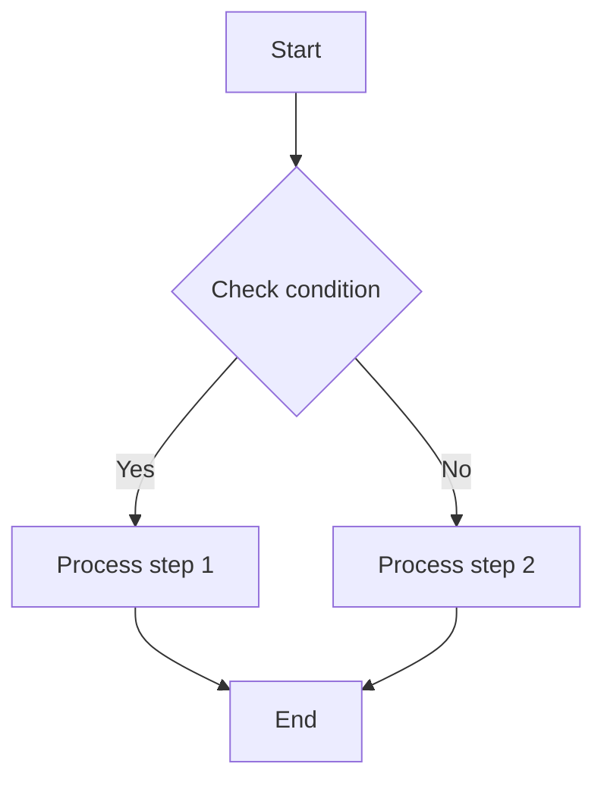

# Agent Instructions: `bfmhno3.github.io`

This site is an Astro static site using the CuteLeaf/Firefly theme.

## Project Overview

```text
.
├── .agents
│   └── skills
├── .github
│   ├── ISSUE_TEMPLATE
│   └── workflows
├── docs
│   └── images
│       └── sponsor
├── public
│   ├── assets
│   │   ├── css
│   │   ├── fonts
│   │   ├── images
│   │   ├── js
│   │   └── music
│   ├── favicon
│   ├── gallery
│   │   ├── encrypted-test
│   │   └── firefly-2026
│   └── pio
│       ├── models
│       └── static
├── scripts
└── src
    ├── assets
    │   └── images
    ├── components
    │   ├── analytics
    │   ├── comment
    │   ├── common
    │   ├── controls
    │   ├── features
    │   ├── layout
    │   ├── misc
    │   ├── pages
    │   └── widget
    ├── config
    ├── constants
    ├── content
    │   ├── dynamic
    │   ├── posts
    │   └── spec
    ├── i18n
    │   └── languages
    ├── layouts
    ├── pages
    │   ├── api
    │   ├── categories
    │   ├── dynamic
    │   ├── gallery
    │   ├── og
    │   ├── posts
    │   └── tags
    ├── plugins
    │   └── utils
    ├── styles
    ├── types
    ├── utils
    └── workers
```

- `.agents/`: AI-assisted development configuration and skill definitions for the project. This directory is not included in the site build.
  - `skills/`: Reusable AI skill definitions.
- `.github/`: GitHub repository configuration.
  - `ISSUE_TEMPLATE/`: Templates for bug reports, feature requests, and custom issues.
  - `workflows/`: GitHub Actions workflows for checks, builds, and deployment.
- `docs/`: Project documentation and its supporting assets.
  - `images/`: Screenshots and images referenced by README files and other documentation.
    - `sponsor/`: Sponsorship-related images.
- `public/`: Static assets copied directly to the site root during the build without Astro processing.
  - `assets/`: Public stylesheets, fonts, images, scripts, and music assets.
    - `css/`: Additional static CSS files.
    - `fonts/`: Site font files.
    - `images/`: Images referenced directly by posts, pages, and the theme.
    - `js/`: Static browser-side scripts.
    - `music/`: Audio assets used by the music player.
  - `favicon/`: Site icons for different themes and sizes.
  - `gallery/`: Static content used by gallery pages.
    - `encrypted-test/`: Assets for encrypted gallery tests.
    - `firefly-2026/`: Assets for the Firefly 2026 gallery.
  - `pio/`: Assets for the Pio/Live2D character widget.
    - `models/`: Live2D model files.
    - `static/`: Other static scripts and assets used by Pio.
- `scripts/`: Build and content-maintenance scripts for generating card data, LQIPs, VNDB covers, font subsets, search indexes, and related artifacts.
- `src/`: Main site source code.
  - `assets/`: Assets imported and processed by Astro/Vite during the build.
    - `images/`: Images imported directly by source code.
  - `components/`: Reusable Astro and Svelte UI components.
    - `analytics/`: Traffic analytics and tracking components.
    - `comment/`: Comment-system components.
    - `common/`: Base components shared across multiple features.
    - `controls/`: Interactive controls such as buttons and switches.
    - `features/`: Feature components for search, galleries, media, and similar functionality.
    - `layout/`: Layout components such as the header, navigation bar, sidebar, and footer.
    - `misc/`: Supporting components that do not fit another category.
    - `pages/`: Components composed for specific pages.
    - `widget/`: Sidebar and page widgets.
  - `config/`: Site and theme configuration, including navigation, comments, fonts, effects, galleries, and music.
  - `constants/`: Runtime constants and data generated by build scripts.
  - `content/`: Root directory for Astro Content Collections.
    - `dynamic/`: Dynamic or short-form content collection.
    - `posts/`: Blog posts.
    - `spec/`: Fixed page content such as the About and portfolio pages.
  - `i18n/`: Internationalization keys and translation-loading logic.
    - `languages/`: Translation text for each language.
  - `layouts/`: Shared page layouts and HTML shells.
  - `pages/`: Astro file-based routes; file paths directly determine public URLs.
    - `api/`: API routes.
    - `categories/`: Category index and category detail routes.
    - `dynamic/`: Dynamic content pages.
    - `gallery/`: Gallery index and detail routes.
    - `og/`: Open Graph image-generation routes.
    - `posts/`: Post index, pagination, and detail routes.
    - `tags/`: Tag index and tag detail routes.
  - `plugins/`: Remark and Rehype plugins for processing Markdown and HTML.
    - `utils/`: Utilities shared by plugins.
  - `styles/`: Global styles and feature-specific CSS/Stylus files.
  - `types/`: TypeScript types and interfaces.
  - `utils/`: Shared business logic for dates, URLs, navigation, images, layouts, content, and related features.
  - `workers/`: Web Worker source code used to move animation and similar computation off the main thread.

## Build and Test Commands

### Build

```bash
pnpm install --frozen-lockfile
pnpm dev --host 127.0.0.1
pnpm check
pnpm build
```

The Nix flake provides Node 24, pnpm, and native image-build dependencies. Docker development runs Astro on port 4321:

```bash
docker compose build
docker compose up -d
docker compose logs --tail=100 astro
docker compose down
```

Podman users must use rootful mode.

Use the environment provided by Nix by default. If Nix is unavailable in the execution environment, try Docker and then Podman, in that order.

### Test

There is no dedicated unit-test framework configured.

- Before submitting changes, run `pnpm check`, `pnpm type-check`, and `pnpm build` for rendering, content, or generated asset work.
- For visual or interactive changes, verify with `pnpm dev` or `pnpm preview` and include screenshots in the PR.
- Name future tests near the feature they cover, using the local file name as the stem.

### All commands

- `pnpm install`: Install dependencies.
- `pnpm dev`: Start the local development server at `localhost:4321`.
- `pnpm build`: Build the site into `./dist/`.
- `pnpm preview`: Preview the built site locally.
- `pnpm check`: Check the code for errors.
- `pnpm format`: Format the code with Biome.
- `pnpm new-post <filename>`: Create a new post.
- `pnpm new-d <content>`: Create a dynamic entry.
- `pnpm new-dynamic <content>`: Create a dynamic entry using the full command.
- `pnpm astro ...`: Run commands such as `astro add` and `astro check`.
- `pnpm astro --help`: Display Astro CLI help.

## Code Style guidelines

### JS and TS

- Biome is the formatter and linter. It uses tabs for indentation and double quotes for JavaScript/TypeScript strings.
- Keep Astro and Svelte components in `PascalCase` (`PostCard.astro`, `Search.svelte`), config modules in `camelCase` ending with `Config.ts`, and utilities in descriptive kebab case such as `date-utils.ts`.
- Keep `src/types` aligned with `src/config`. Avoid unrelated formatting churn.

### Markdown

Use GitHub Flavored Markdown by default.

#### Front Matter

Posts and dynamic entries created with the following commands automatically use the correct Front Matter format:

- `pnpm new-post <filename>`: Create a new post.
- `pnpm new-d <content>`: Create a dynamic entry.
- `pnpm new-dynamic <content>`: Create a dynamic entry using the full command.

The complete set of Front Matter fields is listed below:

| Property | Type | Required | Description |
| --- | --- | --- | --- |
| `title` | `string` | Yes | Post title. |
| `published` | `date` | Yes | Publication date. |
| `updated` | `date` | No | Last updated date. Defaults to the publication date when omitted. |
| `description` | `string` | No | Short post description displayed on the home-page post card. |
| `image` | `string` | No | Cover image path. |
| `tags` | `string[]` | No | Post tags. |
| `category` | `string` | No | Post category. |
| `draft` | `boolean` | No | Whether the post is a draft. Drafts are not visible to readers. |
| `pinned` | `boolean` | No | Whether the post is pinned to the top of the post list. |
| `slug` | `string` | No | Custom URL path. |
| `lang` | `string` | No | Post language code, such as `zh-CN`. Set only when it differs from the site's default language. |
| `author` | `string` | No | Post author. |
| `comment` | `boolean` | No | Whether comments are enabled. Defaults to `true`. |
| `licenseName` | `string` | No | Custom license name. |
| `licenseUrl` | `string` | No | Custom license URL. |
| `sourceLink` | `string` | No | Source URL for the post. |
| `password` | `string` | No | Post password. When set, the post is encrypted; see the post-encryption documentation. |
| `passwordHint` | `string` | No | Password hint displayed above the password input. |

#### Formatting Guardrails

- **Unordered Lists**: Use the `-` marker exclusively. Do not use `*` or `+`.
- **Typesetting**: Always insert a single space between Chinese and English/numeric characters.
- **Quotes & Dashes**: Use plain straight quotes (`'` or `"`) and standard hyphens. Do not emit smart quotes (`“”`, `‘’`) or em dashes (`—`).

#### Mathematical Expressions

- **Inline Math**: Wrap exactly in single dollar signs: `$f(x)$`.
- **Block Math**: Wrap in double dollar signs on separate lines:

```latex
$$
f(X) = x^2
$$
```

#### Mermaid Diagrams

Example:



#### Admonitions

Add GitHub Alert-style admonitions where appropriate in a post. For example:

```markdown
> [!NOTE] Note
> Highlights information that users should notice.

> [!TIP] Tip
> Optional information that helps users succeed.

> [!IMPORTANT] Important
> Essential information that users must know.

> [!WARNING] Warning
> Critical content that requires immediate attention.

> [!CAUTION] Caution
> Potential negative consequences of an action.
```

#### GitHub Repository Cards

Use the following syntax to embed a GitHub repository information card. Data is fetched dynamically from the GitHub API:

```markdown
::github{repo="CuteLeaf/Firefly"}
```

#### Embedded Videos

Paste iframe embed code directly into Markdown.

##### YouTube

```html
<iframe width="100%" height="468"
  src="https://www.youtube.com/embed/VIDEO_ID"
  title="YouTube video player"
  frameborder="0" allowfullscreen>
</iframe>
```

##### BiliBili

```html
<iframe width="100%" height="468"
  src="//player.bilibili.com/player.html?bvid=BV_ID&p=1&autoplay=0"
  scrolling="no" border="0" frameborder="no"
  framespacing="0" allowfullscreen="true">
</iframe>
```

#### Spoiler Text

Use the `:spoiler[]` syntax to hide text. Markdown formatting is supported:

```markdown
Content :spoiler[hidden **text**]!
```

#### File Naming

This section applies only to blog-related Markdown files and the images they reference.

- Name blog files in English, separate words with `-`, and use the `.md` extension. Do not use `.mdx`.
- Name images in English and separate words with `-`.

## Security considerations

- Do not commit secrets, tokens, or service keys in config files.
- Keep deployment-specific settings in the target platform environment, and review generated files such as `dist`, `src/constants/lqips.json`, and `src/constants/icons.ts` before committing them.

## Additional Notes

- Read existing files before writing. Don't re-read unless changed.
- Thorough in reasoning, concise in output.
- Skip files over 100KB unless required.
- No sycophantic openers or closing fluff.
- No emojis or em-dashes.
- Do not guess APIs, versions, flags, commit SHAs, or package names. Verify by reading code or docs before asserting.
