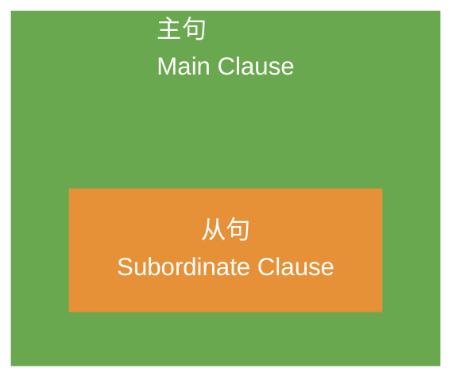

我们为什么学语法？

~~当然是为了考高分啊😂~~
{: .notice--info}

其实，所有的英语语法都只有一个目的：**造句**。

英语和中文一样，我们说话写文章有的时候用短句子，有的时候用长句子。不同的短句子又可以组合成新的长句。但这里说的是句子的长度，并不适合语法讨论。

我们只有把句子拆开来，直到拆到不能再继续拆了，否则句意会不完整的 “基本句”，才好研究语法。因为如果 “基本句” 研究透了，长句子就是它们的组合。

## 1. 简单句（Simple Sentence）

我们把这样的不能再拆的 “基本句” 称作**简单句**（Simple Sentence）。而这样的简单句，除去那些**感叹句**（“嗯”，“哦”，“啊”等）、**省略句**、**（向整句提问的）问句**，几乎全部都是在说：

**什么** + **怎么样**
{: .notice--info}

绝大多数句子粗略地分一共就只有这两个部分，而这个 “什么” 和 “怎么样” 分别对应了两个最基本的**句子成分**：

- “什么”： **主语**（Subject）。
- “怎么样”：**谓语**（Predicate）。

换句话说，几乎所有的英语句子结构都是：

**主语** + **谓语**
{: .notice--info}

这里的**主语**一般是人或物，不管是抽象还是具体。而这里的**谓语**则是指一个广义的动作或发生的事情。

这个 “动作” 不是我们平时狭义说的要动起来的 “动作”，而这个广义的 “动作” 也就是我们语法上说的**动词**（Verb）。
{: .notice--warning}

## 2. 谓语动词

|序号|动词类型|解释|
|:---:|:---|:---|
|1|不及物动词|可以独立完成的动作|
|2|单及物动词|有一个动作的承受者|
|3|双及物动词|有两个动作承受者|
|4|复杂及物动词|只有一个动作承受者|
|5|系动词|非 “动作”|

### 2.1 不及物动词（Intransitive Verb）

**不及物动词**（Intransitive Verb）就是指**可以独立完成的动作**，例如：

> Papa Rabbit sleeps.
>
> 兔老爹睡觉。

类似 "sleeps" 这样的没有承受者的动词就是**不及物动词**（Intransitive Verb）。

不及物动词所对应的基本句子结构就是：

**主语** + **不及物动词**
{: .notice--success}

### 2.2 单及物动词（Monotransitive Verb）

> Papa Rabbit likes you.
>
> 兔老爹喜欢你。

如果这里只说 “兔老爹喜欢”，你肯定觉得意思不完整，因为像 “喜欢” 这样的动词没有承受者就没有什么实际意义，这样的动词就属于**及物动词**（Transitive Verb），而这个动作承受者就是**宾语**（Object）。

具体而言，对于只有一个宾语及物动词，我们称为**单及物动词**（Monotransitive Verb）。

单及物动词对应的基本句子结构就是：

**主语** + **单及物动词** + **宾语**
{: .notice--success}

### 2.3 双及物动词（Ditransitive Verbs）

> Papa Rabbit teaches you English.
>
> 兔老爹教你英语。

这里的核心动词是 "teach"（教），但是教授的知识是 “英语”，而知识的接收对象是 “你”。在语法上，我们把这样的动词的两个承受者分别称为**直接宾语**（Direct Object）和**间接宾语**（Indirect Object）。

如果只说 “兔老爹教英语”，其实语义已经完整了，所以 "English" 这里就是**直接宾语**，而如果只说 “兔老爹教你”，而又没有上下文的话，你肯定觉得还缺了什么，所以 "you" 在这里是间接宾语。

这样的往往既有直接宾语又有间接宾语的动词，也是及物动词的一种，更具体地说，它属于**双及物动词**（Ditransitive Verbs）。

双及物动词对应的基本句子结构就是：

**主语** + **双及物动词** + **间接宾语** + **直接宾语**
{: .notice--success}

### 2.4 复杂及物动词（Complex-transitive Verb）

> Papa Rabbit considers you smart.
>
> 兔老爹认为你聪明。

这里虽然只有一个动作的承受者 "you"，但如果只说 “兔老爹认为你”，你肯定会觉得话没有说完，但是宾语 "you" 后面的 "smart" 却也不像双及物动词那样是另一个动作承受者。

这样的动词，必须要有个补充承受者的信息才意义完整，而这个补充的信息，我们在语法上称为**补足语**或**补语**（Complement）。更明确也可以说是**宾语补语**（Object Complement）。

这样的需要**补语**的动词，我们称之为**复杂及物动词**（Complex-transitive Verb）

复杂及物动词对应的基本句子结构就是：

**主语** + **复杂及物动词** + **宾语** + **（宾语）补语**
{: .notice--success}

### 2.5 系动词（Linking Verb）

这种动作所表示的含义与狭义上的 “动作” 不太一样：

> Papa Rabbit is tall.
>
> 兔老爹是高的。

这里的 "is" 在中文里经常翻译成 “是”，但它实际上的作用很简单：

就是把这个动词之后的信息**赋予**前面的主语。
{: .notice--danger}

这里的 "is" 说白了就是把 "Papa Rabbit" 和 "tall" 连在一起，划上等号而已。或者说，把后者信息赋予前者。如果把 "tall" 换成 "in the room"：

> Papa Rabbit is in the room.
>
> 兔老爹在房间里。

其实也是把 "in the room" 这个状态性质赋予 "Papa Rabbit" 而已。

> Papa Rabbit looks tall.
>
> 兔老爹看起来高。

这个 "look" 通常意义是 “看”，但是这里到底是谁在看？其实不是 "Papa Rabbit" 在看，"Papa Rabbit" 在这里是**被看**。这里的 "looks" 其实也是把后面的 "tall" 赋予前面的主语 "Papa Rabbit" 而已，也算是划等号，只不过这个划等号比之前的 "is" 多了个 “看上去”。

> Papa Rabbit smells nice.
>
> 兔老爹闻上去香。

这里的 "smells" 还是把 "Papa Rabbit" 和 "nice" 划等号，只不过还有 “闻上去” 这层意思。

像这样的赋予主语某种性质状态的 “划等号” 的动词，我们称之为**连系动词**（Linking Verb），也称为**系动词**。

系动词后面的补充信息自然就是**补足语**或**补语**，更精确地说是**主语补语**，而**主语补语**在中国的英语教学中又被称为**表语**（Predicative）。

系动词对应的基本句子结构就是：

**主语** + **系动词** + **（主语）补语/表语**
{: .notice--success}

## 3. 五大基本句型

|序号|句型|
|:--:|:---|
|1|主语 + 不及物动词|
|2|主语 + 单及物动词 + 宾语|
|3|主语 + 双及物动词 + 间接宾语 + 直接宾语|
|4|主语 + 复杂及物动词 + 宾语 + 宾语补语|
|5|主语 + 系动词 + 主语补语/表语|

还有一种 “八大句型” 的分类，即在 “五大句型” 基础上增加：

<ol start="6">
  <li><strong>there be</strong> 句型，如：There is a rabbit. 可理解为第 5 种句型 “主语 + 系动词 + 主语补语/表语” 的倒装。</li>
  <li><strong>主语</strong> + <strong>谓语</strong> + <strong>状语</strong>，如：I live in China. 可理解为第 1 种句型 “主语 + 不及物动词” 的延伸（虽然这里的状语很重要）。</li>
  <li><strong>主语</strong> + <strong>谓语动词</strong> + <strong>宾语</strong> + <strong>状语</strong>，如：I put the carrot on the table. 可理解为第 4 种句型 “主语 + 复杂及物动词 + 宾语 + 宾语补语” 的延伸。</li>
</ol>

严格说来，谓语和谓语动词是有区别的。句子主语后面余下的部分就是谓语，谓语动词只是谓语的一部分。

但是在平时，通俗地，为了方便，很多人会直接称呼谓语动词为谓语，而把 “主语 + 谓语动词 + 宾语” 这样的句子结构直接称呼为 “主语 + 谓语 + 宾语”（或 “主谓宾”），这也不是什么大问题。

## 4. 句子基本成分

|序号|成分|英文名|解释|例句|
|:---:|:---|:---|:---|:---|
|1|主语|Subject|动作的发出者或被讨论的对象|**Papa Rabbit** eats carrots.|
|2|谓语动词|Predicate Verb|表示具体的动作或状态|Papa Rabbit **eats** carrots.|
|3|宾语|Object|动作的承受者|Papa Rabbit eats **carrots**.|
|4|宾语补语|Object Complement|补充说明宾语的状态或特征|Papa Rabbit considers you **smart**.|
|5|主语补语|Subject Complement|补充说明主语的性质状态（即表语）|Papa Rabbit is **tall**.|
|6|定语|Attributive|修饰主语或宾语|**The little** white rabbit ate **a large** carrot.|
|7|状语|Adverbial|修饰谓语动词|The rabbit ate **quickly**.|
|8|同位语|Appositive||Papa Rabbit, **an English teacher**, eats carrots.|

你可能听过 “**插入语**”，如：This carrot, I think(插入语), is very tasty. 但是插入语是独立的，不作句子成分。
{: .notice--info}

## 5. 复杂句

直到现在所说的都是**简单句**（Simple Sentence），说白了就是没法再拆成更多句子了。但是我们说话写文章可不全是简单句，而是经常会把这些简单句互相组合形成所谓**复合句**（Compound Sentence）和**复杂句**（Complex Sentence）。

**复合句**说白了就是句子简单的叠加，句子和句子之间是**并列关系**，因此也被称为**并列句**。

**复杂句**则是把一个句子套在另一个句子里，允许不断嵌套，是**从属关系**。

一个句子套另一个句子，在英语语法上分别叫做**主句**（Main Clause）和**从句**（Subordinate Clause）。

从句说白了就是把简单句修改一下来充当另一个句子的句子成分。

### 5.1 从句类型

|序号|从句|作用|补充|例句|
|:---:|:---|:---|:---|:---|
|1|主语从句|作主语|名词性从句|**What Papa Rabbit ate** is a carrot.|
|2|宾语从句|作宾语|名词性从句|I know **that Papa Rabbit likes carrots**.|
|3|表语从句|作表语|名词性从句|The truth is **that he likes you**.|
|4|同位语从句|作同位语|名词性从句|The fact **that he ate the carrot** is obvious.|
|5|定语从句|作定语||The rabbit **who ate the carrot** is my papa.|
|6|状语从句|作状语||I will leave **when Papa Rabbit comes**.|

## 6. 词性

但是现在问题来了，两个句子也许句子组成的方式相同，比如都是 “主语 + 谓语动词 + 宾语”，可是句中包含的词的类型并不一定相同，比如：

> *The rabbit* **ate** ~~a carrot~~.
> 
> *He* **saw** ~~something over there~~.

很显然，这两句话 “句型” 相同，但是包含的词却不太一样。也就是说，同一类句子成分里可能有不同的词类（或词类），这个概念中文中也有。

|序号|词性|英文名|解释|例句|
|:---:|:---|:---|:---|:---|
|1|动词|verb|表示动作或状态|Papa Rabbit **eats** a carrot.|
|2|名词|noun|表示人或物|Papa Rabbit is a **rabbit**.|
|3|冠词|article|用于说明人和事物|Papa Rabbit is **a** rabbit.|
|4|代词|pronoun|替代人和物|**I** am a rabbit.|
|5|形容词|adjective|形容人和物|I am a **smart** rabbit.|
|6|数词|numeral|表数量|I ate **two** carrots.|
|7|副词|adverb|修饰动作或形容词|I ate two carrots **quickly**.|
|8|介词|preposition|表示和其他词关系的词|I ate two carrots **with** chopsticks.|
|9|叹词|interjection|表感叹|**Ah**, the carrot is tasty!|
|10|连词|conjunction|连接词和句|I ate two carrots and a potato, **because** I was hungry.|

**句子成分**（Clause Element）和句子中的**词类**（Parts of Speech）是完全不同的概念。
{: .notice--danger}

前文所述的每一种句子成分，除了**谓语动词**只能是动词，其他成分都可能包含不同的词类。

## 7. 谓语动词的 “三大本领”

英语中的谓语动词有很多厉害的本领，而这些本领，中文中的动词都没有，是英语语法的难点之一：

1. 动作时间
2. 动作状态
3. 动作假设，情感等

所谓 “中文动词没有这些本领” 是说中文动词本身没有 “时、体、气” 的概念，但是中文当然有相同或相似意思的表达。
{: .notice--warning}

### 7.1 时态

英语的时态就是**时间** + **状态**合在一起，而并非只有时间。

||**现在**|**过去**|**将来**|**过去将来**|
|:---|:---|:---|:---|:---|
|*一般*|*一般***现在**|*一般***过去**|*一般***将来**|*一般***过去将来**|
|*完成*|**现在***完成*|**过去***完成*|**将来***完成*|**过去将来***完成*|
|*进行*|**现在***进行*|**过去***进行*|**将来***进行*|**过去将来***进行*|
|*完成进行*|**现在***完成进行*|**过去***完成进行*|**将来***完成进行*|**过去将来***完成进行*|

时态是时间的排列组合，并不是一个线性的列表，更不是只和时间有关。
{: .notice--info}

### 7.2 语气

|序号|语气|解释|例句|
|:---:|:---|:---|:---|
|1|虚拟语气|用来表示意愿，与事实相反的假设等|If I **were** a rabbit...|
|2|陈述语气||I ate a carrot and...|
|3|祈使语气||Eat this carrot and...|

### 7.3 助动词（Auxiliary Verb）

英语的谓语动词本身往往是不能够独立完成刚才说的上述的这些本领，而且谓语动词也无法完成比如表示否定、可能性、必须性等意思。

想让谓语动词充分发挥，我们必须用到另一类经常和动词一起用的词，来帮助完成任务，它们就是**助动词**（Auxiliary Verb）

例如对于动词 eat：

|协助|助动词|组合|
|:---|:---|:---|
|表示 “吃过了（完成）”|have|have eaten|
|表示 “正在吃（进行）”|be|is eating|
|表示 “被吃”|be|is eaten|
|表示 “有能力吃”|can|can eat|
|表示 “有可能吃”|might|might eat|
|表示 “有义务吃”|must|must eat|
|表示 “不吃（否定）”|do|do not eat|

以上的 can, might, must 也被称作 “情态动词”，可归类在 “助动词” 里，但是也有些语法体系把情态动词单独归类，这是分类的不同，不影响理解。
{: .notice--info}

有些动词，既可以是助动词（无实义），也可以做实义动词，比如 have 也可以表示 “拥有”。千万不要把助动词和它的其他身份（作实义动词时）弄混淆。
{: .notice--danger}

## 8. 非谓语动词

之所以需要把动词叫做谓语动词，是因为还有所谓**非谓语动词**，这听起来似乎是一句废话。

不过，之所以这么叫，是因为动词除了充当句子中的谓语动词，还有可能充当：主语、宾语、宾语补语、主语补语、定语等，只不过需要变成非谓语动词。

不仅如此，非谓语动词几乎可以取代所有的从句，从而简化句子。只不过非谓语动词就不再具有表示动作时间、状态、语态、语气的功能，也就是它们丧失了时态、语气、语态这些本领了。

非谓语动词以不同的形式出现在句中，包括：

- **动词不定式**：常表将来或具体的单次行为。如作主语：**To eat** a carrot is Papa Rabbit's dream.
- **现在分词**：常表主动或正在进行。如作定语：The rabbit **eating** a carrot is my papa.
- **动名词**：将动词名词化，常表抽象概念或习惯。如作宾语：Papa Rabbit enjoys **eating** carrots.
- **过去分词**：常表被动或已经完成。如作宾语补语：Papa Rabbit wants the carrot **eaten**.

## 9. 总结

上述这么多一直在讲动词，这是因为：

英语语法的核心就是动词，动词几乎可以串联起所有英语语法的核心概念。
{: .notice--danger}



以上就是英语语法体系的主体框架，绝大多数的语法规则，都逃不出这个框架。而无数的规则和特例也不过就是让这个核心体系更加丰富而已。

## 10. 参考资料

1. [英语兔：英语语法综述](https://www.bilibili.com/video/BV1XY411J7aG?t=0&p=2)
2. [Minimal Mistakes: Layouts](https://mmistakes.github.io/minimal-mistakes/docs/layouts)
