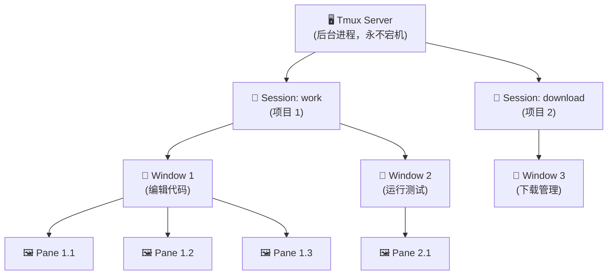

title: "Tmux 使用笔记"
date: 2026-04-25 21:55:00 +08:00
excerpt: "理解 tmux 的 C/S 架构和 Session、Window、Pane 的三层模型，快速掌握日常工作中最常用的快捷键，提升远程开发效率。"
categories:
  - Note
tags:
  - Linux
---

## 为什么我们需要 tmux？

### 1. 终端的物理与逻辑基础

在计算机世界里，我们通过 “终端（Terminal）” 与 “Shell（如 bash, zsh）” 进行交互。

当你打开一个终端窗口，或者通过 SSH 连接到远程服务器时，操作系统为你分配了一个 **TTY（伪终端）**，并在这个 TTY 上启动了一个 Shell 进程。你在终端里运行的所有程序（跑脚本、开服务器、编辑代码），都是这个 Shell 的**子进程**。

### 2. 致命的耦合（痛点所在）

这就产生了一个致命的 “生命周期耦合” 问题：

- **规则**：当你的终端窗口关闭，或者由于网络波动导致 SSH 连接断开时，系统会向该 TTY 上的 Shell 发送一个 `SIGHUP`（挂断信号）。
- **结果**：Shell 收到信号后会立即终止，并带着它所有的子进程一起退出。
- **痛点**：如果你正在服务器上训练一个需要跑 3 天的深度学习模型，或者正在编译一个巨大的项目，只要你的网络断开一秒钟，或者你不小心关掉了窗口，前功尽弃。

### 3. 需求推演

为了解决这个问题，我们需要在 “显示界面（你的屏幕/SSH连接）” 和 “后台进程（Shell 及你的任务）” 之间，插入一个**中间层**。

这个中间层需要具备两个核心能力：

1. **进程解耦（持久化）**：它可以接管所有的 Shell 进程，并且无视网络断开和窗口关闭，永远在后台运行。
2. **多路复用（分屏）**：既然它接管了终端，那它最好能把一个屏幕切分成多个区域，让我们可以同时看代码、看日志、跑服务，而不需要开一堆 SSH 连接。

这就是 **tmux** 诞生的原因。

## tmux 是什么？（核心架构）

**tmux (Terminal Multiplexer，终端复用器)** 就是我们刚刚推导出的那个“中间层”。

它的底层本质是一个 **C/S 架构（Client-Server）**：

- **Server（服务端）**：当你第一次运行 tmux 时，它会在后台默默启动一个 Server。这个 Server 负责管理你所有的运行环境。只要服务器不重启，它就一直活着。
- **Client（客户端）**：当你在终端敲下 `tmux` 时，你实际上是启动了一个 Client，连接到了后台的 Server。把 Client 关掉，只是断开了 “显示器”，后台的 Server 和进程依旧在运转。

### tmux 的层级逻辑（非常重要）

为了方便管理，tmux 将你的工作区抽象为三个层级：

1. **Session（会话）**：最大的单位。一个 Session 通常代表一个 “项目”。比如你可以建一个名叫 `work` 的 Session，里面跑你的代码；再建一个名叫 `download` 的 Session，里面专门用来挂机下载。
2. **Window（窗口）**：Session 里面的 “标签页”。类似于浏览器的 Tab，一个屏幕只能显示一个 Window。
3. **Pane（窗格）**：Window 里的 “分屏”。你可以把一个 Window 切分成左边看代码、右边看日志。

## tmux 的使用方法

理解了上面的逻辑，使用 tmux 就只是死记硬背几个命令而已了。

### 1. 前置概念：Prefix Key（前缀键）

在 tmux 中，所有的快捷键都必须配合一个**前缀键**使用，默认是 `Ctrl + b`。

**操作逻辑：** 先同时按下 `Ctrl` 和 `b`，**松开双手**，然后再按下一个键。

*(下文中我将 `Ctrl + b` 简称为 `Prefix`)*
{: .notice--info}

### 2. Session 管理（在普通的 Linux 终端打字）

这是你和 Server 交互的命令：

- **新建会话**：`tmux new -s myproject` （新建一个名为 myproject 的会话并进入）
- **脱离会话（后台运行）：** `Prefix` 然后按 `d` (detach)。你的界面会退回普通终端，但里面的程序还在跑！
- **查看现有会话**：`tmux ls`
- **重新连接会话**：`tmux attach -t myproject` (attach)
- **彻底杀死会话**：`tmux kill-session -t myproject`

### 3. Window 管理（在 tmux 内部使用快捷键）

- **新建窗口**：`Prefix` 然后按 `c` (create)
- **切换窗口**：`Prefix` 然后按 `n` (next，下一个)
  - `Prefix` 然后按 `p` (previous，上一个)
  - `Prefix` 然后按 `数字键` (直接跳转到指定窗口)
- **关闭当前窗口**：`Prefix` 然后按 `&` (会弹出确认提示)

### 4. Pane 管理（在 tmux 内部使用快捷键）

这是日常写代码最常用的分屏功能：

- **左右分屏**：`Prefix` 然后按 `%`
- **上下分屏**：`Prefix` 然后按 `"` (双引号)
- **在分屏间移动光标**：`Prefix` 然后按 `方向键` (上下左右)
- **全屏/取消全屏当前分屏**：`Prefix` 然后按 `z` (zoom，非常实用，看长报错信息时按一下放大，看完再按一下缩小)
- **关闭当前分屏**：`Prefix` 然后按 `x` 或者直接输入 `exit`

## 进阶：让 tmux 变得更好用

可以参考开源项目 [gpakosz/.tmux](https://github.com/gpakosz/.tmux)，这里仅列举出开源项目中使用的快捷键绑定。

### 格式说明

- `<prefix>` 表示需要按下 <kbd>Ctrl</kbd> + <kbd>a</kbd> 或者 <kbd>Ctrl</kbd> + <kbd>b</kbd>。
- `<prefix> c` 表示需要按下 <kbd>Ctrl</kbd> + <kbd>a</kbd> 或者 <kbd>Ctrl</kbd> + <kbd>b</kbd> 加上 <kbd>c</kbd>。
- `<prefix> C-c` 表示需要按下 <kbd>Ctrl</kbd> + <kbd>a</kbd> 或者 <kbd>Ctrl</kbd> + <kbd>b</kbd> 加上 <kbd>Ctrl</kbd> + <kbd>c</kbd>。

### 快捷键分类说明

下表按**使用频率和优先级**分组，建议按顺序学习：

- **📌 必学**：日常工作最核心的 5 个操作，学会了就能满足基本需求
- **⭐ 常用**：提升工作效率的 15 个快捷键，逐步熟悉即可
- **🔧 进阶**：高级功能和特殊场景，按需学习

### 快捷键速查表

#### 📌 会话与窗口基础

| 快捷键                     | 功能                                          |
| -------------------------- | --------------------------------------------- |
| `tmux new -s myproject`    | **新建会话** myproject 并进入（普通终端执行） |
| `tmux ls`                  | 列出所有会话（普通终端执行）                  |
| `tmux attach -t myproject` | 重新连接会话（普通终端执行）                  |
| `<prefix> d`               | **脱离会话**，回到普通终端，后台保持运行      |
| `<prefix> c`               | **新建窗口**                                  |
| `<prefix> n`               | 切换到 **下一个** 窗口                        |
| `<prefix> p`               | 切换到 **上一个** 窗口                        |
| `<prefix> 数字`            | 直接切换到指定窗口                            |

#### 📌 分屏基础

| 快捷键            | 功能                   |
| ----------------- | ---------------------- |
| `<prefix> %`      | **左右分屏**           |
| `<prefix> "`      | **上下分屏**（双引号） |
| `<prefix> 方向键` | 在分屏间 **移动光标**  |
| `<prefix> z`      | **放大/缩小** 当前分屏 |
| `<prefix> x`      | **关闭** 当前分屏      |

#### ⭐ 常用操作

| 快捷键         | 功能                                                                       |
| -------------- | -------------------------------------------------------------------------- |
| `<prefix> e`   | 打开 .local 配置文件（使用 $VISUAL 或 $EDITOR 变量定义的编辑器，默认 vim） |
| `<prefix> r`   | 重新加载配置                                                               |
| `<prefix> C-c` | 新建会话                                                                   |
| `<prefix> C-f` | 按名称切换会话                                                             |

#### ⭐ 窗口与分屏导航

| 快捷键 | 功能                     |
| ------ | ------------------------ |
| `C-l`  | 清空屏幕和 tmux 历史记录 |

| 快捷键         | 功能                 |
| -------------- | -------------------- |
| `<prefix> C-h` | 导航到上一个窗口     |
| `<prefix> C-l` | 导航到下一个窗口     |
| `<prefix> Tab` | 切换到最后活跃的窗口 |

| 快捷键       | 功能                     |
| ------------ | ------------------------ |
| `<prefix> -` | 垂直分屏                 |
| `<prefix> _` | 水平分屏                 |
| `<prefix> h` | 向左导航窗格（Vim 风格） |
| `<prefix> j` | 向下导航窗格（Vim 风格） |
| `<prefix> k` | 向上导航窗格（Vim 风格） |
| `<prefix> l` | 向右导航窗格（Vim 风格） |

#### 🔧 进阶操作 - 窗格调整与交换

| 快捷键       | 功能                   |
| ------------ | ---------------------- |
| `<prefix> H` | 向左调整窗格大小       |
| `<prefix> J` | 向下调整窗格大小       |
| `<prefix> K` | 向上调整窗格大小       |
| `<prefix> L` | 向右调整窗格大小       |
| `<prefix> <` | 与左边的窗格交换       |
| `<prefix> >` | 与右边的窗格交换       |
| `<prefix> +` | 最大化当前窗格到新窗口 |

#### 🔧 进阶操作 - 鼠标与复制粘贴

| 快捷键           | 功能                      |
| ---------------- | ------------------------- |
| `<prefix> m`     | 切换鼠标模式（开启/关闭） |
| `<prefix> Enter` | 进入复制模式              |
| `<prefix> b`     | 查看粘贴缓冲区列表        |
| `<prefix> p`     | 从顶部粘贴缓冲区粘贴      |
| `<prefix> P`     | 选择粘贴缓冲区进行粘贴    |

#### 🔧 进阶操作 - 工具集成

| 快捷键       | 功能                                 |
| ------------ | ------------------------------------ |
| `<prefix> U` | 启动 Urlscan（如果可用）或 Urlview   |
| `<prefix> F` | 启动 Facebook PathPicker（如果可用） |

### 🔧 进阶操作 - Copy-mode-vi 绑定

配置文件中的 `copy-mode-vi` 设定与 Vim 配置相匹配，以下为复制模式下的快捷键：

| 快捷键   | 功能                             |
| -------- | -------------------------------- |
| `v`      | 开始选择 / 可视模式              |
| `C-v`    | 在块状可视模式和可视模式之间切换 |
| `H`      | 跳转到行首                       |
| `L`      | 跳转到行尾                       |
| `y`      | 复制选择内容到顶部粘贴缓冲区     |
| `Escape` | 取消当前操作                     |

**提示**：你也可以通过在 .local 自定义配置文件中设置 `tmux_conf_preserve_stock_bindings` 变量为 true，来保留 tmux 的原始按键绑定。
{: .notice--info}

## 总结

掌握 tmux 的关键不在于背熟所有的快捷键，而是在脑海中建立起 **Server -> Session -> Window -> Pane** 的空间模型，以及理解它**将显示与进程解耦**的核心价值。习惯它之后，你会发现它是服务器端开发的终极神器。
