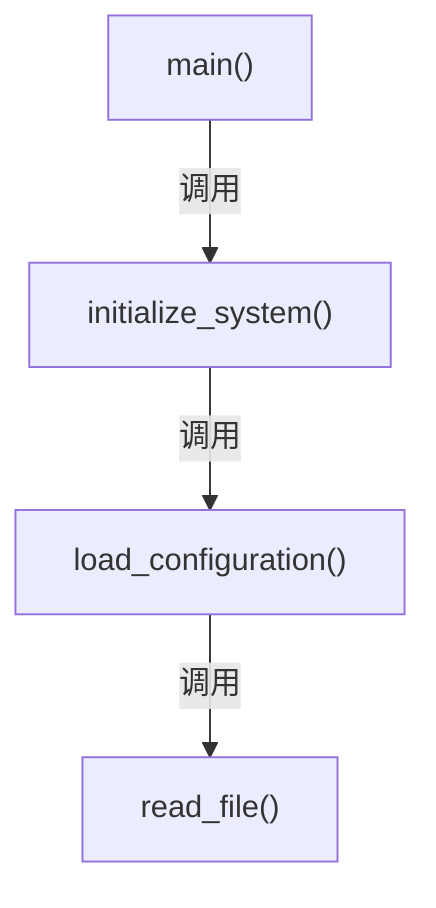
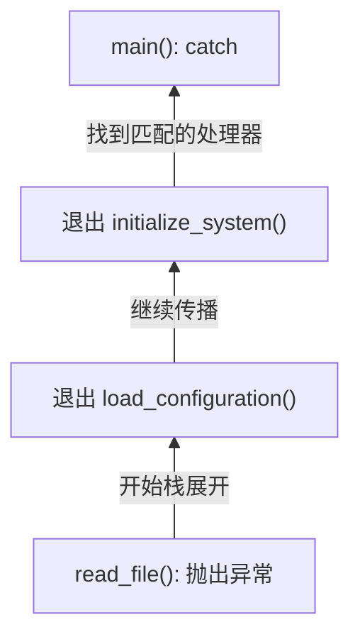
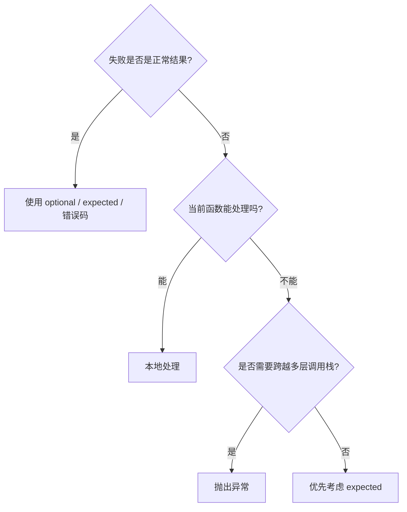

> "异常不是一种错误返回值。它是一种非局部的控制流。"

我以前写嵌入式 C 时，错误处理基本是一条熟悉的流水线：

```c
int result = read_sensor(&value);
if (result != 0) {
  return result;
}
```

函数返回错误码，调用者检查错误码，然后继续向上传递。一路上每层都写一次 `if`，最终总有某一层真正处理它 - 或者某一层忘记检查，程序带着错误继续运行。后者当然非常有趣，只是通常不会在你方便调试的时候发生。

C++ 异常做的事情，本质上是把"逐层手动返回错误"改成了"自动向上寻找能够处理错误的位置"。

但这句话里最关键的不是"自动"，而是"能够处理"。

## 异常最基本的语法

抛出异常使用 `throw`：

```cpp
double divide(double a, double b) {
  if (b == 0.0) {
    throw std::invalid_argument("division by zero");
  }

  return a / b;
}
```

调用者使用 `try` 和 `catch`：

```cpp
try {
  double result = divide(10.0, 0.0);
  std::cout << result << '\n';
} catch (const std::invalid_argument& error) {
  std::cerr << "参数错误: " << error.what() << '\n';
}
```

几个基本规则：

```cpp
try {
  // 可能抛出异常的代码
} catch (const SpecificException& error) {
  // 处理特定异常
} catch (const std::exception& error) {
  // 处理其他标准异常
} catch (...) {
  // 处理所有其他异常
}
```

> [!WARNING] 捕获顺序
> `catch` 按从上到下的顺序匹配，因此具体类型应放在前面，基类放在后面；`catch (...)` 只能放在最后。

异常一般按值抛出、按 `const` 引用捕获：

```cpp
throw MyException{"motor stalled"};

catch (const MyException& error) {
  // ...
}
```

不要按值捕获：

```cpp
catch (std::exception error) {  // 不推荐
}
```

这可能发生对象切片，丢失派生异常中的信息。

## 抛出以后发生了什么？

假设调用链是：



如果 `read_file()` 抛出异常，它不会像错误码那样正常返回。C++ 会沿调用栈向上寻找匹配的 `catch`：



这个过程叫做栈展开，stack unwinding。

在展开过程中，已经构造完成的局部对象会被自动销毁：

```cpp
void process() {
  std::vector<int> data(1000);
  std::lock_guard<std::mutex> lock(mutex);

  perform_operation();  // 抛出异常
}
```

即使 `perform_operation()` 抛出异常：

- `lock` 的析构函数仍然执行，互斥锁被释放；
- `data` 的析构函数仍然执行，内存被释放。

> [!IMPORTANT] RAII 是异常安全的地基
> 资源放进对象里，清理由析构函数负责，异常只负责改变控制流。不要让 `catch` 承担本应属于对象生命周期的清理工作。

### 我跑了一个最小的栈展开实验

只看规则还是有点抽象，所以我写了一个 34 行的小程序，让 3 个局部对象把构造和析构顺序打印出来，然后在最深处抛出 `std::runtime_error`：

```cpp
#include <iostream>
#include <stdexcept>
#include <string_view>

class Trace {
 public:
  explicit Trace(std::string_view name) : name_(name) {
    std::cout << "construct " << name_ << '\n';
  }

  ~Trace() { std::cout << "destroy " << name_ << '\n'; }

 private:
  std::string_view name_;
};

void read_file() {
  Trace trace{"read_file"};
  throw std::runtime_error{"disk error"};
}

void load_configuration() {
  Trace trace{"load_configuration"};
  read_file();
}

int main() {
  try {
    Trace trace{"main"};
    load_configuration();
  } catch (const std::runtime_error& error) {
    std::cout << "catch runtime_error: " << error.what() << '\n';
  }
}
```

我用 GCC 15.3 和 `-std=c++23 -Wall -Wextra -Wpedantic -Werror` 编译，实际输出是：

```bash
construct main
construct load_configuration
construct read_file
destroy read_file
destroy load_configuration
destroy main
catch runtime_error: disk error
```

3 个对象按构造的严格逆序销毁，最后才进入 1 个匹配的处理器。异常像按下了调用栈的倒带键：控制流向上走，析构函数沿路把资源收回来。若把同一条 3 层调用链改成 C 风格错误码，每一层都要检查并继续返回；这里中间两层没有错误转发代码，只保留了真正处理错误的边界。

因此，现代 C++ 中通常不应该这样清理资源：

```cpp
Resource* resource = acquire();

try {
  use(resource);
} catch (...) {
  release(resource);
  throw;
}

release(resource);
```

应该把资源包装成对象：

```cpp
auto resource = make_resource();
use(resource);
```

资源对象的析构函数负责清理。这样正常返回、提前返回和抛出异常都走同一套清理逻辑。

## `throw;` 和 `throw e;` 不一样

捕获后重新抛出当前异常：

```cpp
catch (const std::exception& error) {
  log_error(error.what());
  throw;
}
```

这里应当使用没有参数的 `throw;`。它重新抛出当前正在处理的异常，保留原始异常对象及其动态类型。

不要写：

```cpp
catch (const std::exception& error) {
  throw error;
}
```

这会用表达式 `e` 的静态类型 `std::exception` 初始化一个新的异常对象，因此派生部分会被切掉。

## 自定义异常

自定义异常通常继承 `std::runtime_error`：

```cpp
class ConfigurationError : public std::runtime_error {
 public:
  using std::runtime_error::runtime_error;
};
```

使用：

```cpp
void load_configuration() {
  if (!configuration_exists()) {
    throw ConfigurationError{"configuration file is missing"};
  }
}
```

捕获：

```cpp
catch (const ConfigurationError& error) {
  std::cerr << "配置错误: " << error.what() << '\n';
}
```

不要为每一种小错误都创建一个异常类。异常类型的价值在于让调用者能够采取不同措施，而不仅仅是让类名看起来很完整。

如果两个错误的处理策略完全一样，它们很可能不需要两个异常类型。

## 到底什么时候应该抛异常？

我认为最有用的判断标准是：

> [!TIP] 判断是否应该抛出
> 当前函数无法完成它承诺的操作，而且调用者不太可能在紧邻的位置用普通分支处理这个失败，此时异常通常是自然的接口。

例如：

```cpp
Configuration load_configuration(const std::filesystem::path& path);
```

这个函数承诺返回一个有效配置。如果文件损坏，函数无法兑现承诺。此时抛异常很自然：

```cpp
Configuration load_configuration(const std::filesystem::path& path) {
  std::ifstream input(path);

  if (!input) {
    throw ConfigurationError{
      "cannot open configuration: " + path.string()};
  }

  return parse_configuration(input);
}
```

特别适合异常的情况包括：

- 构造函数无法建立对象不变量；
- 初始化过程失败，程序无法继续；
- 文件、数据库或系统资源出现罕见故障；
- 某个深层函数无法处理错误，需要跨越多层调用栈；
- 函数通常成功，而失败属于异常路径。

构造函数尤其适合异常，因为构造函数没有返回值可以装错误码：

```cpp
class SerialPort {
 public:
  explicit SerialPort(const std::string& device) {
    // 约定 open_device 成功时返回空 error_code。
    if (const std::error_code error = open_device(device)) {
      throw std::system_error{error,
                              "cannot open serial port " + device};
    }
  }
};
```

要么构造出一个有效的 `SerialPort`，要么构造失败并抛出。不会产生一个"半死不活、需要调用 `is_valid()` 才敢使用"的对象。

## 什么情况不应该抛异常？

异常不适合表达正常、频繁、可预期的业务分支。

例如查找元素：

```cpp
const User* find_user(UserId id);
```

"没有找到用户"可能完全正常，因此返回空指针或 `std::optional` 更合适：

```cpp
std::optional<User> find_user(UserId id);
```

类似情况还有：

- 队列当前为空；
- 非阻塞读取暂时没有数据；
- 用户输入不符合格式；
- 网络操作需要重试；
- 传感器偶尔超时，而超时是协议的一部分；
- 解析器试探某种语法但没有匹配；
- 高频控制循环中的状态变化。

在 C++23 中，还可以使用 `std::expected<T, E>`：

```cpp
enum class SensorError {
  kTimeout,
  kDisconnected,
  kChecksumError,
};

std::expected<Reading, SensorError> read_sensor();
```

调用者显式处理：

```cpp
auto result = read_sensor();

if (!result) {
  if (result.error() == SensorError::kTimeout) {
    retry();
  }
  return;
}

process(*result);
```

我通常这样区分：

| 情况 | 更合适的机制 |
| --- | --- |
| 调用者经常立即处理失败 | `optional`、`expected`、错误码 |
| 失败罕见，需要跨越多层调用 | 异常 |
| 硬实时路径，需要可预测延迟 | 错误码或 `expected` |
| 构造函数无法建立有效对象 | 异常 |
| 查询"有没有" | `optional` |
| 可恢复的输入错误或状态不匹配 | `expected`、错误码 |
| 编程错误或不变量被破坏 | 断言、契约检查或终止 |
| 内存不足、文件系统故障等罕见故障 | 通常可以使用异常 |

异常不是"更高级的错误码"。它们适合不同形状的控制流。

## 应该在哪里捕获？

这是异常设计中最重要的问题。答案不是"尽量靠近抛出点"，而是：

> 在能够采取有意义行动的层级捕获。

所谓有意义行动，大致只有几种：

- 重试操作；
- 使用备用方案；
- 请求用户提供新的输入；
- 把底层错误翻译成当前层的领域错误；
- 回滚当前事务；
- 结束当前请求，但保持整个服务继续运行；
- 在程序最外层记录错误并安全退出。

如果某一层什么都做不了，就不应该为了"看起来处理了错误"而捕获。

这种代码几乎没有价值：

```cpp
try {
  load_configuration();
} catch (const std::exception& error) {
  throw;
}
```

它只是把异常接住，然后原样扔回去。除非这里需要补充上下文，否则让异常自然传播即可。

### 一个实际的分层例子

```cpp
std::string read_file(const std::filesystem::path& path);
Configuration load_configuration(const std::filesystem::path& path);
void initialize_application();
int main();
```

底层文件函数报告它真正知道的事情：

```cpp
std::string read_file(const std::filesystem::path& path) {
  std::ifstream input(path);

  if (!input) {
    // 不从 errno 猜测 iostream 失败的原因。
    throw std::ios_base::failure{"cannot open " + path.string()};
  }

  return {std::istreambuf_iterator<char>{input},
          std::istreambuf_iterator<char>{}};
}
```

配置层知道这个文件对业务意味着什么，因此可以翻译异常：

```cpp
Configuration load_configuration(const std::filesystem::path& path) {
  try {
    return parse_configuration(read_file(path));
  } catch (const std::system_error& error) {
    std::throw_with_nested(ConfigurationError{
      "failed to load application configuration"});
  }
}
```

最外层决定如何向用户呈现：

```cpp
int main() {
  try {
    auto config = load_configuration("app.conf");
    run_application(config);
    return EXIT_SUCCESS;
  } catch (const ConfigurationError& error) {
    std::cerr << "程序无法启动: " << error.what() << '\n';
    return EXIT_FAILURE;
  } catch (const std::exception& error) {
    std::cerr << "未处理的错误: " << error.what() << '\n';
    return EXIT_FAILURE;
  }
}
```

注意这里的职责分工：

- 底层发现并描述技术故障；
- 中间层在必要时翻译语义；
- 顶层决定程序是重试、降级还是退出。

这有点像消防报警：传感器负责报告烟雾，楼层控制器负责判断区域，最终由消防系统决定疏散。让烟雾传感器自己决定是否撤离整栋楼，职责多少有点超纲。

## 捕获异常不等于"解决异常"

这是一个非常常见的困惑。

假设串口打开失败：

```cpp
throw SerialPortError{"COM3 is unavailable"};
```

捕获以后，你不一定能"修好 COM3"。处理异常可能只是：

- 尝试另一个串口；
- 等待一秒后重试；
- 提示用户检查连接；
- 禁用相关功能；
- 记录错误并结束程序。

"处理"指的是把系统带到一个定义良好的状态，而不是必须让原操作成功。

如果当前层做不到这一点，就继续传播。

## `try` 块中的代码是不是应该尽量少？

不是因为 `try` 天生按行收费，而是因为语义。

在 GCC、Clang 和 MSVC 常见的表驱动异常实现中，未抛出异常的正常路径通常不需要像错误码那样在每一层增加显式分支。代价主要转移到了异常处理元数据、二进制体积和真正抛出时的工作；这是一种常见实现策略，不是 C++ 标准给出的性能保证。

> [!NOTE] 性能模型
> - **没有抛出**：常见表驱动实现中的路径成本通常很低，但异常处理元数据和二进制体积并非免费。
> - **真正抛出**：运行时需要构造异常对象、查找处理器、展开调用栈并执行析构函数，成本较高且延迟不容易预测。

`try` 里面有十行还是一百行，并不是主要性能因素。

不过，过大的 `try` 块会造成另一个问题：

```cpp
try {
  load_config();
  connect_database();
  start_network();
  initialize_ui();
} catch (const std::exception& error) {
  // 到底哪一步失败了？
}
```

这里捕获得太宽，错误上下文容易变模糊。可以让各层的异常信息足够明确，或者按恢复策略划分边界。

所以更准确的原则是：

> [!TIP] 划定 `try` 的边界
> `try` 块应当覆盖共享同一种恢复策略的操作，而不是机械地追求行数少。

## 嵌入式项目为什么经常禁用异常？

在嵌入式和硬实时系统里，避免异常往往是合理的。原因可能包括：

- 栈展开延迟难以严格界定；
- 异常处理会增加代码体积和展开表；
- 工具链或运行库支持不完整；
- 项目禁止动态内存分配；
- 中断服务函数不能允许非局部控制流；
- 安全规范要求所有控制路径显式可分析；
- 项目直接使用了 `-fno-exceptions`。

> [!WARNING] 硬实时路径
> 平均速度在硬实时控制循环里意义不大，最坏情况延迟才是约束。异常展开的最坏延迟通常难以严格界定，因此这里更适合错误码或 `std::expected`。

因此我不会提出"现代 C++ 就应该全面使用异常"这种宗教口号。对于嵌入式代码，下面这种组合通常很实际：

- 中断、驱动、实时循环：错误码或 `expected`；
- 上层非实时业务逻辑：根据项目约束决定是否允许异常；
- 初始化阶段：如果允许异常，异常往往很好用；
- 跨 C ABI 边界：绝不让异常逃出；
- 析构函数：通常不得抛出异常。

```cpp
extern "C" int initialize_device() {
  try {
    initialize_cpp_subsystem();
    return 0;
  } catch (const std::exception& error) {
    log_error(error.what());
    return -1;
  }
}
```

异常在 C++ 边界内结束，转换为 C 能理解的错误码。

## `noexcept` 是一份承诺

可以声明某个函数不允许异常逃出：

```cpp
void stop_motor() noexcept;
```

> [!WARNING] `noexcept` 是接口承诺
> 如果异常从 `noexcept` 函数逃出，程序会调用 `std::terminate()`，不会继续寻找外层 `catch`。不要为了性能随手添加 `noexcept`；它表示函数绝不会通过异常报告失败。

析构函数通常隐式为 `noexcept`；但如果它的基类或成员析构函数可能抛出，这个结论也会跟着改变。如果异常从非抛出的析构函数逃出，程序会调用 `std::terminate()`；若此时本来就在栈展开，结果同样是直接终止。

所以析构函数负责释放资源，但不应该通过异常报告清理失败：

```cpp
Connection::~Connection() noexcept {
  close_without_throwing();
}
```

## 异常安全比"有没有 catch"更重要

一个函数抛出异常后，对象和程序应该处于什么状态？

C++ 通常讨论三种保证：

1. 基本保证：没有资源泄漏，对象仍然有效，但状态可能改变。
2. 强保证：操作失败后，状态和调用前完全一致，类似事务回滚。
3. 不抛保证：函数保证不抛异常。

例如，先构造新状态，成功后再替换旧状态：

```cpp
void Document::set_content(std::string new_content) {
  validate(new_content);       // 可能抛出，尚未修改原对象
  content_.swap(new_content);  // C++17 起 std::string::swap 为 noexcept
}
```

验证失败时，原内容没有被修改；交换成功后，旧内容由参数 `new_content` 在离开函数时销毁。这里给出强异常保证，而不是仅仅"接近"它。

相比之下：

```cpp
void update() {
  state_.clear();
  state_.load();  // 如果这里抛出，旧状态已经丢失
}
```

这里即使外层正确捕获异常，对象也可能已经处于不理想的状态。

所以异常设计的真正难点不是 `try/catch` 语法，而是：

> [!IMPORTANT] 异常安全的核心问题
> 操作在任意一步失败时，系统是否仍然保持有效状态？`catch` 只能决定后续控制流，无法自动修复已经破坏的对象不变量。

## 我最终会采用的规则

如果我要从嵌入式 C 迁移到现代 C++，我会先使用下面这套相对保守的规则：

- 预期内、频繁发生、调用者立即处理的失败，使用 `std::expected`、`std::optional` 或错误码。
- 罕见且无法在本地处理、需要跨越多层调用的失败，可以抛异常。
- 构造函数无法建立有效对象时，抛异常。
- 只在能够重试、降级、翻译、回滚或终止当前任务的边界捕获。
- 不要每层都捕获并重新抛出。
- 异常按值抛出，按 `const` 引用捕获。
- 重新抛出使用 `throw;`。
- 用 RAII 管理资源，不要依赖 `catch` 手动释放。
- 析构函数、C 接口和实时路径不允许异常逃出。
- 不用异常表示普通分支，也不用错误码掩盖真正无法继续的故障。
- 不担心 `try` 块里有几行代码；担心的是异常是否频繁发生，以及恢复边界是否清晰。

最简洁的判断方式可能是：



异常最适合的角色不是代替所有错误码，而是处理那些"这里已经无法继续，但更高层仍然知道该怎么办"的失败。

底层负责准确报告，中层负责维持不变量，边界层负责恢复或终止。至于每个函数都写一个 `try/catch` - 大可不必，那只是把错误码时代的 `if (error)` 换了一件稍微昂贵一点的外套。
