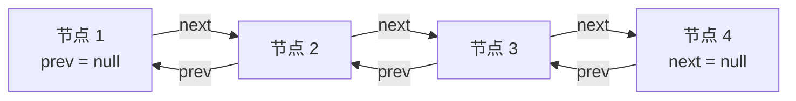

我经常被问到一个问题：都这个年代了，`std::list` 到底还有没有用？答案通常分成两派，一派说链表早就被缓存的现实淘汰了，另一派说头插和 splice 无可替代。我不想继续背结论，就在自己机器上写了一套微基准，把两个容器拉到一起正面打了一架。下面每个数字都是真跑出来的，完整代码和参考资料都附在文里。

## 先把内存模型说清楚

先看一张图，这是理解后面一切的前提：



`std::list` 是双向链表。每个元素都独立分配在堆上，节点之间靠 `prev` 和 `next` 两个指针串起来。这带来两个直接后果：

- **内存不连续**。第 $i$ 个元素和第 $i+1$ 个元素在地址空间里可能隔得很远。
- **没有随机访问**。不能写 `l[5]`，因为没有任何办法从头部一步跳到第 5 个节点。想找它，只能从 `begin()` 开始一个一个 `++` 过去。

打个比方。`std::vector` 像在一整排连续车位上停车，想找第 10 辆车，走过去就行；`std::list` 像把车停在城市里各个独立的停车场，每辆车上贴着两张便签，写着上一辆和下一辆在哪。想找第 10 辆，只能从第 1 辆开始，沿着便签一辆一辆跳过去。

这个"跳"的动作，就是后面所有性能故事的主角。

## 初始化

用法上和 `std::vector` 几乎长得一样，没有学习成本：

```cpp
#include <list>

std::list<int> l1;                        // 空链表
std::list<int> l2 = {1, 2, 3};            // 列表初始化
std::list<int> l3(l2);                    // 拷贝构造，O(N)
std::list<int> l4(5, 100);                // 5 个元素，全是 100
std::list<int> l5(l2.begin(), l2.end());  // 从迭代器区间构造
```

## 基准是怎么测的

一台机器、一个编译器、一套代码。环境如下：

- CPU：AMD Ryzen 7 PRO 6850U（Zen 3+，16 MB L3）
- 编译器：GCC 15.3.0，`-O2 -std=c++20`，`-Wall -Wextra` 无警告
- 系统：Linux
- 计时：`std::chrono::steady_clock` 的墙钟时间
- 内存：读取本进程的 `/proc/self/statm` 常驻集增量

为了不让读者只看到结论，完整源码如下。它是一套独立的微基准，可以直接编译运行复现：

```cpp
// list_vs_vector_benchmark.cpp
//
// Microbenchmarks for the operations that decide whether std::list or
// std::vector is the right container. Build with:
//
//   g++ -O2 -std=c++20 -o list_vs_vector_benchmark
//       list_vs_vector_benchmark.cpp
//
// Every timing is wall-clock milliseconds and, except for the traversal
// benchmark (best of 5), comes from a single run. Memory is the
// resident-set delta of this process, read from /proc/self/statm (Linux).

#include <algorithm>
#include <chrono>
#include <cstdint>
#include <fstream>
#include <iomanip>
#include <iostream>
#include <iterator>
#include <list>
#include <numeric>
#include <random>
#include <vector>

namespace {

using Clock = std::chrono::steady_clock;

constexpr int kTraverseN = 10'000'000;
constexpr int kMiddleN = 200'000;
constexpr int kMiddleInserts = 1'000;
constexpr int kFrontN = 100'000;
constexpr int kMoveN = 1'000'000;
constexpr int kSortN = 1'000'000;
constexpr int kRandomN = 1'000'000;
constexpr int kRandomInserts = 2'000;

// Accumulates loop results so the optimizer cannot delete the loops.
std::int64_t g_sink = 0;

// Wall-clock milliseconds between two time points.
double ElapsedMs(Clock::time_point start, Clock::time_point end) {
  return std::chrono::duration<double, std::milli>(end - start).count();
}

// Resident set size of this process, in KiB.
long ResidentKib() {
  std::ifstream statm("/proc/self/statm");
  long total_pages = 0;
  long resident_pages = 0;
  statm >> total_pages >> resident_pages;
  constexpr long kPageKib = 4;  // 4096-byte pages.
  return resident_pages * kPageKib;
}

// Sums a container `reps` times and returns the fastest run in milliseconds.
template <typename Container>
double FastestSumMs(const Container& container, int reps) {
  double best = 1e18;
  for (int i = 0; i < reps; ++i) {
    const auto start = Clock::now();
    std::int64_t sum = 0;
    for (const auto& value : container) sum += value;
    const auto end = Clock::now();
    g_sink += sum;
    best = std::min(best, ElapsedMs(start, end));
  }
  return best;
}

}  // namespace

int main() {
  std::mt19937_64 rng(1234);

  std::vector<int> data(kTraverseN);
  for (auto& value : data) value = static_cast<int>(rng() & 0xFFFF);
  const std::list<int> data_list(data.begin(), data.end());

  std::vector<int> values(kRandomN);
  for (auto& value : values) value = static_cast<int>(rng() & 0xFFFF);

  std::cout << std::fixed << std::setprecision(2);

  std::cout << "=== A. traverse / sum " << kTraverseN
            << " ints (best of 5) ===\n";
  std::cout << "vector: " << FastestSumMs(data, 5) << " ms\n";
  std::cout << "list:   " << FastestSumMs(data_list, 5) << " ms\n";

  std::cout << "\n=== B. insert " << kMiddleInserts
            << " at the middle, N = " << kMiddleN << " ===\n";
  {
    std::vector<int> v(kMiddleN, 1);
    const auto start = Clock::now();
    for (int i = 0; i < kMiddleInserts; ++i)
      v.insert(v.begin() + v.size() / 2, i);
    const auto end = Clock::now();
    std::cout << "vector: " << ElapsedMs(start, end) << " ms\n";
  }
  {
    std::list<int> l(kMiddleN, 1);
    auto mid = std::next(l.begin(), kMiddleN / 2);
    const auto start = Clock::now();
    for (int i = 0; i < kMiddleInserts; ++i) l.insert(mid, i);
    const auto end = Clock::now();
    std::cout << "list:   " << ElapsedMs(start, end) << " ms\n";
  }

  std::cout << "\n=== C. " << kFrontN << " front insertions ===\n";
  {
    std::vector<int> v;
    v.reserve(kFrontN);
    const auto start = Clock::now();
    for (int i = 0; i < kFrontN; ++i) v.insert(v.begin(), i);
    const auto end = Clock::now();
    std::cout << "vector insert(begin): " << ElapsedMs(start, end) << " ms\n";
  }
  {
    std::list<int> l;
    const auto start = Clock::now();
    for (int i = 0; i < kFrontN; ++i) l.push_front(i);
    const auto end = Clock::now();
    std::cout << "list   push_front:    " << ElapsedMs(start, end) << " ms\n";
  }

  std::cout << "\n=== D. move " << kMoveN
            << " ints into another container (us) ===\n";
  {
    std::vector<int> a(1000, 7);
    std::vector<int> b(kMoveN, 9);
    const auto start = Clock::now();
    a.insert(a.begin(), b.begin(), b.end());
    const auto end = Clock::now();
    std::cout << "vector insert(range): " << ElapsedMs(start, end) * 1000
              << " us\n";
  }
  {
    std::list<int> a(1000, 7);
    std::list<int> b(kMoveN, 9);
    const auto start = Clock::now();
    a.splice(a.begin(), b);
    const auto end = Clock::now();
    std::cout << "list   splice:        " << ElapsedMs(start, end) * 1000
              << " us (b.size()=" << b.size() << ")\n";
  }

  std::cout << "\n=== E. sort " << kSortN << " random ints ===\n";
  {
    std::vector<int> v(values);
    std::list<int> l(values.begin(), values.end());
    auto start = Clock::now();
    std::sort(v.begin(), v.end());
    auto end = Clock::now();
    std::cout << "vector std::sort: " << ElapsedMs(start, end) << " ms\n";
    start = Clock::now();
    l.sort();
    end = Clock::now();
    std::cout << "list   l.sort():  " << ElapsedMs(start, end) << " ms\n";
  }

  std::cout << "\n=== F. resident memory for " << kTraverseN
            << " ints (KiB) ===\n";
  {
    const long base = ResidentKib();
    {
      std::vector<int> big(kTraverseN);
      std::iota(big.begin(), big.end(), 0);
      std::cout << "vector: +" << ResidentKib() - base << "\n";
    }
    {
      std::list<int> big(kTraverseN);
      std::iota(big.begin(), big.end(), 0);
      std::cout << "list:   +" << ResidentKib() - base << "\n";
    }
  }

  std::cout << "\n=== G. insert " << kRandomInserts
            << " at random positions, N = " << kRandomN << " ===\n";
  {
    std::vector<int> v(values);
    std::uniform_int_distribution<int> dist(0, static_cast<int>(v.size()) - 1);
    const auto start = Clock::now();
    for (int i = 0; i < kRandomInserts; ++i) v.insert(v.begin() + dist(rng), i);
    const auto end = Clock::now();
    std::cout << "vector: " << ElapsedMs(start, end) << " ms\n";
  }
  {
    std::list<int> l(values.begin(), values.end());
    std::uniform_int_distribution<int> dist(0, kRandomN - 1);
    const auto start = Clock::now();
    for (int i = 0; i < kRandomInserts; ++i) {
      auto it = std::next(l.begin(), dist(rng));
      l.insert(it, i);
    }
    const auto end = Clock::now();
    std::cout << "list:   " << ElapsedMs(start, end) << " ms\n";
  }

  std::cout << "\n=== H. erase every even element, N = " << kRandomN
            << " ===\n";
  {
    std::vector<int> v(values);
    const auto start = Clock::now();
    v.erase(
        std::remove_if(v.begin(), v.end(), [](int x) { return (x & 1) == 0; }),
        v.end());
    const auto end = Clock::now();
    std::cout << "vector erase-remove: " << ElapsedMs(start, end)
              << " ms (size=" << v.size() << ")\n";
  }
  {
    std::list<int> l(values.begin(), values.end());
    const auto start = Clock::now();
    l.remove_if([](int x) { return (x & 1) == 0; });
    const auto end = Clock::now();
    std::cout << "list   remove_if:    " << ElapsedMs(start, end)
              << " ms (size=" << l.size() << ")\n";
  }

  std::cout << "\nchecksum: " << g_sink << "\n";
  return 0;
}
```

代码遵循 [Google C++ Style Guide](https://google.github.io/styleguide/cppguide.html)：2 空格缩进、`PascalCase` 函数名、`k` 前缀常量、`snake_case` 变量、80 列换行。基准里的累计和 `g_sink` 会在最后打印（`checksum: 3276322411190`），用来防止编译器把整个循环优化掉。

## 结果

下面是一次代表性运行的输出。整段程序跑了三遍，量级关系稳定；抖动最大的是 `list::sort` 和随机位置插入这两项，我会在对应小节注明。

|场景|`std::vector`|`std::list`|差距|
|:---|:---|:---|:---|
|A. 遍历求和 1000 万 `int`（best of 5）|2.53 ms|24.27 ms|vector 快 **9.6 倍**|
|B. 中间插入 1000 次（N = 20 万，已持迭代器）|5.17 ms|0.03 ms|list 快约 **170 倍**|
|C. 头部插入 10 万次|227.20 ms|2.87 ms|list 快约 **79 倍**|
|D. 搬运 100 万个元素|2309.66 µs|5.39 µs|list 快约 **429 倍**|
|E. 排序 100 万随机 `int`|45.13 ms|318.73 ms|vector 快约 **7.1 倍**|
|F. 常驻内存（1000 万 `int`）|+39,064 KiB|+294,340 KiB|list 多 **7.5 倍**|
|G. 随机位置插入 2000 次（N = 100 万，每次定位）|79.77 ms|2348.11 ms|vector 快约 **29 倍**|
|H. 删除全部偶数元素（N = 100 万）|2.86 ms|9.21 ms|vector 快约 **3.2 倍**|

有意思的地方全在这些数字的裂缝里，我们一个个看。

### A. 遍历：连续内存的碾压

```cpp
std::int64_t sum = 0;
for (const auto& value : container) sum += value;
```

1000 万个 `int`，`vector` 2.53 ms，`list` 24.27 ms，**9.6 倍**的差距。

原因很朴素。现代 CPU 从内存取数据不是一次取 4 字节，而是按 64 字节的 cache line 整块搬。`vector` 的数据挨在一起，拿一个 `int` 顺带把后面 15 个也塞进了缓存，后续访问全是缓存命中。`list` 每访问一个节点，都要从一个陌生的地址拉回一整条 cache line，却只用掉其中的 4 字节数据加两个指针。9.6 倍这个数字，基本就是"有用字节占总搬运字节的比例"的倒数。

### B. 中间插入：真相取决于你要不要先找到那个位置

这是全场最有教育意义的一组对比。

**情况一：已经手握迭代器，原地插入 1000 次。** `vector` 5.17 ms，`list` 0.03 ms，`list` 快了约 **170 倍**。因为 `list` 每次插入是纯指针操作，$O(1)$；而 `vector` 每插一次，位置后面的所有元素都得搬一次家。

**情况二：每次都要先从头定位再插入（见 G 节）。** 同样是在中间插 2000 个元素，`vector` 79.77 ms，`list` 冲到 **2348.11 ms**，反被 `vector` 快了约 **29 倍**。

同一个容器，同一个"在中间插入"的说法，结论直接反转。差别在于那一步定位：

- `list` 定位要 `std::next(l.begin(), i)`，这是一次纯粹的指针追逐，每跳一步都可能是一次 cache miss，$O(N)$ 且常数巨大。
- `vector` 定位就是 `v.begin() + i`，一次加法，然后 `memmove` 连续搬数据，虽然也是 $O(N)$，但常数小得多。

所以"list 中间插入快"这句话，条件是你要免费拿到那个迭代器。一旦定位成本算进来，`list` 经常连本带利亏回去。对小对象和连续内存密集的场景尤其如此，上面这组数字就是证据。

### C. 头插：list 这一次赢得很干脆

10 万次头插，`vector` 用了 227.20 ms，`list` 只用 2.87 ms，差了约 **79 倍**。

`vector` 根本没有 `push_front`，只能写 `v.insert(v.begin(), x)`。而每次往头部插一个元素，都要把后面所有元素整体往后挪一格。10 万次下来就是 $\sum_{i=1}^{100000} i \approx 5 \times 10^9$ 次移动，即 $O(N^2)$。

`list` 的 `push_front` 只是分配一个节点、改两个指针，是货真价实的 $O(1)$，总共 $O(N)$。

顺带说一句，需要频繁在两端增删时，`std::deque` 通常是比 `list` 更聪明的选择（它有 `push_front`，且内存连续性更好），不过这是另一篇文章的题了。

### D. splice：`std::vector` 根本做不到的事

`splice` 是 `list` 的杀手锏。它把一个链表的一段，直接"剪"下来"粘"到另一个链表上，**不拷贝任何数据，只改指针**。

```cpp
std::list<int> a(1000, 7);
std::list<int> b(1'000'000, 9);

// 把 b 的全部元素搬到 a 的头部，b 随后变空
a.splice(a.begin(), b);
```

100 万个元素，`vector` 用区间插入要 2309.66 µs（要逐个拷贝并整体后移），`list` 的 `splice` 只用 **5.39 µs**，约 **429 倍**的差距。更重要的是，这个差距会随元素数量线性扩大：`splice` 的复杂度是 $O(1)$，和搬多少元素无关。

`vector` 想完成同样的语义，只能拷贝加删除。这是量级上的差别，不是常数上的差别。如果某个设计里"把一段序列从一个容器挪到另一个容器"是核心操作，那这里基本就是 `list` 的专属地盘。

`splice` 的几个重载都值得记住：

```cpp
l1.splice(pos, l2);               // 把 l2 全部搬到 pos 前
l1.splice(pos, l2, it);           // 只搬 l2 中 it 指向的那个元素
l1.splice(pos, l2, first, last);  // 搬 l2 中 [first, last) 这一段
l1.splice(pos, l1, it);           // 同一条链内部重排，把 it 搬到 pos 前
```

### E. 排序：自带 `sort` 不代表更快

标准库的 `std::sort` 要求随机访问迭代器，`list` 用不了，所以它自带了一个 `l.sort()`（底层通常是自底向上的归并排序，稳定）。

100 万个随机 `int`：`vector` 的 `std::sort` 45.13 ms，`list::sort` 318.73 ms，`vector` 快了约 **7 倍**。这一项抖动比较大，我实测三次 `list::sort` 落在 318 到 376 ms 之间，`vector` 稳定在 44 到 45 ms，所以结论方向不变。

归并排序在链表上是 $O(N \log N)$ 次指针操作，理论上和数组版本同阶，但每一次指针跳转都是一次潜在的 cache miss。差距又回到了缓存。

> [!WARNING] 别对 list 用 std::sort
> 如果你不小心写了 `std::sort(l.begin(), l.end())`，这不是运行时报错，而是直接**编译失败**。GCC 15 的报错长这样：
>
> ```text
> error: no match for 'operator-'
> (operand types are 'std::_List_iterator<int>' and 'std::_List_iterator<int>')
> ```
>
> 因为 `std::sort` 内部要算区间中点，需要 `__last - __first`，而双向迭代器不支持减法。这个报错其实是在提醒你：排序请用成员函数 `l.sort()`。

### F. 内存：每个元素都在为两个指针付房租

1000 万个 `int`，`vector` 常驻内存增加 39,064 KiB（约 38 MiB，基本就是 $10^7 \times 4$ 字节），`list` 增加了 **294,340 KiB**（约 287 MiB），约 **7.5 倍**。

算一下账：`list` 每个节点的载荷只有 4 字节的 `int`，但节点结构里还有两个 8 字节指针，加上分配器的对齐和元数据，实测平均每个元素约 30 字节。也就是说，**数据本身只占了总内存的七分之一左右**，其余全花在了"怎么找到下一个"这件事上。

### G. 随机位置插入：定位成本会反杀

前面 B 节说 `list` 原地插入快 170 倍，这里补上定位成本。在 100 万元的容器里插 2000 个元素，每次都先从头走到随机位置：

- `vector`：`v.begin() + dist(rng)` 是常数时间定位，79.77 ms。
- `list`：`std::next(l.begin(), dist(rng))` 平均要走 50 万步，总计约 $2 \times 10^9$ 次指针跳转，**2348.11 ms**。

`vector` 反超约 **29 倍**。这一项也抖得厉害，三次实测 `list` 在 2348 到 2658 ms 之间，`vector` 稳定在 78 到 80 ms。结论依然是：没有现成迭代器时，别指望 `list` 的中间插入。

### H. 删除：erase-remove 也赢了 `remove_if`

删除 100 万个 `int` 里所有的偶数元素：`vector` 的 erase-remove 惯用法 2.86 ms，`list::remove_if` 9.21 ms，`vector` 快约 **3.2 倍**。

`list::remove_if` 是 $O(N)$ 的，每删一个节点还伴随一次释放（回到分配器，可能触发锁或合并不连续的块）。而 `vector` 的 erase-remove 是一次连续扫描加一次 `memmove` 收尾，对内存友好太多。

## 迭代器：这才是 list 真正难以替代的地方

前面全是性能，而 `list` 真正让它在某些设计里不可替代的，其实是迭代器的**稳定性**。

先说类型：`std::list` 提供的是**双向迭代器**（Bidirectional Iterator）。

- 支持：`++it`、`--it`、`*it`。
- 不支持：`it + 5`、`it < other_it`。不能跳，也不能比大小。

然后是最关键的一条，容器操作对已有迭代器的影响：

|操作|`std::vector`|`std::list`|
|:---|:---|:---|
|插入|可能扩容导致**全部**迭代器失效；中间插入使插入点之后的**全部**失效|**一个都不失效**|
|删除|删除点之后的全部失效|**只有**指向被删元素的那个失效|

用一个例子把它钉死：

```cpp
std::list<int> l = {1, 2, 3, 4, 5};
auto it = std::next(l.begin(), 2);  // 指向 3

l.push_front(0);
l.push_back(6);
l.remove(4);
// 以上操作之后 it 依然有效，依然指向 3
std::cout << *it << '\n';  // 输出 3
```

`std::vector` 做不到这一点。它在扩容时会重新分配整块内存并搬走所有元素，你手里的旧迭代器会指向一片已经被释放的内存，用它就是未定义行为。

这就引出 `list` 的一个经典用法：把迭代器当作稳定的"句柄"存起来，指回容器里的某个元素。

```cpp
using Bucket = std::list<std::pair<int, std::string>>;
using Handle = Bucket::iterator;

Bucket bucket;
std::unordered_map<int, Handle> index;

bucket.push_back({42, "answer"});
auto it = std::prev(bucket.end());
index[42] = it;  // 存下稳定句柄

// 之后无论往 bucket 里怎么插删，index[42] 指向的元素都还在
```

如果你需要这种"外部索引加稳定句柄"的结构，`std::list` 几乎是标准库里的唯一选择。

## list 独有的工具箱

因为无法随机访问，标准库的通用算法（`std::sort`、`std::lower_bound` 等）对 `list` 大多无效。作为补偿，`list` 自带了一整套成员函数，都针对链表结构优化过：

- `l.push_front(x)` / `l.pop_front()`：头部 $O(1)$ 增删（`vector` 没有）。
- `l.splice(...)`：$O(1)$ 搬家，见上文。
- `l.sort()`：$O(N \log N)$ 稳定排序。想按别的规则排就传比较器，例如 `l.sort([](int x, int y) { return x > y; });`
- `l.merge(other)`：合并两个**已经有序**的链表，稳定，且 `other` 会被搬空（同样是指针操作）。
- `l.remove(x)`：删除所有等于 `x` 的元素，$O(N)$。
- `l.remove_if(pred)`：删除所有满足条件的元素，$O(N)$。
- `l.unique()`：删除**相邻**的重复元素，$O(N)$。
- `l.reverse()`：原地逆置，$O(N)$，只是把所有 `next` 和 `prev` 指针互换一遍。

`unique` 需要特别留意"相邻"两个字：

```cpp
std::list<int> l = {1, 1, 2, 3, 3, 1, 1};
l.unique();  // {1, 2, 3, 1}，只去掉了相邻的重复
```

想去掉全部重复，得先 `l.sort()` 让相同的元素聚到一起再 `unique()`。这也是为什么对链表来说，`sort + unique` 是一个固定搭配。

## 那什么时候该用 list

综合上面所有数字，我的判断是：

- **95% 的情况用 `std::vector`。** 遍历快 9.6 倍，排序快 7 倍，省 7.5 倍内存，删除也更快。这些年我写过的代码里，`list` 的比例一直在往下走。
- **需要稳定迭代器 / 外部句柄时，用 `std::list`。** 这是它最硬的理由，前面那套"map 存迭代器"的结构就是典型。
- **核心操作是大段搬运（`splice`）时，用 `std::list`。** $O(1)$ 对 $O(N)$，这是量级的差距。
- **只有头部频繁增删时，先想想 `std::deque`。** 它也有 `push_front`，而且内存连续性比 `list` 好得多，`list` 在这个场景常常不是最优解。
- **"元素很大、拷贝很贵"这个理由，现在已经基本失效了。** C++11 之后有了移动语义，`vector` 搬元素往往只是搬一个指针。

顺便说一句：`list` 的中间插入快，前提是你**已经拿着迭代器**。要是每次还得从头 `std::next` 过去定位，G 节那组 29 倍的翻车数据就是下场。

## 补遗：更省内存的 `std::forward_list`

C++11 引入了 `std::forward_list`，单向链表。

- 只有一个 `next` 指针，没有 `prev`，所以每个节点比 `list` 少一个指针。
- 代价：只能向前遍历，是**前向迭代器**，连 `--it` 都不支持。
- 它没有 `size()`（想要长度得 `std::distance`，$O(N)$），增删也走 `insert_after` / `erase_after` 这种"后一个位置"的接口。
- 典型场景是极度在意内存的容器内部实现，比如 `std::unordered_map` 的桶，libstdc++ 就是用单向链表串起来的。

如果 `list` 的两个指针你都用不上，`forward_list` 能把每个节点的开销再砍掉一个指针。省内存的路上，永远还有下一个台阶。

## 写在最后

这组基准里最让我意外的一项，是 B 和 G 两个"中间插入"结论的反转。我原本以为 `list` 在中间插入上是无条件的赢家，结果一旦把定位成本算进去，`vector` 反杀了 29 倍。直觉和实测之间的这道裂缝，正是写基准的意义所在。

我猜未来这个天平还会继续往 `vector` 那一侧倾斜。因为缓存只会越来越重要，而链表的每一次指针跳转，都在和内存墙作对。`std::list` 不会消失，但它的生存空间会越来越集中在那几个 `vector` 真的做不到的角落：稳定的迭代器，和 $O(1)$ 的 `splice`。

想动手的话，可以试试把基准里元素类型从 `int` 换成 `std::string` 或者一个 64 字节的自定义结构体，看量级关系会不会变；再试试用 `std::deque` 替换 C 节的头插，看它和 `list` 到底谁更快。

## 参考资料

- [Google C++ Style Guide](https://google.github.io/styleguide/cppguide.html)，本文所有代码遵循的风格。
- [C++ Core Guidelines](https://isocpp.github.io/CppCoreGuidelines/CppCoreGuidelines)，其中 SL.con.2：Prefer using STL `vector` by default unless you have a reason to use a different container。
- [cppreference: std::list](https://en.cppreference.com/w/cpp/container/list)，接口、复杂度和迭代器失效规则。
- [cppreference: std::vector](https://en.cppreference.com/w/cpp/container/vector)，容量增长与迭代器失效规则。
- [Bjarne Stroustrup, "Are lists evil?"](https://www.stroustrup.com/bs_faq.html#list)，作者本人对 list 与 vector 之争的回应，结论是默认用连续存储。
- [libstdc++ `bits/stl_list.h`](https://github.com/gcc-mirror/gcc/blob/master/libstdc%2B%2B-v3/include/bits/stl_list.h)，节点布局与 `splice` 的实现。
