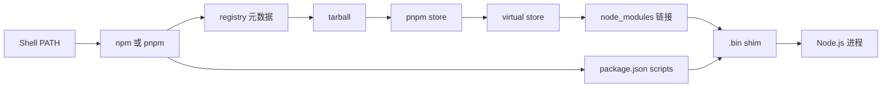

很多人第一次接触 Node.js 项目时，会把 Node.js、npm、pnpm、nvm 和 Corepack 当成一组相似的安装工具。它们其实处在不同层次。先把这些边界分清，再看依赖如何下载、文件如何落盘，遇到 `command not found` 或版本错误时就不会只能反复重装。

本文以 WSL2 中的 Ubuntu 22.04 LTS 为例。命令行提示符统一使用虚构的 `user@wsl`，路径中的用户名、主机名、硬件、IP、Windows 路径和日志路径均已省略，不要把示例输出中的路径当成自己的环境事实。

## npm、pnpm、Node.js 和 nvm 分别是什么

- **Node.js** 是 JavaScript 的运行时，负责执行 JavaScript 程序。
- **npm** 是 Node.js 生态的包管理器，通常随 Node.js 一起安装。它负责下载依赖、维护 `package.json` 和 `package-lock.json`，也能执行项目脚本。
- **pnpm** 是独立的 Node.js 包管理器。它与 npm 使用同一个 npm registry 生态，但命令、锁文件和 `node_modules` 的组织方式有所不同。
- **nvm** 是 Node.js 版本管理器，用来安装和切换 Node.js 版本。它不是包管理器，也不负责安装项目依赖。
- **Corepack** 是包管理器入口和版本准备工具。它可以根据项目声明准备指定版本的 pnpm 或 Yarn，但它不是 npm，也不负责安装项目依赖。

### npm 和 pnpm 怎么选

两者都能创建项目、安装依赖和执行脚本，但默认行为不同：

| 对比项 | npm | pnpm |
| --- | --- | --- |
| 通常来源 | 随 Node.js 发行版提供 | 独立安装或由 Corepack 准备 |
| 锁文件 | `package-lock.json` | `pnpm-lock.yaml` |
| 默认依赖布局 | 直接组织在项目 `node_modules` 中 | 共享 store，加 virtual store 和链接 |
| 磁盘复用 | 依赖具体版本和配置 | 共享内容寻址 store，通常更节省空间 |
| 依赖声明约束 | 相对宽松 | 链接布局更容易暴露未声明依赖 |
| 添加依赖 | `npm install <pkg>` | `pnpm add <pkg>` |

推荐规则很简单：**新项目优先考虑 pnpm，已有项目必须遵循项目声明。** 如果项目已经提交了 `package-lock.json`，通常使用 npm；如果项目已经提交了 `pnpm-lock.yaml`，就使用 pnpm。不要在同一个项目里交替执行 `npm install` 和 `pnpm install`，这样会产生两套锁文件和难以解释的依赖变化。

pnpm 并不是所有场景的唯一答案。只想快速开始一个小项目，或者参与明确要求 npm 的项目时，npm 更直接。选择的关键不是“哪个命令更酷”，而是项目是否有明确的包管理器契约，以及团队是否统一使用它。

## 在 WSL2 中准备 Node.js

进入 Ubuntu 后，可以先确认系统和 shell。以下输出只保留与教程有关的部分：

```bash
user@wsl:~$ uname -sr
Linux 6.x.x-microsoft-standard-WSL2
user@wsl:~$ bash --version | head -n 1
GNU bash, version 5.1.16
```

使用 nvm 安装 Node.js。安装远程脚本前应先阅读来源和内容，因为 `curl | bash` 会直接执行下载的脚本：

```bash
user@wsl:~$ curl -o- https://raw.githubusercontent.com/nvm-sh/nvm/v0.40.7/install.sh | bash
=> Downloading nvm from git to '$HOME/.nvm'
=> Appending nvm source string to '$HOME/.bashrc'
```

当前 shell 立即加载 nvm：

```bash
user@wsl:~$ . "$HOME/.nvm/nvm.sh"
user@wsl:~$ nvm install 24
Downloading and installing node v24.20.0...
Computing checksum with sha256sum
Checksums matched!
Now using node v24.20.0 (npm v11.19.0)
Creating default alias: default -> 24 (-> v24.20.0 *)
user@wsl:~$ node --version
v24.20.0
user@wsl:~$ npm --version
11.19.0
```

这里的 `npm` 已经随 Node.js 一起提供。此时可以使用 npm，但还没有因为安装 Node.js 就自动得到 pnpm。

## Corepack 到底做什么

Corepack 最容易被误解成“另一个包管理器”。更准确的分层是：

1. Node.js 执行 JavaScript。
2. npm 是一个包管理器，通常随 Node.js 分发。
3. pnpm 和 Yarn 是其他包管理器。
4. Corepack 为 pnpm、Yarn 等包管理器准备版本，并提供转发入口。

Corepack 解决的问题是：**应该运行哪个版本的包管理器**。它不解决：**项目应该安装哪些依赖**。后一个问题仍由 `pnpm install`、`pnpm add`、`npm install` 等命令负责。

### `corepack enable pnpm` 发生了什么

在提供 Corepack 的 Node.js 环境中执行：

```bash
user@wsl:~$ corepack --version
0.35.0
user@wsl:~$ corepack enable pnpm
user@wsl:~$ type -a pnpm
pnpm is .../bin/pnpm
```

`corepack enable pnpm` 通常会创建或启用一个名为 `pnpm` 的 shim。shim 不是完整的 pnpm，它更像一个转接头：用户执行 `pnpm` 时，shim 把请求交给 Corepack；Corepack 再准备合适版本的 pnpm 并转发参数。

因此第一次执行 `pnpm` 时，可能看到下载确认：

```bash
user@wsl:~$ pnpm --version
! Corepack is about to download https://registry.npmjs.org/pnpm/-/pnpm-11.24.0.tgz
? Do you want to continue? [Y/n] y
11.24.0
```

这次下载的是 **pnpm 自己**，不是项目依赖。确认下载后，Corepack 保存或复用这个包，之后继续把 `pnpm` 命令交给它执行。

### `packageManager` 和 Corepack 的关系

项目可以在 `package.json` 中写：

```json
"packageManager": "pnpm@11.22.0"
```

这个字段是项目声明，意思是“处理这个项目时使用 pnpm 11.22.0”。它不是依赖声明，也不会把 `pnpm` 写入项目的 `dependencies`。

如果项目的 `.npmrc` 还包含：

```ini
manage-package-manager-versions = true
```

那么 pnpm 可以根据 `packageManager` 字段参与包管理器版本管理。可以把两者理解为：

- `packageManager`：项目声明应该使用什么工具和版本。
- `manage-package-manager-versions`：pnpm 是否允许按这项声明管理工具版本。
- Corepack shim：让命令能够进入版本准备和转发流程。
- `pnpm install`：真正安装项目依赖。

检查四个版本时，命令和输出应分别理解：

```bash
user@wsl:~$ node --version
v24.20.0
user@wsl:~$ npm --version
11.19.0
user@wsl:~$ corepack --version
0.35.0
user@wsl:~$ pnpm --version
11.24.0
```

如果某个 Node.js 发行版没有提供 Corepack，`corepack` 命令可能不存在。这时应按照项目文档安装 pnpm，最后仍然用 `pnpm --version` 检查实际运行版本。全局安装 pnpm、Corepack 提供命令入口、`pnpm add` 安装项目依赖，是三个不同动作。

## 用隔离项目观察安装过程

不要为了学习包管理器直接修改重要项目。创建临时目录后，在其中安装几个形态不同的包：

```bash
user@wsl:~$ tmp_dir=$(mktemp -d)
user@wsl:~$ echo "$tmp_dir"
/tmp/tmp.xxxxxxxx
user@wsl:~$ cd "$tmp_dir"
user@wsl:/tmp/tmp.xxxxxxxx$ pnpm init
Wrote to /tmp/tmp.xxxxxxxx/package.json
user@wsl:/tmp/tmp.xxxxxxxx$ pnpm add lodash typescript sharp
Packages: +9
Progress: resolved 54, reused 0, downloaded 12, added 9, done

 dependencies:
+ lodash 4.18.1
+ sharp 0.35.4
+ typescript 7.0.2

Done in 6.5s using pnpm v11.24.0
```

这里的版本和下载数量会变化。重要的是动作：`pnpm init` 创建 `package.json`，`pnpm add` 修改依赖声明、解析依赖并创建安装目录。

查看生成的声明：

```bash
user@wsl:/tmp/tmp.xxxxxxxx$ cat package.json
{
  "name": "tmp-project",
  "version": "1.0.0",
  "packageManager": "pnpm@11.24.0",
  "type": "module",
  "dependencies": {
    "lodash": "^4.18.1",
    "sharp": "^0.35.4",
    "typescript": "^7.0.2"
  }
}
```

`pnpm init` 在不同版本中生成的字段可能不同。不要把临时项目的名字、版本或格式当成固定模板。

## 包不是语言

registry 发布的是带元数据的 tarball，而不是“一个 JavaScript 文件”。包中可以包含：

- JavaScript 或 TypeScript 源码
- WASM 文件
- 原生 `.node` 模块
- 预编译二进制
- CLI 入口
- 其他包的运行时或平台依赖

实验中的三个包分别说明了不同情况：

- `lodash` 主要作为可导入的 JavaScript API 使用。
- `typescript` 提供 API，也通过 `bin` 字段提供 `tsc` 命令。
- `sharp` 会根据操作系统和 CPU 解析平台相关实现，安装时可能出现 `@img/*` 等平台包。

查询 registry 元数据：

```bash
user@wsl:/tmp/tmp.xxxxxxxx$ pnpm view lodash dist.tarball
https://registry.npmjs.org/lodash/-/lodash-4.18.1.tgz
user@wsl:/tmp/tmp.xxxxxxxx$ pnpm view typescript bin --json
{
  "tsc": "bin/tsc"
}
```

`bin` 字段表示包声明了命令入口。安装后，包管理器会在项目中创建 `node_modules/.bin/tsc` 的链接或 shim：

```bash
user@wsl:/tmp/tmp.xxxxxxxx$ pnpm exec tsc --version
Version 7.0.2
```

`tsc` 不是 shell 自带命令，也不是独立安装的系统程序。它来自 TypeScript 包的 `bin` 声明，最终由 Node.js 执行。判断一个包能做什么，应查看它的 `exports`、`main`、`bin`、平台依赖和安装脚本，而不是只看包名。

## 一次安装改变了哪些东西

可以把项目依赖分成三层：

1. **声明层**：`package.json` 中的 `dependencies` 和 `devDependencies`。
2. **解析层**：lockfile 中的实际版本、间接依赖、peer dependency 和完整性信息。
3. **落盘层**：store、virtual store、`node_modules` 链接和 `.bin` 入口。

运行 `pnpm add lodash` 时，大致发生四步：

1. 读取项目边界和 registry 配置。
2. 查询包元数据，按照 semver 范围选择版本并写入 lockfile。
3. 下载 tarball，校验后写入内容寻址 store。
4. 在项目中创建依赖链接和命令入口。

用命令查看这些层：

```bash
user@wsl:/tmp/tmp.xxxxxxxx$ pnpm root
/tmp/tmp.xxxxxxxx/node_modules
user@wsl:/tmp/tmp.xxxxxxxx$ pnpm store path
<home-directory>/.local/share/pnpm/store/v11
user@wsl:/tmp/tmp.xxxxxxxx$ realpath node_modules/lodash
/tmp/tmp.xxxxxxxx/node_modules/.pnpm/lodash@4.18.1/node_modules/lodash
user@wsl:/tmp/tmp.xxxxxxxx$ pnpm why sharp
sharp@0.35.4
└── tmp-project@1.0.0 (dependencies)
```

pnpm 的 store 像共享零件仓，`node_modules/.pnpm` 像当前项目的装配区，顶层 `node_modules/lodash` 是给 Node.js 看的入口。多个项目可以复用 store，但项目自己的 `package.json`、lockfile、链接和 peer 组合仍然独立。

npm 的目标相同，但默认的依赖布局不同。应用代码应依赖包公开的 `exports` 或 `main`，不要依赖某个包管理器偶然生成的内部路径。

`^1.2.3` 是版本范围，不是唯一版本。它允许一定范围内的更新；lockfile 则记录这次实际选择的版本。`pnpm install --frozen-lockfile` 会拒绝在安装时偷偷修改 lockfile，适合 CI 和新机器：

```bash
user@wsl:/path/to/project$ pnpm install --frozen-lockfile
Lockfile is up to date, resolution step is skipped
Already up to date
```

npm 项目通常使用 `npm ci` 达到类似的“按已有锁文件安装”效果。`pnpm install` 和 `pnpm update` 也不是一回事：前者按当前声明安装，后者主动寻找允许范围内的新版本。

## 命令为什么能运行

普通 shell 通过 `PATH` 查找命令：

```bash
user@wsl:/tmp/tmp.xxxxxxxx$ command -v node
<node-installation>/bin/node
user@wsl:/tmp/tmp.xxxxxxxx$ type -a pnpm
pnpm is <node-installation>/bin/pnpm
```

执行项目脚本时，npm 和 pnpm 会临时把项目的 `node_modules/.bin` 放到脚本环境的 PATH 前面。因此，安装 TypeScript 后可以在 `package.json` 中定义：

```json
"scripts": {
  "type-check": "tsc --version"
}
```

普通 shell 不会自动注入这层 PATH。可以通过以下两种入口明确执行同一个本地 `tsc`：

```bash
user@wsl:/path/to/project$ pnpm exec tsc --version
Version 7.0.2
user@wsl:/path/to/project$ node_modules/.bin/tsc --version
Version 7.0.2
```

四种常见入口可以这样区分：

1. `node src/index.mjs`：Node.js 直接运行文件。
2. `pnpm exec tsc --version`：从当前项目依赖中寻找并运行 `tsc`。
3. `pnpm run dev`：读取 `package.json` 的 `scripts`，并注入本地 `.bin` PATH。
4. 脚本启动 Node.js、shell 或其他子进程：子进程继承脚本环境。

`pnpm dlx`、`npx` 和 `npm exec` 适合临时获取并执行 CLI，不会自动把它变成项目依赖。需要可复现的工具，应写入 `dependencies` 或 `devDependencies`，再通过 `scripts` 或 `pnpm exec` 使用。

## registry、换源和网络故障

registry 是提供包元数据和 tarball 的 HTTP 服务。它可以是 npm 默认 registry、第三方镜像、公司私有 registry 或代理缓存。切换 registry 只改变查询和下载的来源，不改变项目依赖目录，也不会自动修复错误的版本范围。

先检查当前配置：

```bash
user@wsl:/tmp/tmp.xxxxxxxx$ pnpm config get registry
https://registry.npmjs.org/
user@wsl:/tmp/tmp.xxxxxxxx$ npm config get registry
https://registry.npmjs.org/
```

只验证一次时，使用命令行参数，不改变配置文件：

```bash
user@wsl:/tmp/tmp.xxxxxxxx$ pnpm view lodash version --registry=https://registry.npmjs.org/
4.18.1
```

项目级 `.npmrc` 适合项目配置，用户级配置适合个人默认值。认证信息不要写死在仓库中：

```ini
//registry.example.invalid/:_authToken=${NPM_TOKEN}
```

遇到 `ERR_PNPM_NO_MATCHING_VERSION`，先检查包名、registry 和可用版本，再检查 semver、lockfile 和平台限制。遇到网络超时或证书错误，依次检查 registry、DNS、代理、系统时间和 CA。不要把清空整个缓存当成万能修复。

## audit 与生命周期脚本

`audit` 会把依赖树中的包名和版本与已知漏洞公告进行匹配。它不审查业务代码，也不能证明没有报告的包绝对安全：

```bash
user@wsl:/tmp/tmp.xxxxxxxx$ pnpm audit
No known vulnerabilities found
user@wsl:/tmp/tmp.xxxxxxxx$ pnpm audit --prod
No known vulnerabilities found
```

安装依赖本身也可能执行代码。`preinstall`、`install`、`postinstall` 和 `prepare` 可能编译 native addon、下载平台产物、生成代码，甚至执行任意脚本。安装前应审查包来源和生命周期脚本，不要把关闭安全检查作为第一步修复。

如果项目的 `package.json` 声明了 `devEngines.packageManager`，却使用了错误的包管理器，npm 可能报：

```text
npm error code EBADDEVENGINES
npm error Invalid name "pnpm" does not match "npm"
```

这表示当前 npm 不符合项目要求，不是一次漏洞扫描结果。正确做法是切换到项目声明的 pnpm，而不是删除检查或绕过它。

## 从零建立可迁移环境

新机器可以按以下顺序操作：

1. 在 WSL2 中准备 Ubuntu 和 shell。
2. 使用 nvm 安装满足项目 `engines` 的 Node.js。
3. 检查 `node --version` 和 `npm --version`。
4. 启用或安装项目规定的 pnpm，并检查 `corepack --version` 和 `pnpm --version`。
5. 进入项目根目录，执行 `pnpm install --frozen-lockfile`。
6. 按项目文档执行开发、检查、构建和预览命令。

最小排错表：

| 症状 | 先查什么 | 最小修复 | 如何确认 |
| --- | --- | --- | --- |
| `command not found` | `command -v pnpm`、`echo $PATH` | 修正 PATH 或 Corepack 入口 | `pnpm --version` |
| `ERR_PNPM_NO_MATCHING_VERSION` | 包名、registry、可用版本 | 修正版本范围或 registry | `pnpm view <pkg> versions` |
| registry 超时或证书错误 | registry、代理、系统时间 | 修正源、DNS、代理或 CA | 单次 `pnpm view` 成功 |
| lockfile 不同步 | `git diff package.json pnpm-lock.yaml` | 使用正确管理器更新锁文件 | `pnpm install --frozen-lockfile` |
| Node 不满足 engines | `node --version` | 切换 Node.js 版本 | 版本满足 `engines` |
| native 模块安装失败 | `pnpm why <pkg>`、平台包和安装日志 | 修复平台依赖或编译链 | 实际导入模块 |
| 脚本找不到本地 CLI | `pnpm exec <cmd>`、脚本 PATH | 使用项目脚本或 `pnpm exec` | `<cmd> --version` |
| `EBADDEVENGINES` | `packageManager`、当前包管理器 | 使用项目声明的管理器 | `pnpm --version` |

整条路径可以概括为：



真正值得记住的不是一串安装咒语，而是这条边界链：包从哪个 registry 来，版本解析记录在哪里，文件落在哪一层，命令由哪个入口转给哪个 Node.js。顺着这条链排查，npm 和 pnpm 的差异就会变成可以观察和验证的实现选择。

## 参考资料

- [npm package.json 文档](https://docs.npmjs.com/cli/v11/configuring-npm/package-json)
- [npm scripts 文档](https://docs.npmjs.com/cli/v11/using-npm/scripts)
- [npm audit 文档](https://docs.npmjs.com/auditing-package-dependencies-for-security-vulnerabilities)
- [pnpm add 文档](https://pnpm.io/cli/add)
- [pnpm package.json 文档](https://pnpm.io/package_json)
- [pnpm store 文档](https://pnpm.io/cli/store)
- [pnpm Node-Modules 设置](https://pnpm.io/settings/node-modules)
- [Node.js Corepack 文档](https://nodejs.org/api/corepack.html)
- [Node.js npm 入门指南](https://nodejs.org/en/learn/getting-started/an-introduction-to-the-npm-package-manager)
