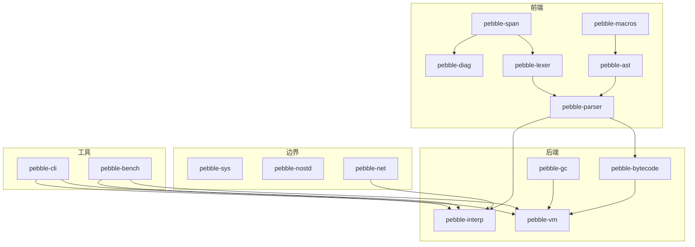

前三篇把语言本身讲完了。最后一篇讲一个更实际、也更容易被教程跳过的问题：**代码该往哪放，`use` 后面那一串路径是从哪来的。**

先从三个经常被混用的词开始，因为它们决定了后面所有的目录结构。

## package、crate、module

- **package（包）**：一个带 `Cargo.toml` 的目录。它有一个名字、一个版本，是 Cargo 能发布的最小单位。
- **crate**：一次编译单元。一个 package 最多含**一个库 crate**（`src/lib.rs`）和**任意多个二进制 crate**（`src/main.rs` 或 `src/bin/*.rs`）。
- **module（模块）**：crate **内部**的组织单位，用 `mod` 声明、用 `use` 引用。

一句话记：**package 装着 crate，crate 里装着 module。** 说"我有 16 个 crate"时，严格讲是"16 个 package，每个导出一个库 crate，其中一个是二进制"。

## 工作区：一个仓库，16 个包

单包项目里，`Cargo.toml` 在根目录、源码在 `src/`，就完事了。Pebble 不是单包：它把每个关注点拆成一个独立的包，用一个**workspace（工作区）**串起来。根目录的 `Cargo.toml` 是"虚拟清单"，它自己不产出任何东西，只负责管理成员：

```toml
[workspace]
resolver = "3"
members = ["crates/*"]

[workspace.package]
version = "0.1.0"
edition = "2024"
rust-version = "1.88"
license = "MIT OR Apache-2.0"
repository = "https://github.com/bfmhno3/pebble"
# ...
```

`members = ["crates/*"]` 是个 glob：`crates/` 下面每个目录，只要里面有 `Cargo.toml`，就是工作区成员。加新包不用改根清单，建目录就行。

`[workspace.package]` 里的字段是**共享元数据**。成员包通过 `version.workspace = true` 继承，于是"改版本号"只改一处：

```toml
[package]
name = "pebble-span"
version.workspace = true
edition.workspace = true
rust-version.workspace = true
license.workspace = true
repository.workspace = true
```

## 依赖也在工作区统一声明

`[workspace.dependencies]` 是让大型工作区保持一致的另一个机制。根清单里写一次：

```toml
[workspace.dependencies]
pebble-span = { path = "crates/pebble-span", version = "0.1.0" }
tokio = { version = "1", features = ["rt-multi-thread", "net", "io-util", "macros", "sync", "time", "signal"] }
clap = { version = "4", features = ["derive", "wrap_help"] }
```

成员包要用，就写 `tokio.workspace = true`。好处有两个：**版本只在一处**（不会出现 A 用 tokio 1.50、B 用 1.53 的情况），**feature 也只在一处**。`pebble-net` 的清单因此非常短：

```toml
[dependencies]
pebble-span.workspace = true
pebble-diag.workspace = true
pebble-parser.workspace = true
pebble-value.workspace = true
pebble-interp.workspace = true
tokio.workspace = true
```

内部包之间的依赖也走这里，只不过带 `path = "crates/..."`：这就是"本地包互相引用"的写法，不走网络。

顺便说一句：我写完第一版后扫了一遍，发现工作区里声明了 `thiserror`、`serde`、`serde_json`、`itertools`、`once_cell`、`smallvec`、`async-trait`、`futures`、`bytes` 九个依赖，**没有一个被真正 `use`**。删掉之后 `Cargo.lock` 少了 66 行。声明了不用是负债，删掉比留着强。

## 四种 crate 清单

不同角色的包，`Cargo.toml` 长得不一样。四种都在 Pebble 里。

**普通库**（`pebble-span`）：只有 `[dependencies]`，甚至可以完全没有。

**过程宏库**（`pebble-macros`）：必须声明自己是 proc-macro，否则编译器不收：

```toml
[lib]
proc-macro = true

[dependencies]
proc-macro2.workspace = true
quote.workspace = true
syn.workspace = true
```

**二进制**（`pebble-cli`）：显式给出 `[[bin]]`，并带 `dev-dependencies`（只有测试和示例用的依赖，不会进最终产物）：

```toml
[[bin]]
name = "pebble"
path = "src/main.rs"

[dependencies]
clap.workspace = true
# ...

[dev-dependencies]
assert_cmd = "2"
predicates = "3"
```

**基准**（`pebble-bench`）：`[[bench]]` 加 `harness = false`（因为 Criterion 自己就是驱动），并且标记不发布：

```toml
publish = false

[[bench]]
name = "backends"
harness = false

[dev-dependencies]
criterion.workspace = true
```

还有一类依赖叫 **build-dependencies**，只有编译脚本 `build.rs` 能用。`pebble-sys` 用它来编译 C：

```toml
[build-dependencies]
cc.workspace = true
```

## 模块：文件就是模块

一个 crate 是一棵模块树。树根是 `src/lib.rs`（或 `src/main.rs`），用 `mod` 声明子模块。子模块可以是内联的，也可以是**另一个文件**。

`pebble-cli` 有五个源文件，`main.rs` 开头就是树的声明：

```rust
mod cli;
mod commands;
mod repl;
mod sources;

use crate::cli::{Cli, Command};
```

`mod cli;` 的意思是"去找 `src/cli.rs`（或 `src/cli/mod.rs`），把它作为这个 crate 里一个叫 `cli` 的模块"。**不用在别处注册**，编译器按文件名找。文件的目录结构就是模块的层级结构。

真正跨 crate 可见与否，由 `pub` 控制：`mod cli;` 是**私有**模块，只有本 crate 能访问。`pebble-gc` 和 `pebble-nostd` 里有 `pub mod`，因为它们的子模块是要给外面用的：

```rust
// crates/pebble-nostd/src/lib.rs
pub mod bump;
pub mod eval;
```

引用路径有四种前缀，记住这个就不迷路了：

| 前缀 | 含义 |
| --- | --- |
| `crate::` | 从**本 crate 的根**开始 |
| `super::` | 上一层模块 |
| `self::` | 当前模块（显式写出来时） |
| `pebble_span::` | 另一个 crate（包名，横杠变下划线） |

还有个很常用的动作叫**再导出**，用 `pub use`：

```rust
// crates/pebble-ast/src/lib.rs
pub use pebble_span::{Span, Spanned};
```

`Span` 明明定义在 `pebble-span` 里，这行之后 `pebble_ast::Span` 也能用。这样依赖 `pebble-ast` 的人不必知道 `Span` 的"老家"在哪。再导出让 crate 的公开接口更收拢，是 Rust 里很受欢迎的工程手法。

## `Cargo.lock` 该不该提交

**该，对这个项目而言。** 区别很简单：

- 你写的是**应用**（有 `main`、要部署）：提交 `Cargo.lock`，保证所有人构建出一模一样的依赖树。
- 你写的是给别人用的**库**：通常不提交，让下游自己解析版本。

Pebble 是工作区，里面有二进制（`pebble`），所以 `Cargo.lock` 进了版本库。它还标记成了 `linguist-generated`，避免在 diff 里制造噪音。

## `build.rs`：编译期跑的一段 Rust

`pebble-sys` 目录下有个 `build.rs`，它在**编译这个包之前**被 Cargo 运行一次。它的活是把 C 文件编译成静态库：

```rust
// build.rs 里的大意
cc::Build::new()
    .file("csrc/pebble_shim.c")
    .include("csrc/include")
    .compile("pebble_shim");
```

`cc` 这个包帮忙找到系统 C 编译器、拼出正确的参数。`build.rs` 是 FFI 项目的标配，也是嵌入选型（比如把版本号写进代码）常用的手段。

## 工具链与格式：把环境钉死

Rust 项目往仓库里放几个小配置文件，能把"在我机器上能跑"变成"在谁机器上都能跑"：

| 文件 | 作用 |
| --- | --- |
| `rust-toolchain.toml` | 声明需要的工具链版本与组件（rustfmt、clippy） |
| `rustfmt.toml` | 代码格式规则，例如 `max_width = 100` |
| `clippy.toml` | lint 配置，例如最低支持版本 `msrv` |
| `flake.nix` | 一条 `nix develop` 就拿到固定版本的整套工具 |
| `.github/workflows/ci.yml` | push 时自动跑 fmt / clippy / test / build |

还有个容易忽略的地方：`[workspace.lints]`。工作区级 lint 规则写一次，成员包用 `[lints] workspace = true` 继承：

```toml
[workspace.lints.rust]
rust_2018_idioms = "warn"
unsafe_op_in_unsafe_fn = "warn"

[workspace.lints.clippy]
all = "warn"
```

于是 CI 上跑 `cargo clippy -- -D warnings`，"所有警告都当错误"，全仓库统一标准。

## 看一眼真实的依赖图

Cargo 自带一个命令能把依赖树打出来。看最大的那个包 `pebble-cli`：

```text
$ cargo tree -p pebble-cli --depth 1
pebble-cli v0.1.0
├── anyhow v1.0.104
├── clap v4.6.7
├── pebble-ast v0.1.0
├── pebble-bytecode v0.1.0
├── pebble-diag v0.1.0
├── pebble-interp v0.1.0
├── pebble-lexer v0.1.0
├── pebble-parser v0.1.0
├── pebble-span v0.1.0
├── pebble-value v0.1.0
├── pebble-vm v0.1.0
└── rustyline v18.0.1
[dev-dependencies]
├── assert_cmd v2.2.2
└── predicates v3.1.4
```

CLI 是唯一"认识所有人"的包，这也符合它的角色：它就是把所有零件缝起来的那双手。整个工作区分成四层：



顺带解释一个工程上的选择：**为什么拆这么多包，而不是一个大 crate？** 因为拆包会**限制可见性**。`pebble-span` 里的"私有"东西真的只有它能碰，别的包无论怎么 `use` 都够不着。它还把编译变成增量的：改 `pebble-vm` 不会重编 `pebble-lexer`。代价是包之间的接口要显式写清楚。对一个想让人读懂的教学项目，这个代价是值得的。

## 常用的 `cargo` 命令

| 命令 | 作用 |
| --- | --- |
| `cargo build` | 编译（debug） |
| `cargo build --release` | 编译（优化） |
| `cargo run -p pebble-cli -- run file.pebble` | 跑指定包的二进制，`--` 后面是它的参数 |
| `cargo test --workspace` | 跑所有测试 |
| `cargo test -p pebble-span` | 只跑一个包 |
| `cargo clippy -- -D warnings` | lint，警告当错误 |
| `cargo fmt --all` | 格式化 |
| `cargo bench -p pebble-bench` | 跑基准 |
| `cargo doc --open` | 生成并打开文档 |
| `cargo tree -p X` | 看依赖树 |
| `cargo add serde` | 加依赖（自动选版本） |

## 怎么再加一个 crate

假设要给 Pebble 加一个 `pebble-fmt`（代码格式化器）：

1. `mkdir -p crates/pebble-fmt/src`
2. 写 `crates/pebble-fmt/Cargo.toml`：`[package]` 用 `workspace = true` 继承，`[dependencies]` 写 `pebble-ast.workspace = true`，末尾加 `[lints] workspace = true`
3. 写 `crates/pebble-fmt/src/lib.rs`，开头一句文档注释
4. 如果别的包要用它，在根 `Cargo.toml` 的 `[workspace.dependencies]` 加一行 `pebble-fmt = { path = "crates/pebble-fmt", version = "0.1.0" }`
5. `cargo build --workspace`，搞定（`members = ["crates/*"]` 自动收编）

## 基础篇结束，接下来怎么读

到这里，读 Rust 代码需要的基础齐了：

1. **语法**：变量、类型、函数、struct/enum、match、trait、模块的写法。
2. **标准库**：字符串、集合、智能指针、`Option`/`Result`、迭代器、格式化、并发。
3. **所有权**：移动、借用、生命周期，以及遇到借用检查器时怎么重构。
4. **项目组织**：Cargo、工作区、模块系统、依赖与工具链配置。

现在可以进实现篇了。它的 11 篇按数据流走：位置与诊断 → 词法器 → AST 与宏 → 解析器 → 树遍历解释器 → 字节码编译器 → 垃圾回收器 → 虚拟机 → 边界（async/FFI/no_std）→ CLI 与工程化。每篇都会用到这一篇里的东西：看到的每个 `crate::` 都是上面的模块树，每个 `Rc<RefCell<..>>` 都是"借用检查器搞不定、于是请运行时帮忙"。

如果现在让你直接读 `pebble-span` 和 `pebble-lexer` 的源码，应该已经能读懂大半了。读不懂的地方，欢迎在评论区指出，我再回来补。
