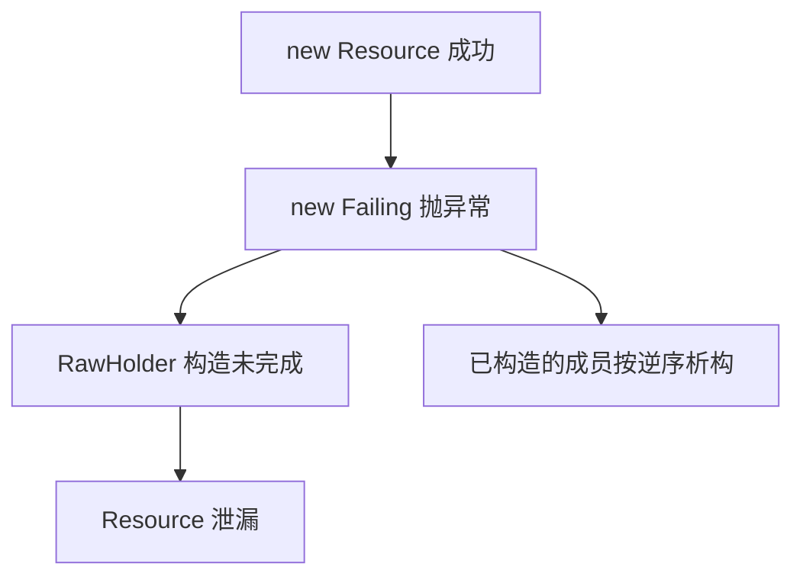

> "RAII 不是'自动释放'，而是'让资源的生命周期等于一个作用域'。"

RAII 是我在 C++ 里用得最多、却解释得最少的机制。每天都写 `std::unique_ptr`、`std::lock_guard`、`std::vector`，但要说清楚"析构函数凭什么一定会被调用""它到底有没有性能开销"，我以前只有直觉，没有证据。

所以这次我不先讲概念，先做实验。所有代码都在同一台机器上编译运行：GCC 15.3.0、binutils 2.46、Linux 6.18、x86-64。代码统一按 Google C++ Style 排版（2 空格缩进、80 列、成员变量尾随下划线），下面贴的每一段都真的编译过。

我本来想用 valgrind 和 perf，这台机器上都没有，于是用 `-fsanitize=address` 和 `std::chrono::steady_clock` 顶上。为了数清楚"泄漏了几个对象"，我还替换了全局的 `operator new` / `operator delete`，这个技巧后面单独讲。

## 一个函数，四处清理

先看一段很普通的代码。它打开一个文件、分配一块缓冲区，中途有两条失败路径：

```cpp
// Four exit paths, one of them forgets std::free().
bool ProcessManual(const char* path) {
  std::FILE* f = std::fopen(path, "rb");
  if (!f) return false;

  char* buf = static_cast<char*>(std::malloc(1024));
  if (!buf) {
    std::fclose(f);
    return false;
  }

  buf[0] = '\0';
  if (!Consume(buf)) {
    std::fclose(f);  // Leaks buf.
    return false;
  }

  std::free(buf);
  std::fclose(f);
  return true;
}
```

`ProcessManual` 里一共写了 4 处清理：3 次 `fclose`、1 次 `free`。其中第二条失败路径漏掉了一次 `free`，泄漏 1024 字节。

我拿 `grep -oE` 数了一下，手工版本 4 处清理，RAII 版本：

```cpp
struct FileCloser {
  void operator()(std::FILE* f) const {
    if (f) {
      std::fclose(f);
    }
  }
};

using FilePtr = std::unique_ptr<std::FILE, FileCloser>;

bool ProcessRaii(const char* path) {
  FilePtr f(std::fopen(path, "rb"));
  if (!f) return false;

  auto buf = std::make_unique<char[]>(1024);
  buf[0] = '\0';
  if (!Consume(buf.get())) return false;

  return true;
}
```

0 处。

这就是 RAII 的全部卖点：清理动作不在函数体里，而在对象的生命周期里。函数怎么退出都行，只要对象死掉，资源就跟着死。

顺便说一句，我本来想让编译器直接抓出那个泄漏：

```bash
$ g++ -std=c++23 -fanalyzer -c analyzer_probe.cpp
analyzer_probe.cpp: In function 'void ObviousLeak()':
analyzer_probe.cpp:3:33: warning: ignoring return value of 'void* malloc(size_t)'
    declared with attribute 'warn_unused_result' [-Wunused-result]
    3 | void ObviousLeak() { std::malloc(4096); }
      |                      ~~~~~~~~~~~^~~~~~
```

GCC 15.3 对它一言不发。这段代码里 `malloc` 的返回值直接丢掉，是一次无条件的泄漏，但 `-fanalyzer` 只抱怨了"返回值没人用"，没有报 `-Wanalyzer-malloc-leak`。所以静态分析这条路我放弃了，改用运行时自己数：每个 `operator new` 加一，每个 `operator delete` 减一。

## 我把"泄漏"变成了一个可以数的数字

替换全局分配函数是 C++ 里少有的、不需要任何插桩框架就能做到的观测手段：

```cpp
namespace {

long g_new_count = 0;
long g_delete_count = 0;
// Keeps the allocation observable, so the compiler cannot elide it.
volatile void* g_escape = nullptr;

void* CountAlloc(std::size_t n) {
  ++g_new_count;
  if (void* p = std::malloc(n)) return p;
  throw std::bad_alloc();
}

}  // namespace

void* operator new(std::size_t n) { return CountAlloc(n); }
void* operator new[](std::size_t n) { return CountAlloc(n); }

void operator delete(void* p) noexcept {
  if (p) {
    ++g_delete_count;
    std::free(p);
  }
}

void operator delete[](void* p) noexcept {
  if (p) {
    ++g_delete_count;
    std::free(p);
  }
}

void operator delete(void* p, std::size_t) noexcept { operator delete(p); }

void operator delete[](void* p, std::size_t) noexcept {
  operator delete[](p);
}
```

注意最后两行：C++14 之后编译器会优先调用带 `size_t` 的 sized deallocation。如果只替换不带 size 的版本，计数会漏掉一半，这个坑我踩过一次。

然后写六个场景，每个都让构造函数或后续调用抛异常：

| 场景 | new | delete | 泄漏对象 |
|:---|:---:|:---:|:---:|
| 手工清理，构造函数抛异常 | 2 | 1 | **1** |
| RAII，构造函数抛异常 | 2 | 2 | **0** |
| 裸指针成员，构造函数抛异常 | 2 | 1 | **1** |
| RAII 成员，构造函数抛异常 | 2 | 2 | **0** |
| 手工清理，后续调用失败 | 1 | 0 | **1** |
| RAII，后续调用失败 | 1 | 1 | **0** |

> [!WARNING] 这张表是在 `-O0` 下跑出来的
> 我一开始用 `-O2` 编译同一份代码，得到的是另一张表。GCC 会把一对不逃逸的 `new` / `delete` 直接优化掉。手工清理那一行的第一个 `new` 就是这么消失的，泄漏数从 1 变成了"看起来没泄漏"。写这篇文章的第一次汇编实验我也栽在这里：两个循环的 `operator new` 全被消除了，我一度以为编译器把整个循环优化成了闭式求和，确实如此，但那不是我要测的东西。

顺带一提，这个计数器的实现方式也解释了"为什么 C++ 里泄漏难查"：分配和释放是两个独立的函数调用，中间隔着任意长的控制流。RAII 做的事情，就是把这两个调用在**同一个作用域**里绑定起来。

## 构造函数抛异常时，析构函数不会运行

上表里最反直觉的是第二行和第三行的对比。它们看起来几乎一样，结果却不同：

```cpp
struct Boom {};

struct Resource {
  char pad[64];
};

struct Failing {
  Failing() { throw Boom{}; }
};

class RawHolder {
 public:
  RawHolder() : resource_(new Resource), failing_(new Failing) {}
  ~RawHolder() {
    delete failing_;
    delete resource_;
  }

 private:
  Resource* resource_;
  Failing* failing_;
};
```

`new Failing` 抛出异常时，`RawHolder` 这个对象从来没被构造完成，所以 `~RawHolder` **不会执行**。`resource_` 指向的那个 `Resource` 对象就此失联。



注意图里那条分支：**已经构造完成的成员**会被销毁。这正是 `std::unique_ptr` 成员版本安全的原因：`resource_` 这个 `unique_ptr` 本身已经构造完成了，栈展开会调用它的析构函数，顺手把 `Resource` 也删掉。

所以在构造函数里管理多个资源时，正确写法不是"在构造函数末尾兜底"，而是让每个资源各自拥有一个已经构造完成的所有者：

```cpp
class RaiiHolder {
 public:
  RaiiHolder()
      : resource_(std::make_unique<Resource>()),
        failing_(std::make_unique<Failing>()) {}

 private:
  std::unique_ptr<Resource> resource_;
  std::unique_ptr<Failing> failing_;
};
```

不需要写析构函数，也不需要 `try` / `catch`。这条规则和"构造函数里不要写裸露的 `delete`"是同一件事的两种说法。

## 销毁顺序是确定的，不是随机的

运行下面这几个类，把构造和析构都打印出来：

```cpp
class Tracer {
 public:
  explicit Tracer(const char* name) : name_(name) {
    std::printf("  ctor  %s\n", name_);
  }
  ~Tracer() { std::printf("  dtor  %s\n", name_); }

 private:
  const char* name_;
};

struct Base {
  Tracer tracer{"Base"};
};

struct MemberA {
  Tracer tracer{"member a (declared 1st)"};
};

struct MemberB {
  Tracer tracer{"member b (declared 2nd)"};
};

class Derived : public Base {
 public:
  Derived() = default;

 private:
  MemberA a_;
  MemberB b_;
  Tracer body_{"Derived ctor body"};
};

int main() {
  std::printf("-- enter main --\n");
  {
    Tracer first{"local 1 (outer scope)"};
    Tracer second{"local 2 (outer scope)"};
  }
  std::printf("-- locals gone, now build Derived --\n");
  Derived d;
  std::printf("-- leaving main --\n");
}
```

实际输出：

```bash
-- enter main --
  ctor  local 1 (outer scope)
  ctor  local 2 (outer scope)
  dtor  local 2 (outer scope)
  dtor  local 1 (outer scope)
-- locals gone, now build Derived --
  ctor  Base
  ctor  member a (declared 1st)
  ctor  member b (declared 2nd)
  ctor  Derived ctor body
-- leaving main --
  dtor  Derived ctor body
  dtor  member b (declared 2nd)
  dtor  member a (declared 1st)
  dtor  Base
```

三条规则，一次全看到了：

- 局部对象按构造的逆序销毁；
- 成员按**声明顺序**构造、按声明逆序销毁，和初始化列表里写的顺序无关；
- 基类在成员之后销毁。

第三条规则有个实际后果。如果一个成员的析构函数要用到另一个成员：

```cpp
struct Session {
  Connection conn;
  Logger log;  // log 的析构函数要往 conn 里写日志
};
```

那么 `log` 会先于 `conn` 销毁，写入会落在一个已经关闭的连接上。声明顺序就是依赖顺序：被依赖的对象声明在前面，它就会活得最久。

> [!IMPORTANT] 初始化列表的顺序会被编译器警告
> 初始化列表里写的顺序如果和声明顺序不一致，GCC 会给出 `-Wreorder` 警告，但析构顺序不会警告。后者只能靠你自己记住。
>
> ```bash
> reorder.cpp:7:7: warning: 'Pair::second_' will be initialized after [-Wreorder]
> reorder.cpp:6:7: warning:   'int Pair::first_' [-Wreorder]
> reorder.cpp:3:3: warning:   when initialized here [-Wreorder]
> ```

## 标准库已经写好了一大半 RAII

不需要自己造轮子。日常用到的基本都在标准库里：

| 资源 | RAII 类型 | 释放动作 |
|:---|:---|:---|
| 单个对象 | `std::unique_ptr<T>` | `delete` |
| 数组 | `std::unique_ptr<T[]>` | `delete[]` |
| 共享所有权 | `std::shared_ptr<T>` | 引用计数归零时 `delete` |
| 互斥锁 | `std::lock_guard` / `std::unique_lock` | `unlock` |
| 文件流 | `std::ifstream` / `std::ofstream` | `close` |
| 动态数组 | `std::vector` | 释放缓冲区并调用元素析构 |
| 线程 | `std::jthread` | `request_stop` 后 `join` |
| 任意 C 句柄 | `std::unique_ptr<T, Deleter>` | 你自己指定的 `Deleter` |

最后一行最有用。C 库里所有的 `fopen` / `sqlite3_open` / `SSL_new`，都能用自定义删除器包成 RAII（`FilePtr` 就是上面那个 `std::unique_ptr<std::FILE, FileCloser>`）：

```cpp
std::vector<FilePtr> OpenAll() {
  std::vector<FilePtr> files;
  files.emplace_back(std::fopen("/etc/hostname", "r"));
  files.emplace_back(std::fopen("/etc/os-release", "r"));
  return files;  // Moved out; if this throws, both are closed.
}
```

运行时输出：

```bash
opened 2 files
leaving main
  fclose(0x5f92727d9320)
  fclose(0x5f92727d9520)
```

两次 `fclose` 都发生在 `main` 返回之后、进程退出之前。注意 `OpenAll()` 是按值返回 `std::vector<FilePtr>` 的，`unique_ptr` 不可拷贝，这里全靠移动语义。如果第二个 `emplace_back` 抛异常，第一个 `FilePtr` 已经是一个构造完成的元素，`vector` 的析构会把它一起带走。

锁也值得单独看一眼。用 4 个线程各加 20 万次，然后让一个函数握着锁抛异常：

```cpp
void BumpAndThrow() {
  std::lock_guard<std::mutex> lock(g_mutex);
  g_counter += 1000;
  throw std::runtime_error("boom while holding the lock");
}
```

```bash
caught: boom while holding the lock
counter = 801000 (expected 801000)
mutex is free after the throw
```

最后一行是 `g_mutex.try_lock()` 试出来的。如果没有 RAII，这个异常会让互斥量永远锁着，下一次加锁就是死锁，而且是在某个与错误原因完全无关的地方卡住。这类 bug 的调试成本远高于它的代码长度。

## 那它到底贵不贵：热路径 55 对 55

这是我最想知道的。同一段循环，一份用裸指针，一份用 `unique_ptr`：

```cpp
long g_sink = 0;
// volatile keeps the constructor/destructor side effects observable.
volatile int g_live = 0;
volatile void* g_escape = nullptr;

void MayThrow();

class Widget {
 public:
  explicit Widget(int value) : value_(value) { g_live = g_live + 1; }
  ~Widget() { g_live = g_live - 1; }

  int value() const { return value_; }

 private:
  int value_;
};

void ManualHot(int n) {
  long sum = 0;
  for (int i = 0; i < n; ++i) {
    Widget* w = new Widget(i);
    g_escape = w;
    sum += w->value();
    g_escape = nullptr;
    delete w;
  }
  g_sink = sum + g_live;
}

void RaiiHot(int n) {
  long sum = 0;
  for (int i = 0; i < n; ++i) {
    auto w = std::make_unique<Widget>(i);
    g_escape = w.get();
    sum += w->value();
    g_escape = nullptr;
  }
  g_sink = sum + g_live;
}
```

`g_escape` 这个 `volatile` 全局变量是必须的。第一次写这个实验时我没加它，GCC 把两边的 `new` / `delete` 全部消掉了，`objdump` 里一个 `operator new` 都找不到，我差点得出"编译器把整个循环算成了等差数列"这种荒谬结论（它确实这么做了，但那不是我要测的）。写入一个 `volatile` 全局指针之后，分配结果必须真实存在，两个循环才终于可以在同一层面上比较。

`-O2` 编译，数指令：

```bash
$ objdump -d -C --no-show-raw-insn codegen.o > codegen.asm
$ awk '/^[0-9a-f]+ </ { n=$0; sub(/^[^<]*</,"",n); sub(/>:$/,"",n); next }
       /^[[:space:]]+[0-9a-f]+:/ { c[n]++ }
       END { for (k in c) printf "  %-24s %3d instructions\n", k, c[k] }' codegen.asm | sort
  ManualHot(int)            55 instructions
  ManualUnwind(int)         58 instructions
  RaiiHot(int)              55 instructions
  RaiiUnwind(int)           58 instructions
  RaiiUnwind(int) [clone .cold]   8 instructions
```

55 对 55。我把两份反汇编去掉地址和注释后逐行 `diff`，53 行里唯一的差别是分支目标地址，以及一条 `cmp` 的操作数顺序（`cmp %r12d,%r14d` 和 `cmp %r14d,%r12d` 对后面的 `jne` 等价）。两者都是 `call operator new`、几次 `volatile` 写入、`call operator delete`、循环。也就是说，在热路径上，RAII 的抽象代价是 **0**。

那异常路径呢？在获取资源和释放资源之间放一个可能抛异常的调用：

```cpp
void ManualUnwind(int n) {
  long sum = 0;
  for (int i = 0; i < n; ++i) {
    Widget* w = new Widget(i);
    g_escape = w;
    sum += w->value();
    MayThrow();  // 这里抛异常
    g_escape = nullptr;
    delete w;    // 到不了
  }
  g_sink = sum + g_live;
}

void RaiiUnwind(int n) {
  long sum = 0;
  for (int i = 0; i < n; ++i) {
    auto w = std::make_unique<Widget>(i);
    g_escape = w.get();
    sum += w->value();
    MayThrow();  // 这里抛异常
    g_escape = nullptr;
  }
  g_sink = sum + g_live;
}
```

两个函数的主体都是 58 条指令。差别只在别的地方：

```bash
--- manual_only.o ---
  .text                 180 bytes
  .eh_frame              72 bytes
--- raii_only.o ---
  .text                 196 bytes
  .text.unlikely         32 bytes   <- RAII 特有的
  .gcc_except_table      21 bytes   <- RAII 特有的
  .eh_frame             120 bytes
```

手工版本里**根本没有** `.text.unlikely` 和 `.gcc_except_table` 这两节，因为它压根没有"异常时该清理什么"的概念。RAII 版本多出来的 32 字节冷代码，就是栈展开时执行的着陆垫：

```bash
0000000000000000 <RaiiUnwind(int) [clone .cold]>:
   0:	mov    (%r12),%eax
   4:	mov    %rbx,%rdi
   7:	mov    $0x4,%esi
   c:	sub    $0x1,%eax
   f:	mov    %eax,(%r12)
  13:	call   ... operator delete(void*, unsigned long)
  18:	mov    %r13,%rdi
  1b:	call   ... _Unwind_Resume
```

前 5 条指令是内联的 `~Widget`（`g_live` 减一），然后释放对象，最后 `_Unwind_Resume` 把异常继续往上抛。8 条指令，外加 21 字节的只读异常表。整个异常安全的成本就是这些：它不在热路径上，不在每次迭代里，只在"真的要展开"的路径上。这也是我理解 RAII 开销的方式 - 它不是"每次调用付一点"，而是"为每条可能失败的路径准备一小段冷代码"。

（严格地说，这里是 libstdc++ 的 table-based unwinding 才有的性质。如果编译器用了别的展开方案，或者析构函数可能抛异常，代码生成会不一样。我倾向于认为在这个配置下结论是稳的。）

## 分配开销：unique_ptr 1.0x，shared_ptr 1.2x

上一节测的是"不额外的指令"。这一节测"会不会更慢"。

我在 `std::vector` 里放 20 万个 `int`，对象的创建和销毁都算进时间里，跑 25 轮取中位数：

| 写法 | min | 中位数 | max | 相对裸指针 |
|:---|---:|---:|---:|---:|
| 裸 `new` / `delete` | 30.4 | **38.2** | 43.4 | 1.00x |
| `std::make_unique<int>` | 34.3 | **40.4** | 45.2 | 1.06x |
| `std::make_shared<int>` | 34.9 | **46.4** | 62.2 | 1.22x |

单位是 ns/object。我跑了 3 轮完整的 25 次中位数，`unique_ptr` 是 0.99x - 1.06x，`shared_ptr` 是 1.16x - 1.22x。

`unique_ptr` 和裸指针在同一片噪声里，这个符合预期：它就是一个指针，析构函数是 `delete`，编译器内联之后没有额外字段。`shared_ptr` 稳定地贵约 15% - 20%，差价来自控制块和引用计数的原子操作。注意我用的是 `const auto&` 解引用，没有触碰引用计数；如果按值传 `shared_ptr`，每传一次就多一次原子增减，那个差距会更大。

> [!NOTE] 这个基准测的是什么
> 时间大头其实是分配器，不是智能指针。20 万个 4 字节的对象，真实成本在 `malloc` / `free`。换成 `std::pmr` 或者按块分配，两者的绝对数字都会变，但比例关系大概不会。

## 六个真实的坑

到这里，RAII 看起来是免费的、万能的。下面是我自己在真实代码里踩过的坑，每一个都有可以复现的失败。

### 1. 浅拷贝就是两次 `delete`

```cpp
class Buffer {
 public:
  explicit Buffer(std::size_t size) : data_(new char[size]), size_(size) {}
  ~Buffer() { delete[] data_; }

  // No copy constructor, no copy assignment: the implicit ones are shallow.

 private:
  char* data_;
  std::size_t size_;
};

int main() {
  Buffer a(16);
  Buffer b = a;  // Shallow copy of data_.
}
```

编译器生成的拷贝构造函数做的事是"逐位拷贝"，于是两个 `Buffer` 拥有同一个 `data_`。两个析构函数都要 `delete[]` 它：

```bash
ERROR: AddressSanitizer: attempting double-free on 0x75412fde0010 in thread T0:
    #0 ... in operator delete[](void*)
    #1 ... in Buffer::~Buffer() buffer.cpp:6
    #2 ... in main buffer.cpp:18
freed by thread T0 here:
    #1 ... in Buffer::~Buffer() buffer.cpp:6
previously allocated by thread T0 here:
    #1 ... in Buffer::Buffer(unsigned long) buffer.cpp:5
SUMMARY: AddressSanitizer: double-free buffer.cpp:6 in Buffer::~Buffer()
```

这就是"三法则 / 五法则"的来源：一旦你手写析构函数，拷贝构造、拷贝赋值、移动构造、移动赋值都得一起考虑。`unique_ptr` 的做法是直接把拷贝构造 `= delete`，编译期就拦住：

```bash
unique_ptr_copy.cpp:5:12: error: use of deleted function
    'std::unique_ptr<_Tp, _Dp>::unique_ptr(const std::unique_ptr<_Tp, _Dp>&)
     [with _Tp = int; _Dp = std::default_delete<int>]'
    5 |   auto b = a;  // Deleted: unique_ptr is move-only.
      |            ^
note: declared here
  543 |       unique_ptr(const unique_ptr&) = delete;
```

比运行时 double-free 好得多。

### 2. 自赋值会读到自己刚释放的内存

```cpp
class Holder {
 public:
  Holder() : payload_(new Payload) {}
  ~Holder() { delete payload_; }
  Holder(const Holder& other) : payload_(new Payload(*other.payload_)) {}

  Holder& operator=(const Holder& other) {
    delete payload_;  // If &other == this, other.payload_ now dangles.
    payload_ = new Payload(*other.payload_);
    return *this;
  }

 private:
  Payload* payload_;
};

int main() {
  Holder h;
  h = h;
}
```

```bash
ERROR: AddressSanitizer: heap-use-after-free on address 0x78e30a9e0040
READ of size 32 at 0x78e30a9e0040 thread T0
    #0 ... in Holder::operator=(Holder const&) self_assign.cpp:19
    #1 ... in main self_assign.cpp:29
freed by thread T0 here:
    #1 ... in Holder::operator=(Holder const&) self_assign.cpp:18
previously allocated by thread T0 here:
    #1 ... in Holder::Holder() self_assign.cpp:13
SUMMARY: AddressSanitizer: heap-use-after-free self_assign.cpp:19
    in Holder::operator=(Holder const&)
```

修法是 copy-and-swap：先拷贝出一个临时对象，再和它交换。这样自赋值天然安全，因为交换的是指针，不是被指向的数据。

```cpp
  Holder& operator=(Holder other) {  // By value: the copy already exists.
    swap(*this, other);              // It dies at the end of the function.
    return *this;
  }

  friend void swap(Holder& a, Holder& b) noexcept {
    using std::swap;
    swap(a.payload_, b.payload_);
  }
```

### 3. 析构函数抛异常，程序直接 `terminate`

```cpp
class Bad {
 public:
  ~Bad() { throw std::runtime_error("boom in destructor"); }
};
```

```bash
dtor_throw.cpp: In destructor 'Bad::~Bad()':
dtor_throw.cpp:6:12: warning: 'throw' will always call 'terminate' [-Wterminate]
    6 |   ~Bad() { throw std::runtime_error("boom in destructor"); }
      |            ^~~~~~~~~~~~~~~~~~~~~~~~~~~~~~~~~~~~~~~~~~~~~~
dtor_throw.cpp:6:12: note: in C++11 destructors default to 'noexcept'
terminate called after throwing an instance of 'std::runtime_error'
  what():  boom in destructor
[exit: 134]
```

C++11 起析构函数默认是 `noexcept` 的，所以在析构函数里抛异常会直接 `std::terminate`，`try` / `catch` 都拦不住。如果你真的需要让析构失败可见，正确的做法是提供一个显式的 `close()` 方法，把错误返回给调用者，析构函数只做"尽力而为"的清理。

### 4. 构造函数里管理多个资源

已经单独讲过，本质是"构造函数抛异常时，这个对象的析构函数不会运行"。用 RAII 成员，不要用裸指针成员。

### 5. `new[]` 和 `delete` 不匹配

```cpp
int main() {
  int* p = new int[4];
  delete p;  // new[] must be paired with delete[].
}
```

```bash
ERROR: AddressSanitizer: alloc-dealloc-mismatch (operator new [] vs operator delete)
    #1 ... in main array_mismatch.cpp:3
SUMMARY: AddressSanitizer: alloc-dealloc-mismatch array_mismatch.cpp:3 in main
```

用 `std::unique_ptr<int[]>` 或者 `std::vector<int>` 就不会写错。

### 6. `shared_ptr` 的循环引用

两个对象互相持有 `shared_ptr`，引用计数永远不归零，析构函数永远不执行。RAII 在这里帮不了你，因为它压根等不到析构被调用的那一刻。打破环用 `std::weak_ptr`。这一条我没有单独写实验，因为它太容易复现，而解释起来又太长。

## 编译器还没有给我 `<scope>`，所以我自己写了一个

C++23 的 `<scope>` 头文件提供了 `std::scope_exit` 和 `std::scope_fail`。我试了一下：

```bash
$ g++ -std=c++23 scope.cpp -o scope
scope.cpp:2:10: fatal error: scope: No such file or directory
    2 | #include <scope>
      |          ^~~~~~~
```

libstdc++ 15.3 还没有实现它，所以现在只能自己写一个。核心也是析构函数：

```cpp
template <typename F>
class ScopeGuard {
 public:
  explicit ScopeGuard(F f) : f_(std::move(f)) {}
  ScopeGuard(ScopeGuard&& other) noexcept
      : f_(std::move(other.f_)), active_(std::exchange(other.active_, false)) {}
  ScopeGuard(const ScopeGuard&) = delete;
  ScopeGuard& operator=(const ScopeGuard&) = delete;
  ~ScopeGuard() {
    if (active_) {
      f_();
    }
  }

  void dismiss() noexcept { active_ = false; }

 private:
  F f_;
  bool active_ = true;
};

template <typename F>
ScopeGuard<F> MakeScopeGuard(F f) {
  return ScopeGuard<F>(std::move(f));
}
```

运行起来：

```bash
  body of block 1
  guard 1 fired
  body of block 2
done
```

第二个 block 调用了 `dismiss()`，所以它的守卫没有触发。`ScopeGuard` 是 move-only 的，移动时把 `active_` 交接出去而不是拷贝，否则移动后临时对象的析构会重复触发一次 `f_()`。这个 `std::exchange` 和 `unique_ptr` 移动时清空自己的指针是同一个动作。

## 一些 RAII 不擅长的地方

我不想把 RAII 说成万能的。它至少有四个边界：

- **析构顺序有依赖时，它是隐式的**。成员声明顺序决定了谁活得长，这个约束藏在类的布局里，不看头文件看不出来。
- **需要报告失败的清理，它做不到**。`fclose` 会失败，`fsync` 会失败，但析构函数不能抛异常。这类资源需要显式的 `close()`。
- **生命周期长于作用域的场景，它管不了**。缓存、连接池、跨线程共享的对象，需要 `shared_ptr`、所有权转移，或者干脆把所有权交还给调用者。
- **深层递归析构可能爆栈**。用 `unique_ptr` 串起来的链表，析构时会一层层递归。我在 8 MiB 栈上实测：10 万个节点还能撑住，100 万个节点直接段错误（退出码 139）。这时候反而需要一个手写的迭代式清理。

前三条是边界，第四条是陷阱。

## 最后

我把这套实验留下的最实际的结论写在这里：

- 热路径上，RAII 和手工清理编译出的机器码逐条同构（55 对 55 条指令）。
- 异常路径上，它额外付出的是 8 条冷指令和一个 21 字节的只读异常表。
- 分配 + 释放的实测开销，`unique_ptr` 和裸指针在噪声内，`shared_ptr` 约 1.2x。
- 真正的风险不在性能，而在语义：浅拷贝、自赋值、析构函数抛异常、构造函数里的第二个资源。

如果我在 2015 年重新写一遍现在手上的这些代码，我会做的最小改动只有一个：把所有 `goto cleanup` 和所有在函数末尾手写的 `free`，换成让编译器替我安排。省下的不是 keystroke，是那条你迟早会漏掉的失败路径。

现在我要去把项目里那几个 `goto cleanup` 删掉了。

## 参考

- C++ Core Guidelines: [R.1 - Manage resources automatically using resource handles and RAII](https://isocpp.github.io/CppCoreGuidelines/CppCoreGuidelines#Rr-raii)
- [Google C++ Style Guide](https://google.github.io/styleguide/cppguide.html)
- Scott Meyers, *Effective C++*, Item 13: Use objects to manage resources
- cppreference: [RAII](https://en.cppreference.com/w/cpp/language/raii)
- 本仓库的姊妹篇：[从错误码到栈展开：我如何理解 C++ 异常](/posts/cpp-exception/)
