我会 `git add`、`git commit`、`git pull` 和 `git push`，但很长时间里，这些命令在我脑中只是一条能让代码抵达 GitHub 的传送带。AI 当然可以替我操作，而且大多数时候会操作得更快；但如果我自己分不清工作区、暂存区、引用和远端跟踪分支，就连 AI 刚刚改写了历史还是只更新了一个指针都无法判断。于是我用 Git 2.54.0 建了一个隔离仓库，从对象数据库开始，把平时敲下的命令逐层拆开。

这不是一张命令速查表。我的目标是先建立模型，再从模型推导命令。Git 自己给出的冷幽默式描述是 "the stupid content tracker"，但它的底层其实相当小：一个内容寻址对象数据库，加上一组会移动的名字，再配一个准备下一次快照的 index。命令很多，核心没有那么多。

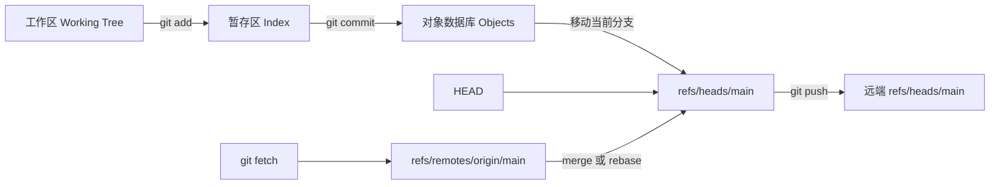

这张图是全文的地图。后面的绝大多数 Git 操作，都只是复制内容、创建不可变对象，或者让某个引用从一个 commit 移到另一个 commit。

## 先把几个基础概念钉牢

我以前会说"这个文件已经在 Git 里了"，但这句话至少可能指 4 件不同的事：文件出现在工作目录里、内容进入 index、内容被某个 commit 引用，或者 commit 已经推到远端。Git 的难点有一半来自把这些状态压成了一个模糊的"保存"。

### 仓库与工作区不是同一个东西

**Repository（仓库）** 主要指 `.git` 中的对象、引用和配置。**Working tree（工作区或工作树）** 是我在编辑器里看到、编译器会读取的那份文件集合。一个普通项目目录通常把两者放在一起：

```text
pocket-git/          # 工作区根目录
├── README.md        # 可以直接编辑的文件
├── src/
│   └── app.txt
└── .git/            # 仓库元数据与对象数据库
```

删除工作区文件不等于立即删除历史中的 blob；删除 `.git` 则会让这个目录失去本地 Git 历史、refs 和 index，只剩普通文件。bare repository 没有普通工作区，服务器端仓库经常采用这种形态。

> [!NOTE]
> 上一段中的"工作区"是 Git working tree，不是 IDE 把多个文件夹组织起来时所说的 workspace。两者可能指向同一目录，也可能完全不是一层概念。

### 暂存区不是待上传清单

**Index（索引，也叫 staging area 或暂存区）** 保存下一次 commit 准备采用的路径、文件模式和 blob ID。它不是一个只有文件名的勾选列表，也不是尚未 push 的 commit 队列，而是一份接近完整目录快照的二进制数据结构。

这解释了一个初学时很反直觉的现象：

```bash
printf 'version 1\n' > app.txt
git add app.txt
printf 'version 2\n' > app.txt
git commit -m 'record app'
```

这个 commit 收进去的是 `version 1`，因为 `git add` 当时把那份内容写入对象数据库并让 index 指向它。之后写入工作区的 `version 2` 仍未暂存。`git add` 更准确的理解不是"开始跟踪这个文件"，而是"把这些路径此刻的内容放入下一张快照"。

### `HEAD`、branch 与 commit

**Commit** 是不可变对象，记录根 tree、parent、身份、时间和消息。**Branch** 是 `refs/heads/...` 下会移动的引用。**`HEAD`** 表示当前检出位置，通常间接指向某个本地分支。

```text
HEAD -> refs/heads/main -> commit 0063127 -> parent cd5e714
```

执行 `git commit` 时，Git 创建新 commit，再让当前分支指向它；旧 commit 没有被修改。执行 `git switch topic` 时，Git 改变 `HEAD` 所指分支，并让 index 与工作区尽量匹配目标快照。分支是名字，commit 才是历史节点。

### tracked、untracked、modified 与 staged

这些词描述的是路径与 3 份状态之间的关系：

| 状态 | 含义 | 常见下一步 |
| --- | --- | --- |
| untracked | 工作区有这个路径，但 index 与 `HEAD` 都没有记录它 | `git add <path>` 或写入 `.gitignore` |
| unmodified | 工作区、index 与 `HEAD` 对该路径的内容一致 | 不需要动作 |
| modified | 工作区内容不同于 index | 查看 `git diff`，再暂存或恢复 |
| staged | index 内容不同于 `HEAD` | 查看 `git diff --staged`，再 commit 或取消暂存 |
| deleted | 某次比较的一侧已有路径，另一侧没有 | 暂存删除、恢复文件或提交删除 |
| conflicted | index 中存在尚未解决的高 stage 条目 | 解决内容，`git add` 后继续操作 |

一个文件可以同时 modified 与 staged。前面的 `MM src/app.txt` 就是：index 已准备一个版本，工作区又在它上面继续修改。`git status` 给状态摘要，`git diff` 展开具体内容；前者像仪表盘，后者才是示波器。

### 本地分支、远端跟踪分支与 upstream

这 3 个名字也经常被混成"远端分支"：

- `main` 是本地分支，我可以离线提交并移动它；
- `origin/main` 是本地保存的 remote-tracking ref，表示上次 fetch 后我看到的远端 `main`；
- 服务器上的 `refs/heads/main` 才是远端此刻真正的分支。

**Upstream** 是给本地分支配置的默认比较、pull 和 push 对象。例如 `git push -u origin topic` 会在发布分支的同时设置 upstream。upstream 不是父 commit，也不意味着本地分支会自动与服务器同步。

最后把最常见的状态流压成 4 步：

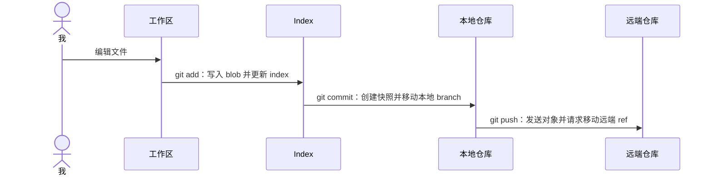

这 4 步可以分开检查，也应该分开理解。

## 先说结论：Git 保存的是快照，不是补丁

很多介绍会把 Git 描述成一个逐行保存差异的工具。这对阅读 `git diff` 很直观，但不适合作为底层模型。

每次 commit 指向一棵完整目录树。没有变化的文件会继续引用原来的 blob，所以 Git 不需要重复创建内容相同的对象；发生变化的文件得到新的 blob。Git 在对象语义上保存快照，在 packfile 的物理存储里才会为了压缩寻找 delta。换句话说：**快照是数据模型，差异是比较结果和存储优化。**

我把 Git 想成一座仓库：对象是贴着内容指纹的密封箱，commit 是一张指向整批箱子的装箱单，branch 只是贴在某张装箱单上的可移动书签。这个比喻到这里就够了，接下来直接看字节。

## 从零建一个可以解剖的仓库

我不会拿正在工作的项目做实验。先创建临时目录，并显式指定初始分支名：

```bash
repo=$(mktemp -d)
cd "$repo"
git init --initial-branch=main
git config user.name Ada
git config user.email ada@example.com
```

我的实验版本是：

```text
git version 2.54.0
```

`git init` 没有创建任何 commit。它只创建 `.git` 管理目录。下面是采用默认 `files` 引用后端的仓库在后续使用中会出现的关键路径；`index`、`refs/remotes` 和 `logs` 并不一定在刚初始化时就存在：

```text
.git/
├── HEAD
├── config
├── index              # 第一次 add 后出现
├── objects/           # 对象数据库
├── refs/heads/        # 本地分支引用
├── refs/remotes/      # fetch 后的远端跟踪引用
└── logs/              # 启用 reflog 的引用发生更新后出现
```

现代脚本应使用 `git init --initial-branch=main`，而不是依赖某个 Git 版本或用户配置碰巧采用什么默认分支名。长期偏好则可以配置：

```bash
git config --global init.defaultBranch main
```

> [!NOTE]
> `--global` 修改当前用户的 Git 配置，不应该不加判断地写进项目安装脚本。项目级策略尽量放在仓库配置、服务端规则或文档中，个人偏好留给个人。

## 第一个 blob：内容如何变成 ID

写一个 13 字节文件（结尾换行也算 1 字节）：

```bash
printf '# pocket-git\n' > README.md
git hash-object README.md
```

我得到：

```text
5d87241c4953134b72c3ef069243777aa25121d9
```

这个 40 位 object ID 不是只对文件内容计算 SHA-1。Git 实际哈希的是：

```text
blob 13\0# pocket-git\n
```

也就是对象类型、一个空格、十进制长度、NUL 字节，再接原始内容：

```python
import hashlib

content = b"# pocket-git\n"
raw = f"blob {len(content)}\0".encode() + content
print(hashlib.sha1(raw).hexdigest())
```

输出仍然是：

```text
5d87241c4953134b72c3ef069243777aa25121d9
```

`git hash-object README.md` 默认只计算，不写入数据库；加 `-w` 才会写。平时不需要直接执行它，因为 `git add` 会完成这一步。

Git 2.54.0 新仓库仍默认使用 SHA-1，也支持 `git init --object-format=sha256`。不过 SHA-1 与 SHA-256 仓库目前不能直接互操作，所以不要为了看起来更现代就擅自切换团队仓库的对象格式。这里的 object ID 首先承担内容寻址和完整性校验；它不是文件加密，也不等于 commit 签名。

## `git add` 不是"添加文件"，而是更新下一张快照

再写一个文件，然后暂存两者：

```bash
mkdir src
printf 'version 1\n' > src/app.txt
git add README.md src/app.txt
git ls-files --stage
```

我看到：

```text
100644 5d87241c4953134b72c3ef069243777aa25121d9 0 README.md
100644 83baae61804e65cc73a7201a7252750c76066a30 0 src/app.txt
```

这就是 index 的可读投影。每行记录文件模式、blob ID、stage 编号和路径。`100644` 是普通非可执行文件；最后的 `0` 表示正常条目。普通内容冲突中，同一路径最多还可能出现 stage 1、2、3，分别保存 merge base、ours 和 theirs；删除等冲突类型可能缺少其中某项，而且 rebase 里的 ours 与 theirs 要从重放操作而非原分支名理解。

所以 `git add` 这个名字稍微有点误导。它不仅"添加新文件"，还会把已修改文件的**当前内容**写成 blob，并更新 index 中对应路径。之后继续编辑同一个文件，不会自动改变已经暂存的内容。

## 从 index 写出 tree，再创建 commit

index 还不是 tree 对象，但它是 tree 的施工图。执行：

```bash
git write-tree
```

我的根 tree ID 是：

```text
208dc736f90acf95e1f43a0a0ae122b906953eef
```

查看它：

```bash
git cat-file -p 208dc736f90acf95e1f43a0a0ae122b906953eef
```

会看到根目录中的 blob 和 `src` 子 tree。tree 保存名字、模式和下一级对象 ID；blob 只保存内容，不知道自己叫 `README.md` 还是 `copy.md`。两个路径内容完全相同，可以指向同一个 blob。


现在提交。为了让下面的 commit ID 可以复算，我除了使用前面配置的身份，还临时固定 author date 和 committer date：

```bash
export GIT_AUTHOR_DATE='2026-09-06T12:00:00+08:00'
export GIT_COMMITTER_DATE="$GIT_AUTHOR_DATE"
git commit -m 'feat: build the first snapshot'
```

我得到：

```text
cd5e7140591d1099e8a990fe16f839a4b91be271
```

直接查看对象：

```bash
git cat-file -p HEAD
```

```text
tree 208dc736f90acf95e1f43a0a0ae122b906953eef
author Ada <ada@example.com> 1788667200 +0800
committer Ada <ada@example.com> 1788667200 +0800

feat: build the first snapshot
```

第一个 commit 没有 `parent`。后续普通 commit 有 1 个 parent，merge commit 通常有 2 个或更多 parent。commit 本身不装文件内容，只记录：

- 根 tree；
- parent commit；
- author 与 author date；
- committer 与 committer date；
- commit message；
- 可选签名等 header。

因此修改 commit message、作者、时间、parent 或 tree 中任意一个字节，都会得到新的 commit ID；它之后的所有子 commit 也必须改写，因为每个子 commit 都记录 parent ID。这就是 `rebase`、`commit --amend` 和历史过滤为什么会成串地产生新 ID。

把这些对象连起来以后，第一张快照实际是一张由 ID 串起的 DAG：

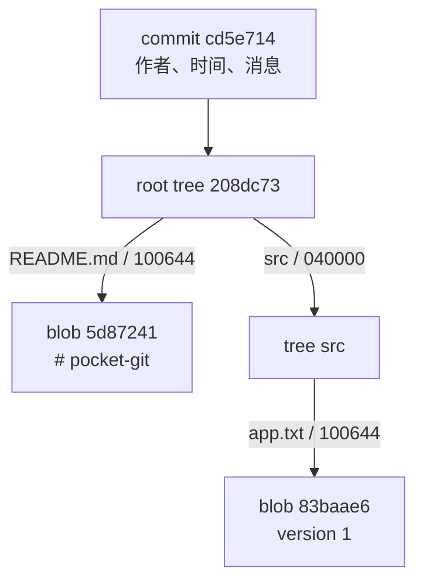

路径名活在 tree 的边上，文件内容活在 blob 中，commit 只从根 tree 进入整张图。这也是相同内容能够复用同一个 blob 的原因。

一次普通 `git commit` 在概念上做了 4 件事：

1. 从 index 写出 tree 对象；
2. 创建指向该 tree 和当前 parent 的 commit 对象；
3. 把当前 branch ref 移到新 commit；
4. 在已启用的 `HEAD` 和当前本地分支 reflog 中记录这次移动。

它**不会**自动提交工作区里尚未暂存的修改。`git commit -a` 只会自动暂存已跟踪文件的修改和删除，仍不会包含未跟踪文件。我更偏好显式 `git add -p`，因为省掉一次检查通常也顺便省掉了思考（这个优化不太划算）。

我实际做了一次：

```bash
printf 'version 2\n' > src/app.txt
git add src/app.txt
printf 'version 3\n' > src/app.txt
git status --short
```

输出是：

```text
MM src/app.txt
```

左边的 `M` 表示 index 相对 `HEAD` 有修改，右边的 `M` 表示工作区相对 index 又有修改。同一个路径此时同时存在 3 个版本：

| 位置 | 内容 | 查看方式 |
| --- | --- | --- |
| `HEAD` | `version 1` | `git show HEAD:src/app.txt` |
| index | `version 2` | `git show :src/app.txt` |
| 工作区 | `version 3` | `cat src/app.txt` |

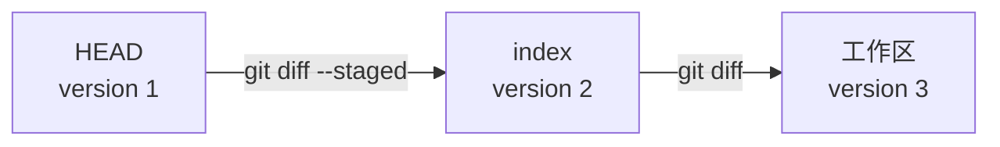

这里的箭头表示比较方向，不表示内容自动流动。它把 `MM` 的两个 `M` 直接摊开了：左列比较 `HEAD` 与 index，右列比较 index 与工作区。

对应的两次比较也完全不同：

```bash
git diff                  # 工作区 vs index
git diff --staged         # index vs HEAD
```

这是我认为最值得形成肌肉记忆的提交循环：

```bash
git status --short --branch
git diff
git add --patch
git diff --staged
git commit
```

`git add --patch`（缩写 `git add -p`）按 hunk 选择内容，比不看差异就 `git add .` 更接近"设计一个 commit"。如果同一段修改同时修 bug、改命名和格式化，我会先把它们拆成能独立解释的快照。commit 的边界是给未来的我、同事、`git bisect` 和 AI 阅读的 API。

> [!WARNING]
> `git add .` 本身没有错，但它表达的是"暂存当前目录以下所有变化"。在运行前后都看 `git status` 和 `git diff --staged`，不要把它当作关闭红点的按钮。

## `git diff` 到底在比较什么

`diff` 是我每天最应该多敲几次的 Git 命令。它不修改状态，只把两个端点之间的变化编码成 patch。真正的第一个问题不是"改了什么"，而是"拿哪两份状态比较"。

### 先选对两端

| 命令 | 旧端 | 新端 | 我通常用它回答 |
| --- | --- | --- | --- |
| `git diff` | index | 工作区 | 我改了但还没暂存什么？ |
| `git diff --staged` | `HEAD` | index | 下一次 commit 会包含什么？ |
| `git diff HEAD` | `HEAD` | 工作区 | 当前全部已跟踪修改是什么？ |
| `git diff <A> <B>` | commit A | commit B | 从 A 变成 B 要应用什么 patch？ |
| `git diff <A>...<B>` | A 与 B 的 merge base | commit B | B 分支从分叉点引入了什么？ |
| `git show <commit>` | 普通 commit 的 parent | 该 commit | 这个普通 commit 引入了什么？ |

方向很重要。`git diff A B` 描述的是把 A 变成 B：`-` 行来自 A，`+` 行来自 B。交换参数，patch 的正负也会反过来。

`git diff A..B` 对 `diff` 来说与 `git diff A B` 基本等价，只比较两个端点；这里的 `..` 不具有 `git log A..B` 那种"可达 commit 集合之差"语义。三点 `A...B` 才会先求 merge base，再把 merge base 与 B 比较。两个点和三个点长得只差一个点，含义差了一棵分叉历史（非常 Git）。

只看某些路径时，我会用 `--` 明确结束 revision 参数：

```bash
git diff HEAD -- src/app.txt
git diff main...topic -- src/
```

这也能避免一个路径名恰好像 branch 名时产生歧义。

### 逐行拆一份 unified diff

在前面的实验里，index 保存 `version 2`，工作区保存 `version 3`。运行：

```bash
git diff -- src/app.txt
```

实际输出是：

```diff
diff --git a/src/app.txt b/src/app.txt
index 1f7a7a4..7170a52 100644
--- a/src/app.txt
+++ b/src/app.txt
@@ -1 +1 @@
-version 2
+version 3
```

从上往下读。

#### `diff --git`：一个文件级变化开始了

```diff
diff --git a/src/app.txt b/src/app.txt
```

这一行标记新的 file patch。`a/` 表示变化前一侧，`b/` 表示变化后一侧；它们通常不是仓库里真实存在的两个目录。重命名或复制时，两侧路径会不同。

#### `index`：前后 blob 与文件模式

```diff
index 1f7a7a4..7170a52 100644
```

- `1f7a7a4` 是旧端内容的 blob ID 缩写，对应 `version 2`；
- `7170a52` 是新端内容计算出的 blob ID 缩写，对应 `version 3`；
- `100644` 表示普通非可执行文件。

工作区版本即使还没被 `git add` 写成 loose object，Git 仍可以根据内容算出它应有的 object ID。文件模式发生变化时，输出通常改为独立的 `old mode` 和 `new mode` 行。

#### `---` 与 `+++`：旧文件和新文件标签

```diff
--- a/src/app.txt
+++ b/src/app.txt
```

`---` 永远标旧端，`+++` 永远标新端。这里的 3 个减号和 3 个加号是 header 语法，不表示删除了 3 行或增加了 3 行。新建文件的旧端、删除文件的新端会在这里显示 `/dev/null`。

#### `@@`：hunk 在两边的坐标

```diff
@@ -1 +1 @@
```

一个 patch 可以包含多个相隔较远的修改块，每一块叫 hunk。一般格式是：

```diff
@@ -<旧起始行>,<旧行数> +<新起始行>,<新行数> @@ <可选上下文>
```

`-1` 表示旧文件从第 1 行开始、共 1 行；`+1` 对新文件含义相同。行数为 1 时逗号和行数会省略，所以这里不是"缺了一个数字"。例如：

```diff
@@ -10,4 +10,6 @@ function parseConfig()
```

表示旧端从第 10 行取 4 行，新端从第 10 行取 6 行。末尾的函数名或章节名只是帮助定位的 hunk context，不参与 patch 内容。

#### hunk 正文：看每行第一个字符

```diff
-version 2
+version 3
```

- 空格开头：context line，两边都存在，内容没变；
- `-` 开头：只在旧端存在，要删除；
- `+` 开头：只在新端存在，要加入。

这几个前缀是 patch 数据，不是装饰颜色。终端常把删除染红、增加染绿，但把颜色关掉或把 patch 发给程序后，真正可靠的仍是行首字符。

若文件最后一行缺少换行，Git 还会输出：

```diff
\ No newline at end of file
```

这不是新增的文件内容，而是说明紧邻的那一侧末行没有 line feed。文本文件看起来完全一样，末尾字节却不同，Git 当然会认真记账（它对字节的原则性比我强得多）。

### 新建、删除、改权限和重命名怎么看

普通内容修改之外，extended headers 会描述文件级元数据：

```text
new file mode 100644
deleted file mode 100644
old mode 100644
new mode 100755
rename from old-name.txt
rename to new-name.txt
similarity index 98%
```

`100644 -> 100755` 通常表示 executable bit 发生变化，不代表文件正文改变。重命名则需要一个重要修正：Git commit 并不存储"rename old to new"操作。Git 保存前后 tree，diff 再把一个删除和一个新增按内容相似度推断为 rename。`similarity index 98%` 表示 Git 认为 98% 的行没有变化；调整 rename detection 阈值可能得到不同展示，但 commit 对象没有改变。

想明确启用并设置阈值，可以：

```bash
git diff --find-renames=50% <A> <B>
```

二进制文件默认通常只显示 `Binary files ... differ`，不会假装把任意字节流解释成文本行。项目可以通过 `.gitattributes` 配置 textconv 或专用 diff driver，但那改变的是展示，不是对象内容。

### 适合不同阅读阶段的 diff 视图

完整 patch 不是每次都最合适。我通常从概览逐层放大：

```bash
git diff --stat                 # 每个文件的增删规模
git diff --name-status          # 路径及 M/A/D/R 等状态
git diff                        # 完整未暂存 patch
git diff --staged               # 完整待提交 patch
git diff --word-diff            # 观察行内词级变化
git diff --check                # 检查空白错误与冲突标记
```

`--stat` 适合先判断变化范围，不能代替阅读 patch；`--word-diff` 对长段文字和一行内改多个 token 很有用，但它不是常规 unified patch；`--check` 适合提交前发现 trailing whitespace 等问题。

只想让脚本判断有无差异时：

```bash
git diff --quiet --exit-code
```

退出码 `0` 表示没有差异，`1` 表示存在差异，其他非零值通常表示真正的错误。这里不能用"命令没有打印东西，所以相同"来判断，因为 `--quiet` 本来就不打印。

Git 也可以离开仓库比较两个普通路径：

```bash
git diff --no-index old.txt new.txt
```

这时它很像系统 `diff -u`，仍使用 Git 熟悉的 patch 展示和退出码。至于 `--patience`、`--histogram` 等 diff algorithm，它们会改变 hunk 如何对齐，适合默认 Myers 算法给出难读结果时尝试；它们不会改变两端真实内容。

> [!IMPORTANT]
> 审查 commit 前看 `git diff --staged`，push 前看 branch 间的 diff。`git status` 只能告诉我"哪个文件处于什么状态"，不能告诉我删掉的条件判断是不是刚好把权限检查也带走了。

## branch 和 HEAD 原来如此轻

第一次提交后，我直接看两个文件：

```bash
cat .git/HEAD
cat .git/refs/heads/main
```

输出分别是：

```text
ref: refs/heads/main
cd5e7140591d1099e8a990fe16f839a4b91be271
```

`main` 只是一个指向 commit 的 ref，`HEAD` 通常又是一个指向当前 branch ref 的符号引用。创建分支几乎不复制数据：

```bash
git branch experiment cd5e714
```

这只是新建 `refs/heads/experiment`，写入同一个 commit ID。无论仓库有 10 KB 还是 100 GB，创建普通分支都不是复制完整项目。

第二次提交后，我得到：

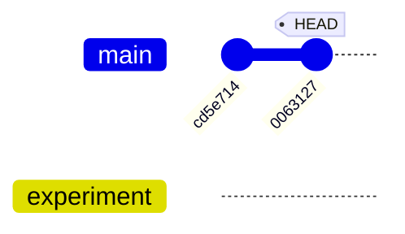

此时 `main` 指向 `0063127`，`experiment` 仍指向 `cd5e714`。所谓"在某个分支上提交"，就是 Git 创建新 commit 后移动 `HEAD` 间接指向的那个分支。

### detached HEAD 是什么

如果执行：

```bash
git switch --detach cd5e714
```

`HEAD` 会直接保存 commit ID，而不再指向 `refs/heads/...`。这适合检查历史或做可丢弃实验。此时提交仍然会创建合法 commit，只是没有 branch 名自动跟着它移动。切走后，那些 commit 可能变得不可达，但通常还能暂时从 reflog 找回。

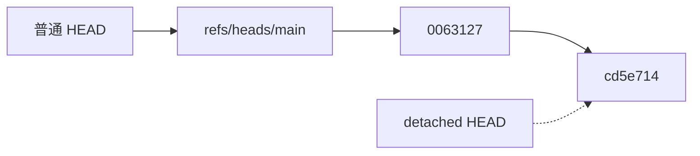

普通状态下，`HEAD -> branch -> commit`；detached 状态则跳过 branch，变成 `HEAD -> commit`。少掉的正是那个会自动移动、也方便以后寻找的名字。

如果实验值得保留，在切走前给它一个名字：

```bash
git switch -c rescued-experiment
```

## 为什么现在更推荐 `switch` 和 `restore`

传统 `git checkout` 同时承担两类工作：

- 切换分支或进入 detached HEAD；
- 用 index 或某个 commit 覆盖路径。

同一个命令既移动 `HEAD`，又可能覆盖文件，意图不够显眼。Git 2.23 在 2019 年加入 `git switch` 和 `git restore`，把两组职责拆开。**`checkout` 没有被废弃，也不是错误命令**；现代交互式工作流更推荐语义专一的命令，因为代码审查和终端历史更容易读懂。

常见映射如下：

| 意图 | 现代命令 | 传统写法 |
| --- | --- | --- |
| 切换已有分支 | `git switch topic` | `git checkout topic` |
| 创建并切换分支 | `git switch -c topic` | `git checkout -b topic` |
| 切回上一个分支 | `git switch -` | `git checkout -` |
| 临时查看 commit | `git switch --detach <commit>` | `git checkout <commit>` |
| 丢弃工作区路径修改 | `git restore <path>` | `git checkout -- <path>` |
| 取消暂存 | `git restore --staged <path>` | `git reset HEAD <path>` |
| 从某 commit 取回路径 | `git restore --source=<commit> <path>` | `git checkout <commit> -- <path>` |

我在前面的 3 版本实验里运行：

```bash
git restore src/app.txt
git restore --staged src/app.txt
```

第一条把工作区从 `version 3` 恢复到 index 的 `version 2`；第二条把 index 从 `version 2` 恢复到 `HEAD` 的 `version 1`，但工作区仍保留 `version 2`。这里没有魔法，只是明确指定复制的来源和目的地。

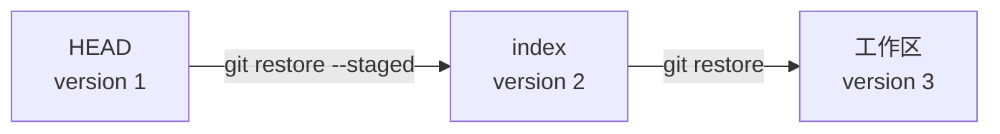

`restore` 的危险程度取决于箭头落在哪里：落到工作区就可能覆盖未保存内容，落到 index 则只是重新安排下一次快照。

> [!CAUTION]
> `git restore <path>` 会覆盖尚未暂存的工作区修改。先运行 `git diff -- <path>`。如果内容重要但还不适合 commit，可以先建临时分支提交，通常比把唯一副本塞进 stash 更容易找回。

## merge、rebase 和 cherry-pick 都在改什么

假设历史分叉成：

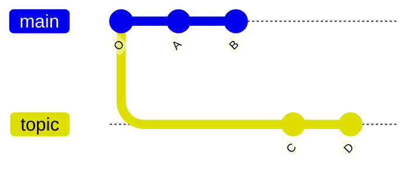

### Fast-forward：历史没分叉，只移动指针

先看最简单的情况。`main` 停在 `O`，`topic` 从 `O` 继续提交了 `C`、`D`，而 `main` 自己没有新 commit：

合并前：

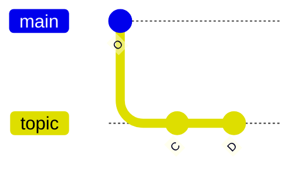

合并后：

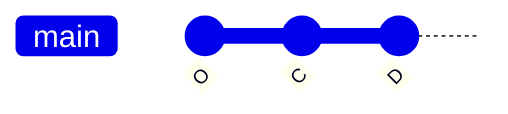

两张图中的 `O`、`C`、`D` 是同一批 commit。前一张图里 `main` 留在 `O`；后一张只画发生变化的 `main`，它已经抵达 `D`。`topic` 没有移动，仍然指向 `D`。

`O` 是 `D` 的祖先，所以 `git merge topic` 不必创建 merge commit。Git 只把 `main` 从 `O` 移到 `D`，commit 图一个节点都没增加；这就是 fast-forward，缩写为 ff。之后看到的 `pull --ff-only` 和 push 检查都在问同一个祖先关系。

### `merge`：保留分叉，增加汇合点

在 `main` 上执行：

```bash
git switch main
git merge topic
```

若不能 fast-forward，Git 创建一个 merge commit `M`：

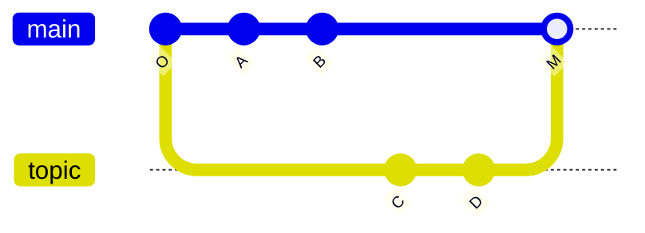

`M` 有两个 parent。历史明确记录两条工作线曾经并行存在。

我会在需要保留集成边界时使用 merge，例如合入一个完整功能分支。想明确保留这个边界，可以：

```bash
git merge --no-ff topic
```

### `rebase`：复制 commit，换一组 parent

在 `topic` 上执行：

```bash
git switch topic
git rebase main
```

Git 找到共同祖先 `O`，取出 `C`、`D` 引入的补丁，再以 `B` 为新基底重放，得到新 commit `C'`、`D'`：

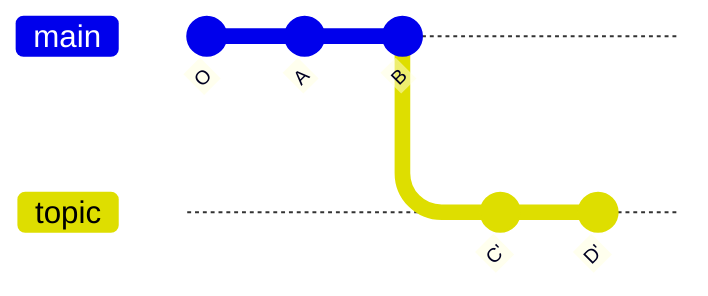

`C'` 与 `C` 的 parent 不同，所以 ID 必然不同；`D'` 的 parent 又变了，因此也有新 ID。rebase 不是"移动原 commit"，而是复制出一条语义相似的新历史，再移动分支引用。

我的规则很简单：

- 尚未共享的个人分支，可以 rebase、`commit --amend`、`rebase --interactive`；
- 已被其他人基于其开发的公开历史，不随意 rebase；
- 集成策略服从项目，不把"线性历史"当宗教。

交互式整理常用：

```bash
git rebase --interactive <base>
```

如果评审后只想把修补自动折叠进原 commit：

```bash
git commit --fixup=<commit>
git rebase --interactive --autosquash <base>
```

rebase 前后想确认 patch series 是否意外变化：

```bash
git range-diff <old-base>..<old-tip> <new-base>..<new-tip>
```

### `cherry-pick`：复制选定的 commit

```bash
git cherry-pick <commit>
```

它把某个 commit 引入的变化应用到当前 `HEAD`，再创建一个新 commit。因为 parent 通常不同，新 ID 也不同。适合把一个独立修复移到维护分支，不适合长期用来手工同步两条本应合并的分支。

冲突不是文件坏了，而是 Git 无法自动决定 3 方合并结果。先看：

```bash
git status
git diff
```

解决每个文件后暂存，再继续对应操作：

```bash
git add <resolved-path>
git merge --continue       # merge 场景
git rebase --continue      # rebase 场景
git cherry-pick --continue # cherry-pick 场景
```

不想继续时，使用相应的 `--abort`，不要边慌边 `reset --hard`。

## 远端不是云端魔法，只是另一个仓库

`origin` 只是远端的默认昵称，不是 Git 的保留关键字。查看配置：

```bash
git remote --verbose
git remote get-url origin
```

一个本地仓库通常同时有：

```text
refs/heads/main                 # 我的本地分支
refs/remotes/origin/main        # 我上次 fetch 后看到的远端状态
远端仓库的 refs/heads/main       # 远端此刻真正的分支
```

后两者不是同一个东西。`origin/main` 是本地的远端跟踪引用，它不会凭空知道服务器刚刚发生了什么。

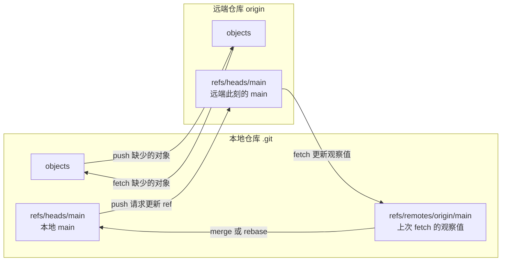

关键是不把 `origin/main` 画到服务器里。它住在我的 `.git` 中，是一次成功 fetch 留下的本地观察值；网络断开以后，它当然不会自己刷新。

### `fetch`：下载对象，更新远端跟踪引用

```bash
git fetch origin --prune
```

它与远端协商本地缺少的对象，接收 packfile，再按 refspec 更新 `refs/remotes/origin/*`。`--prune` 删除远端已经不存在的远端跟踪引用，但不会删除我的本地分支。

fetch 通常不改当前工作区、index 或本地 `main`，所以它是理解远端变化的好分界点：

```bash
git log --oneline --graph --decorate --all
git log --left-right --cherry-pick main...origin/main
git diff main...origin/main
```

### `pull`：先 fetch，再选择一种集成策略

`git pull` 不是与 fetch 并列的下载协议。它先 fetch，然后把上游分支集成进当前分支。真正需要决定的是第二步。

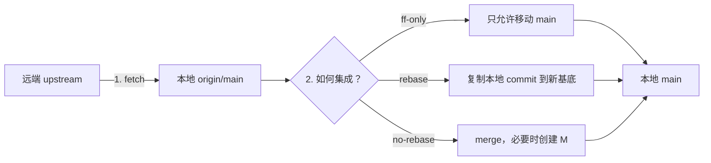

所以 pull 不是第四种历史操作。它只是把 fetch 与某一种已有的集成操作串起来。

我不喜欢让一个无参数 `git pull` 隐藏策略。现代、安全而可读的写法是明确选择：

```bash
git pull --ff-only   # 只允许快进，分叉就停下
git pull --rebase    # fetch 后把本地 commit 重放到上游
git pull --no-rebase # fetch 后 merge
```

对于还在建立心智模型的人，我更推荐拆成两步：

```bash
git fetch origin --prune
git log --oneline --graph --decorate --all
git rebase origin/main  # 或 git merge origin/main
```

这样每个命令只做一类事，出错时也知道哪一层出了问题。Git 版本之间默认 pull 策略可能变化，项目策略也不同；显式参数比背默认值可靠。

长期配置应选自己和团队真正采用的策略，例如：

```bash
git config --global pull.ff only
# 或
git config --global pull.rebase true
```

不要把两条都照抄。`ff-only` 在本地与上游分叉时停止；`rebase` 会重写本地尚未发布的 commit。它们表达不同政策。

### `push`：上传缺少的对象，请远端移动 ref

第一次发布分支：

```bash
git push --set-upstream origin topic
```

`--set-upstream`（缩写 `-u`）建立本地 `topic` 与上游分支的关系。以后在 `push.default=simple` 的常见配置下，可以直接：

```bash
git push
```

push 分成两件事：

1. 把远端缺少的可达对象发送过去；
2. 请求远端把某个 ref 从旧 ID 更新到新 ID。

普通 push 默认要求更新是 fast-forward，也就是远端旧 tip 必须是新 tip 的祖先。否则 Git 拒绝 non-fast-forward，因为直接移动 ref 可能让别人已发布的 commit 失去分支入口。

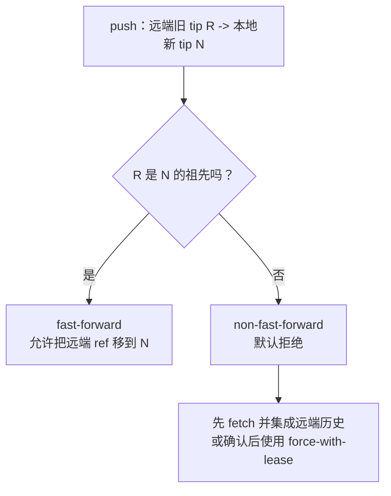

服务器检查的是可达关系，不是比较谁的时间戳更新。如果远端 tip 不是本地 tip 的祖先，直接移动 ref 就可能把一段别人仍需要的历史甩出分支可达范围。

如果我确实 rebase 了**自己的**远端分支，需要改写它，我使用：

```bash
git push --force-with-lease
```

它比 `--force` 多一个租约条件：远端 ref 必须仍是我预期的值，否则拒绝覆盖。需要最严格地表达预期值时，可以写：

```bash
git push \
  --force-with-lease=refs/heads/topic:<expected-old-oid> \
  origin topic
```

裸 `--force-with-lease` 通常以本地远端跟踪引用作为预期值；后台自动 fetch 可能更新这个依据，所以它不是绝对保险。`--force` 则直接关闭这层保护，可能丢掉远端 commit。我不会把 `push -f` 做成 shell alias，这种便利与拔掉烟雾报警器差不多。

## 撤销操作：先问要改哪一层

Git 最让人害怕的地方通常不是保存，而是撤销。只要先回答两个问题，命令会清楚很多：

1. 要改工作区、index、branch ref，还是追加一个反向 commit？
2. 目标历史是否已经共享？

### 常用决策表

| 意图 | 推荐命令 | 改动层 | 是否改写 branch 历史 |
| --- | --- | --- | --- |
| 丢弃未暂存的路径修改 | `git restore <path>` | 工作区 | 否 |
| 取消暂存并保留工作区 | `git restore --staged <path>` | index | 否 |
| 从某快照恢复路径 | `git restore --source=<rev> <path>` | 工作区 | 否 |
| 修正最后一次未发布提交 | `git commit --amend` | commit + ref | 是 |
| 撤销已发布提交 | `git revert <commit>` | 新增反向 commit | 否 |
| 本地分支退回但保留暂存 | `git reset --soft <rev>` | ref | 是 |
| 本地分支退回并重置 index | `git reset --mixed <rev>` | ref + index | 是 |
| 本地分支、index、工作区全退回 | `git reset --hard <rev>` | 三者 | 是，并丢工作区修改 |
| 找回刚刚移丢的 commit | `git reflog` | 只查看日志 | 否 |

`restore` 面向路径，`reset` 主要移动当前 branch 并按模式决定是否同步 index 和工作区，`revert` 则创建新 commit。名字相似，历史兼容性完全不同。

### `revert` 为什么适合公开历史

```bash
git revert <bad-commit>
```

它不删除坏 commit，而是计算反向变化并创建一个新 commit。所有协作者仍共享同一条已有历史，只需继续 fast-forward。对于已经推送到公共分支的错误，这通常是最无聊也最安全的方案。

### reflog：引用移动的本地黑匣子

我做了一个故意的事故：先记住第二个 commit `0063127`，再把 `main` 硬重置回第一个 commit：

```bash
git reset --hard cd5e714
```

`git log` 看不到第二个 commit 了，但 `git reflog --oneline` 仍显示：

```text
cd5e714 HEAD@{0}: reset: moving to cd5e714...
0063127 HEAD@{1}: commit: feat: advance the app
cd5e714 HEAD@{2}: commit (initial): feat: build the first snapshot
```

于是我恢复：

```bash
git reset --hard 0063127
```

`main` 又回到了第二个 commit。reflog 记录启用了日志的 refs 与 `HEAD` 的近期移动；普通非裸仓库通常会记录 `HEAD` 和本地分支，但不是所有引用都必然有 reflog。它不会 push 到远端，也不是永久备份；条目会过期，不可达对象最终可能被垃圾回收。但在误操作之后，第一反应应该是停止继续改写，运行 `git reflog`，给目标 commit 新建分支：

```bash
git branch rescue 0063127
```

这条更稳妥的恢复路径最终得到下面这张历史图：

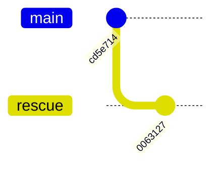

`main` 仍停在 `cd5e714`，而新建的 `rescue` 重新指向 `0063127`。这张图描述的是恢复后的 commit DAG，不是重新执行 commit 的过程：`git branch rescue 0063127` 只补回一个引用，没有创建 `0063127`。

只要对象还在，名字丢了通常比内容丢了容易修。

> [!NOTE]
> 图里的 reflog 是恢复窗口，不是永久引用或远端备份。不要把"现在还能找回"理解成"永远不会被回收"。

## Git 为什么不会为每个版本保存一整份大文件

为了观察物理存储，我创建了一个 255000 字节文本文件，提交后只追加 15 字节，再提交一次。两个 blob 的逻辑大小分别是：

```text
255000 bytes
255015 bytes
```

在运行 `git gc` 前，实验仓库有 15 个 loose objects，zlib 压缩后合计 44641 字节。运行：

```bash
git gc
git verify-pack -v .git/objects/pack/*.idx
```

packfile 变成 14239 字节，索引为 1492 字节。`verify-pack` 显示较新的 255015 字节 blob 在 pack 中占 13080 字节，旧版本则被表示成深度 1 的 delta，数据只有 15 字节（加上对象编码后占 26 字节）。仅比较原 44641 字节 loose objects 与 14239 字节 pack，主体存储缩小约 68.1%。

这解释了两个看似矛盾的事实：

- Git 的逻辑模型是完整快照；
- Git 的物理 packfile 可以跨相似对象做 delta compression。

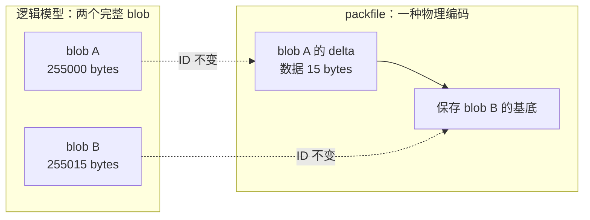

左边回答"对象是什么"，右边回答"这次 pack 如何省空间"。重新打包可以更换基底和 delta 链，却不能改动对象按完整内容计算出的 ID。

对象的 ID 仍由规范化的完整内容决定，不由"它是哪个对象的 delta"决定。Git 可以随时重新打包而不改变 commit ID。`git gc`、push 和服务端维护可能触发打包；日常不需要手工管理每个 pack。

我最后运行：

```bash
git fsck --full
```

命令没有输出并以 0 退出，表示这份小仓库的对象连通性和有效性检查通过。

## clone 到底复制了什么

```bash
git clone <url> project
```

概念上它做了这些事：

1. 创建本地仓库；
2. 配置默认远端 `origin`；
3. 与远端协商并下载所需对象；
4. 建立远端跟踪引用；
5. 创建并检出默认本地分支。

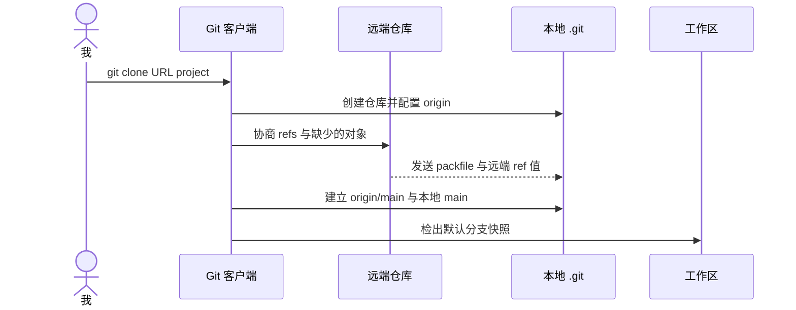

clone 之后出现的是一个能独立工作的本地仓库，而不是远端文件夹的网络映射。`origin` 只是把这个新仓库与来源仓库重新连起来的配置。

Git 是分布式版本控制系统，因为普通 clone 通常拥有项目历史和对象数据库，不只是服务器工作区的一个薄视图。离线时我仍能 log、diff、branch、commit、merge 和 rebase；只有与别的仓库交换对象和 refs 时才需要网络。

大仓库可以选择浅克隆、部分克隆或稀疏检出，但三者解决不同问题：

```bash
git clone --depth=1 <url>           # 截断历史深度
git clone --filter=blob:none <url>  # 按需获取 blob
git sparse-checkout set src docs    # 限制工作区展开路径
```

不要把它们统称为"只下载一部分代码"。浅克隆改变可用历史，partial clone 延迟对象获取，sparse-checkout 主要改变工作区呈现。

## 多任务开发：`worktree` 比反复 stash 更直接

当我正在 `feature` 分支写到一半，突然要修 `main` 上的线上 bug，传统动作常常是 stash、switch、修复、切回、pop，然后祈祷 stash 冲突别来凑热闹。

更清楚的方式是附加工作树：

```bash
git worktree add -b hotfix ../project-hotfix main
```

同一个仓库对象数据库现在对应两个工作目录：原目录继续停在 `feature`，新目录检出 `hotfix`。两边有各自的 `HEAD` 和 index，共享 objects 和大部分 refs。

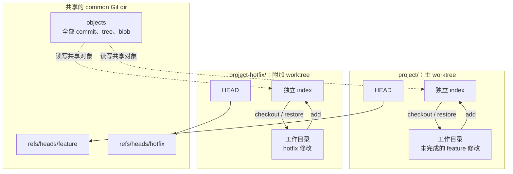


`worktree` 不是再 clone 一次。昂贵的对象数据库和大部分 refs 只保留一份；每个工作树只增加自己的工作目录、`HEAD`、index 与少量管理状态。于是两个任务可以同时脏、同时运行构建，却不会争夺同一份 checkout。

同一个本地 branch 默认不能同时检出到两个 worktree。这层保护避免两个目录都试图移动同一个 branch ref，却给人一种自己互不相关的错觉。

完成后再移除附加工作树：

```bash
git worktree remove ../project-hotfix
```

这对并行运行测试、比较两个版本，以及让多个 AI agent 各自在独立分支工作尤其有用。它不是复制两份完整仓库，也避免一个工作区被不同任务来回覆盖。

`git stash` 仍适合很短的临时收纳：

```bash
git stash push --include-untracked -m 'wip: parser experiment'
git stash list
git stash show --patch stash@{0}
git stash pop
```

但 stash 本质上仍由 commit-like 对象和 refs 管理，不是神秘抽屉。我会给它消息，并尽快处理；需要跨天保存或交给别人时，临时分支上的普通 commit 更可见、更可审查。

## 一套我现在愿意长期使用的命令行

### 初始配置

```bash
git config --global user.name 'Your Name'
git config --global user.email 'you@example.com'
git config --global init.defaultBranch main
git config --global fetch.prune true
git config --global merge.conflictStyle zdiff3
git config --global rerere.enabled true
```

这里前两项进入 commit 身份；`fetch.prune` 清理失效的远端跟踪引用；`zdiff3` 在冲突标记中显示 base，帮助判断双方分别改了什么；`rerere` 记录冲突解决结果，在相同冲突再次出现时复用。签名、凭据管理、换行符和 pull 策略依平台与团队而定，不适合复制一份"万能配置"。

检查配置来源比只看最终值更有用：

```bash
git config --list --show-origin
```

### 每日开始

```bash
git switch main
git fetch origin --prune
git pull --ff-only
git switch -c feature/readable-name
```

如果项目要求 rebase 工作流，我会显式采用它，而不是同时配置互相冲突的习惯。

### 制作原子 commit

```bash
git status --short --branch
git diff
git add --patch
git diff --staged
git commit
```

commit message 解释变化的意图和原因。标题能独立读懂，正文写约束、权衡和行为变化；不要把 `update files` 这种只能证明键盘工作过的句子留给历史。

### 同步并复核

```bash
git fetch origin --prune
git rebase origin/main
git range-diff origin/main...@{upstream} origin/main...HEAD
git push --set-upstream origin HEAD
```

`@{upstream}` 需要当前分支已经配置 upstream；首次发布前没有它。`HEAD` 作为 push 源表示当前分支 tip，但目标命名和权限仍由 refspec、配置和服务端规则决定。团队若使用 merge，则换成对应流程，不要为了套模板偷偷改写历史。

### 阅读历史

```bash
git log --oneline --graph --decorate --all
git log --first-parent main
git show <commit>
git diff <a>..<b>
git blame -L <start>,<end> -- <path>
```

`blame` 回答"这一行最后由哪个 commit 引入"，不是"该怪谁"。拿到 commit 后继续 `git show` 和阅读上下文，通常才有答案。

### 定位引入 bug 的 commit

当我有一个可重复判定好坏的命令时，`bisect` 通常能在 $N$ 个 commit 中用大约 $\log_2 N$ 次判断定位边界。在线性、每个候选都可测试的理想历史中，1024 个候选 commit 约需 10 轮，而不是从头读 1024 次 diff；复杂 merge DAG 和被跳过的 commit 会增加轮数，甚至让 Git 无法唯一定位。

```bash
git bisect start
git bisect bad HEAD
git bisect good <known-good>
git bisect run ./reproduce.sh
git bisect reset
```

`reproduce.sh` 必须以 0 表示 good，1 到 127（除 125）表示 bad，125 表示无法测试。这个脚本值得认真写，因为错误的 oracle 会高效地把我带到错误答案，计算机在这方面一如既往地非常配合。

## 哪些旧习惯该换，哪些只是需要理解

| 旧习惯或高风险写法 | 我现在使用 | 原因 |
| --- | --- | --- |
| `git checkout <branch>` | `git switch <branch>` | 明确表达切分支 |
| `git checkout -- <path>` | `git restore <path>` | 明确表达覆盖工作区路径 |
| `git reset HEAD <path>` | `git restore --staged <path>` | 明确表达取消暂存 |
| 无参数 `git pull` | 显式 `--ff-only`、`--rebase` 或 `--no-rebase` | 明确集成策略 |
| `git push --force` | `git push --force-with-lease` | 避免覆盖意外出现的远端更新 |
| `git filter-branch` | `git filter-repo` 等专用工具 | 官方文档明确警告其安全和性能陷阱 |
| 用 stash 在任务间来回切 | `git worktree add` | 两个工作目录保持独立 index 与工作状态 |
| 一次 `git add .` 后盲提交 | `add -p` + `diff --staged` | 设计并验证 commit 边界 |

这里最重要的修正是：**旧不等于废弃，现代也不等于更短。** `checkout`、`reset` 和 merge 都仍然是合法且必要的 Git 概念。我要淘汰的是含糊意图和无保护的危险默认，而不是为了追新把能工作的命令全部换皮。

`git filter-branch` 是少数官方文档直接写着"不推荐使用"的例子；文档建议改用 `git filter-repo` 等替代工具。反过来，`git checkout` 并没有这种弃用声明。准确区分"职责过载，所以有更清晰的新命令"和"官方明确不推荐"，比传播一张真假混合的现代化清单更重要。

## 把 AI 放回正确的位置

理解这些内部结构后，我并不打算少用 AI。恰恰相反，我可以给出更准确、也更可验证的任务：

```text
请先展示工作区与 index 的 diff，只暂存解析器修复相关 hunk；
创建一个原子 commit；fetch 后不要直接 pull；
比较当前分支与 origin/main，再告诉我应 merge 还是 rebase；
禁止 force，确需改写个人远端分支时使用 force-with-lease。
```

这比"帮我把代码传上去"多了一点字，却把数据损失、历史策略和 commit 边界都变成了显式约束。AI 能替我执行命令，但它不能替我承担仓库策略。至少目前如此，我怀疑以后也仍然如此：工具会越来越善于推断意图，而真正稀缺的东西会变成**能否清楚表达意图，并检查结果是否符合约束**。

如果未来的 Git UI 只剩一个"完成我的修改"按钮，底层大概率仍要回答今天这些问题：下一张快照是什么，哪条引用应该移动，是否允许改写已经共享的历史，远端当前值是否仍符合预期。按钮可以消失，状态机不会。

我现在仍会让 AI 帮我 rebase、拆 commit、找回 reflog 里的对象，甚至写那段无聊的 bisect oracle。但当它说"已完成"时，我至少知道该看 `status`、`diff --staged`、`log --graph` 和 refs，而不是只看终端最后一行是不是绿色。很好，接下来终于可以放心地让机器替我敲命令了。

## 继续拆下去

- [Pro Git: Git Internals - Git Objects](https://git-scm.com/book/en/v2/Git-Internals-Git-Objects)
- [Pro Git: Git Internals - Git References](https://git-scm.com/book/en/v2/Git-Internals-Git-References)
- [Pro Git: Git Internals - Packfiles](https://git-scm.com/book/en/v2/Git-Internals-Packfiles)
- [`git switch` 官方文档](https://git-scm.com/docs/git-switch)
- [`git restore` 官方文档](https://git-scm.com/docs/git-restore)
- [`git pull` 官方文档](https://git-scm.com/docs/git-pull)
- [`git push` 官方文档](https://git-scm.com/docs/git-push)
- [`git reflog` 官方文档](https://git-scm.com/docs/git-reflog)
- [`git worktree` 官方文档](https://git-scm.com/docs/git-worktree)
- [`git diff` 官方文档](https://git-scm.com/docs/git-diff)
- [Git patch 输出格式](https://git-scm.com/docs/diff-generate-patch)
- [`git filter-branch` 的官方警告](https://git-scm.com/docs/git-filter-branch)
