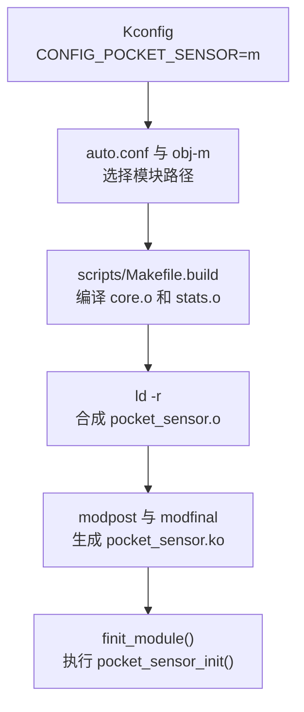
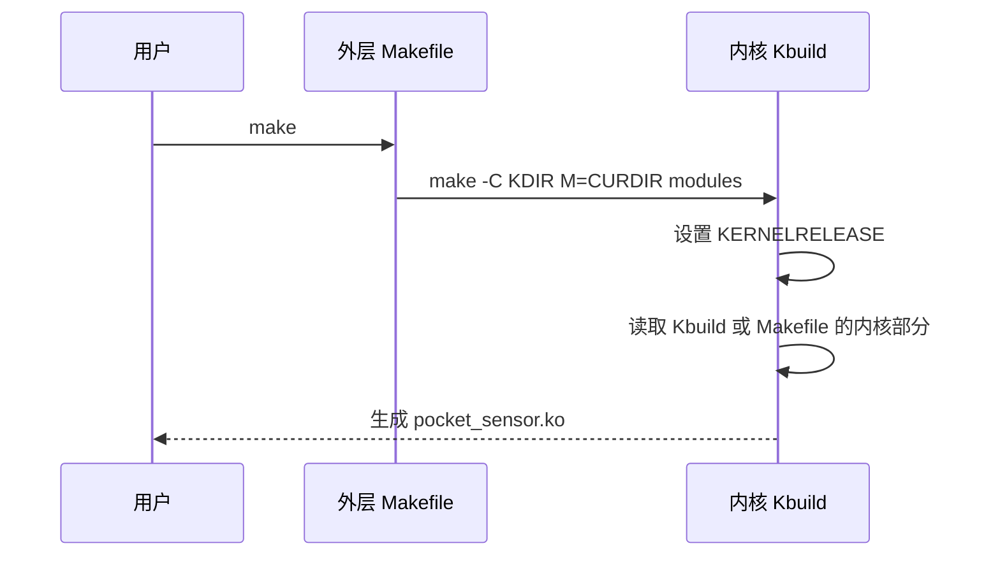
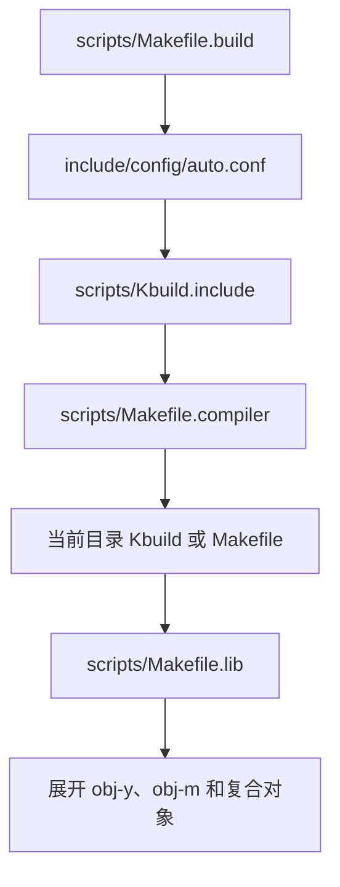
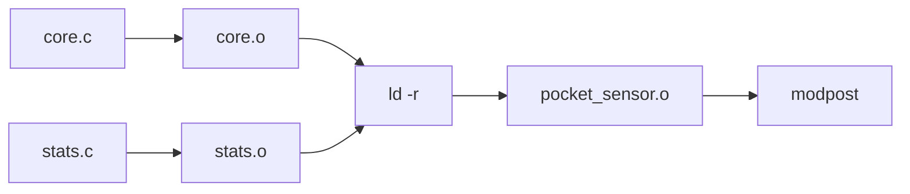
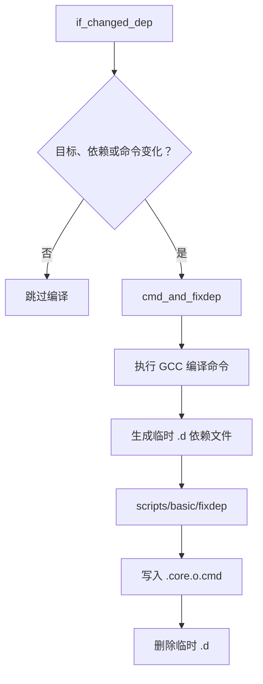
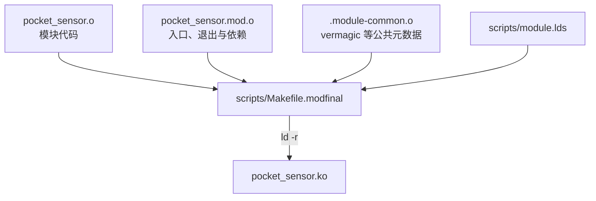
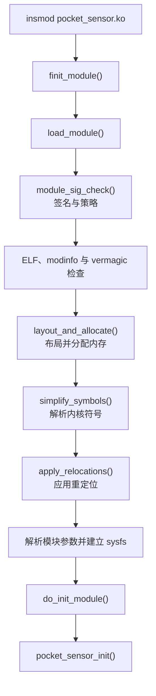
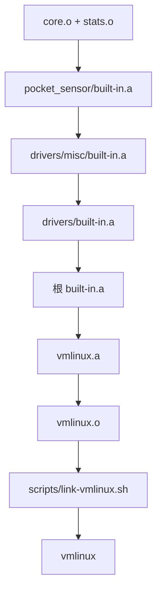
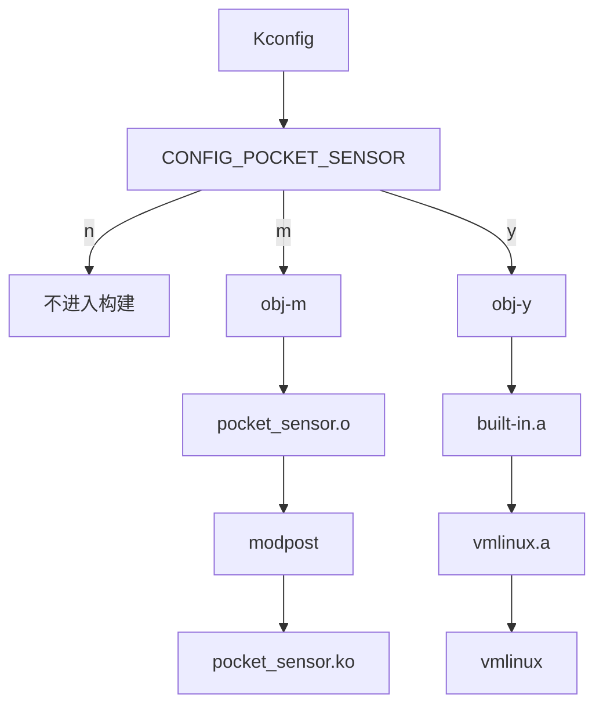

[上一篇文章](/posts/understanding-kconfig/)停在一行很小的 Makefile 上：

```makefile
obj-$(CONFIG_POCKET_SENSOR) += pocket_sensor.o
```

Kconfig 已经算出 `CONFIG_POCKET_SENSOR=m`，但这一行怎么变成一个能让内核执行的 `.ko`？我从 Linux v6.18 拉出这根线，写了一个双文件模块，编译它，拆开中间产物，再把它塞进 QEMU 里的 Linux 6.18。最后我真的看到了 `module_init()` 和 `module_exit()` 各执行一次。很好，配电柜之后，我们终于开始追电线了。



本文只讨论 Linux Kbuild。U-Boot 也继承了 Kbuild 的许多写法，但它没有 Linux 这条可加载模块链，最终镜像路径也不同。这里不把两种系统勉强揉成一种。

## 先把实验钉在具体版本上

我的实验环境如下：

| 项目 | 实验值 |
| --- | --- |
| Linux 源码 | `v6.18` |
| 架构 | `x86_64` |
| GNU Make | `4.4.1` |
| GCC | `15.2.0` |
| GNU Binutils | `2.46` |
| kmod | `31` |
| QEMU | `10.2.4` |
| BusyBox | `1.37.0` |

内核和外部模块统一使用 GCC 15.2.0 与 GNU Binutils 2.46。正式构建也应复用目标内核的工具链、配置和构建目录，因为 Linux 不向外部模块提供稳定的内核内 ABI。

我用下面的源码固定分析基准：

```bash
git clone --depth 1 --branch v6.18 \
  https://github.com/torvalds/linux.git linux-6.18
```

Linux 6.18 是这里的机制快照。后续版本可能移动规则、拆分生成文件或改变命令行，所以文中的源码链接都锁在 `v6.18` 标签。

## 先做出一个真的 `.ko`

| 时机 | 可观察行为 |
| --- | --- |
| 加载 | 读取 `label` 和 `samples` 两个模块参数 |
| 运行 | `stats.c` 分配并初始化一小段样本数组 |
| 卸载 | 释放数组并打印样本数 |

目录只有 5 个输入文件：

```text
pocket-sensor/
├── Kbuild
├── Makefile
├── core.c
├── stats.c
└── pocket_sensor.h
```

`core.c` 负责模块生命周期和参数：

```c
// SPDX-License-Identifier: GPL-2.0
#include <linux/init.h>
#include <linux/module.h>

#include "pocket_sensor.h"

static char *label = "desk";
module_param(label, charp, 0444);
MODULE_PARM_DESC(label, "Sensor label");

static unsigned int samples = 4;
module_param(samples, uint, 0444);
MODULE_PARM_DESC(samples, "Number of synthetic samples");

static int __init pocket_sensor_init(void)
{
	int ret;

	ret = pocket_stats_start(samples);
	if (ret)
		return ret;

	pr_info("pocket_sensor: loaded label=%s samples=%u\n",
		label, samples);
	return 0;
}

static void __exit pocket_sensor_exit(void)
{
	pr_info("pocket_sensor: unloaded samples=%u\n",
		pocket_stats_stop());
}

module_init(pocket_sensor_init);
module_exit(pocket_sensor_exit);

MODULE_AUTHOR("bfmhno3");
MODULE_DESCRIPTION("Small Kbuild experiment");
MODULE_LICENSE("GPL");
```

`stats.c` 提供第二个编译单元：

```c
// SPDX-License-Identifier: GPL-2.0
#include <linux/errno.h>
#include <linux/slab.h>
#include <linux/types.h>

#include "pocket_sensor.h"

static u32 *values;
static unsigned int value_count;

int pocket_stats_start(unsigned int count)
{
	unsigned int i;

	if (!count || count > 4096)
		return -EINVAL;

	values = kcalloc(count, sizeof(*values), GFP_KERNEL);
	if (!values)
		return -ENOMEM;

	for (i = 0; i < count; i++)
		values[i] = i;
	value_count = count;
	return 0;
}

unsigned int pocket_stats_stop(void)
{
	unsigned int count = value_count;

	kfree(values);
	values = NULL;
	value_count = 0;
	return count;
}
```

头文件只是两个编译单元之间的接口：

```c
/* SPDX-License-Identifier: GPL-2.0 */
#ifndef POCKET_SENSOR_H
#define POCKET_SENSOR_H

int pocket_stats_start(unsigned int count);
unsigned int pocket_stats_stop(void);

#endif
```

真正交给 Kbuild 的文件只有两行：

```makefile
obj-m += pocket_sensor.o
pocket_sensor-y := core.o stats.o
```

第一行声明最终模块，第二行声明组成这个模块的对象。`pocket_sensor-y` 里的 `y` 不是说整个模块内建；它表示这些对象无条件组成 `pocket_sensor.o`。最终走内建还是模块路径，仍由外层的 `obj-y` 或 `obj-m` 决定。

为了让目录里直接执行 `make`，我另外放一个很薄的包装 Makefile：

```makefile
KDIR ?= /path/to/linux-6.18-build

.PHONY: all clean
all:
	$(MAKE) -C $(KDIR) M=$(CURDIR) modules

clean:
	$(MAKE) -C $(KDIR) M=$(CURDIR) clean
```

`KDIR` 指向已经配置并完成构建的 Linux 6.18 输出目录。只运行 `modules_prepare` 可以补齐很多生成头和脚本，但在 `CONFIG_MODVERSIONS=y` 时，它不会生成 `Module.symvers`。我这次完整构建了实验内核和 `modules` 目标，避免把缺失符号版本伪装成模块问题。

第一次构建输出是：

```text
$ make
  CC [M]  core.o
  CC [M]  stats.o
  LD [M]  pocket_sensor.o
  MODPOST Module.symvers
  CC [M]  pocket_sensor.mod.o
  CC [M]  .module-common.o
  LD [M]  pocket_sensor.ko
```

干净构建耗时 `1.78` 秒，立刻再构建一次耗时 `0.89` 秒，第二次没有执行任何 `CC`、`LD` 或 `MODPOST`。这里的绝对时间包含启动多层 Make 的固定成本，不适合拿去跑编译器排行榜；有趣的是工作量从 7 个构建动作降到了 0。

5 个输入文件旁边出现了 19 个生成文件：

```text
core.o
stats.o
pocket_sensor.mod
pocket_sensor.o
modules.order
Module.symvers
pocket_sensor.mod.c
pocket_sensor.mod.o
.module-common.o
pocket_sensor.ko
.core.o.cmd
.stats.o.cmd
.pocket_sensor.mod.cmd
.pocket_sensor.o.cmd
.pocket_sensor.mod.o.cmd
.pocket_sensor.ko.cmd
```

此外还有为 `modules.order`、`Module.symvers` 和 `.module-common.o` 保存命令的 3 个隐藏 `.cmd` 文件。连同上面的 16 项，总数是 19。Kbuild 很像一条留下完整货运单的装配线：`.ko` 是箱子，旁边这些小文件告诉它箱子为什么需要重新装。

成品大小为 `6944` 字节：

```text
core.o               4064 bytes
stats.o              1608 bytes
pocket_sensor.o      5136 bytes
pocket_sensor.mod.o  2448 bytes
pocket_sensor.ko     6944 bytes
```

我还编译了一个只有单个 `.c` 的最小模块。它生成 `4552` 字节的 `.ko` 和 15 个派生文件；双文件实验生成 19 个派生文件。两个模块行为不同，所以 `2392` 字节的体积差不能全算作"多文件税"。真正由复合模块新增的关键动作，是把两个局部 `.o` 用 `ld -r` 合成最终的 `pocket_sensor.o`。

## `make -C ... M=... modules` 为什么像走了两遍？

命令是：

```bash
make -C "$KDIR" M="$PWD" modules
```

| 部分 | 作用 |
| --- | --- |
| `-C "$KDIR"` | 进入目标内核构建目录；这里必须有 `.config`、生成头、构建工具和 `Module.symvers` |
| `M="$PWD"` | 声明外部模块，并给出源码目录的绝对路径 |
| `modules` | 选择模块构建目标；它也是外部模块的默认目标 |
| 外层 Makefile | 把调用送进内核 Kbuild，不自行拼接内核编译参数 |

如果把包装逻辑和 Kbuild 声明写在同一个 Makefile，传统写法会检查 `KERNELRELEASE`：

```makefile
ifneq ($(KERNELRELEASE),)
obj-m += pocket_sensor.o
pocket_sensor-y := core.o stats.o
else
KDIR ?= /path/to/linux-6.18-build
all:
	$(MAKE) -C $(KDIR) M=$(CURDIR) modules
endif
```

第一次读取时，普通 Make 看见 `all` 并调用内核。第二次进入 Kbuild 后，`KERNELRELEASE` 已经存在，于是同一文件只暴露 `obj-m`。我选择独立的 `Kbuild` 文件后，不再需要这个分支；Kbuild 会优先读取 `Kbuild`，找不到才读取 `Makefile`。



Linux 6.13 以后还支持 `-f` 入口，它不要求先切换工作目录：

```bash
make -f "$KDIR/Makefile" M="$PWD" modules
```

两种入口最终进入同一套规则。这里的"两遍"不是 GNU Make 神秘地重复编译，而是包装层和内核构建层各读一次自己负责的描述。

### `src`、`obj`、`srctree`、`objtree`

| 变量 | 指向 |
| --- | --- |
| `srctree` | 内核源码树根目录 |
| `objtree` | 内核输出树根目录；非分离构建时通常等于 `srctree` |
| `src` | 当前 Kbuild 目录的源码路径 |
| `obj` | 当前 Kbuild 目录的输出路径或处理位置 |

构建内核时，`O=/path/to/out` 选择 `objtree`。它不等于"把外部模块输出放到这里"。Linux 6.18 为外部模块单独提供 `MO=/path/to/module-out`：

```bash
make -C "$KDIR" M="$PWD" MO="$PWD/out" modules
```

所以我会把边界记成：`O=` 管内核输出树，`M=` 指外部模块源码，`MO=` 可选地管外部模块输出。3 个路径混在一起时，很多看似缺头文件的问题其实只是拿错了构建目录。

## 一行 `obj-m` 怎样进入 `scripts/Makefile.build`？

上一篇文章已经追到这个入口：

```makefile
build := -f $(srctree)/scripts/Makefile.build obj
```

内核随后用近似下面的子 Make 调用处理一个目录：

```bash
make -f scripts/Makefile.build obj=<current-directory>
```

Linux 6.18 的 `scripts/Makefile.build` 先清空 `obj-y`、`obj-m`、flags 等局部变量，再按顺序读入配置和规则：



这解释了为什么一个目录中的 Kbuild 可以非常短。公共文件已经定义了如何编译 `.c`、怎样保存命令、如何归档 `built-in.a`、怎样生成 `modules.order`。目录文件只声明输入图，不重复写编译器菜谱。

对这两行输入：

```makefile
obj-m += pocket_sensor.o
pocket_sensor-y := core.o stats.o
```

`Makefile.build` 算出几组直接影响实验的集合：

```text
obj-m       = pocket_sensor.o
multi-obj-m = pocket_sensor.o
real-obj-m  = core.o stats.o
```

`multi-obj-m` 是需要部分链接的复合模块。`real-obj-m` 是真正从源码生成的叶子对象。`scripts/Makefile.lib` 再通过 `part-of-module` 给叶子编译追加 `-DMODULE`、`KBUILD_MODNAME` 等 flags。我的 `V=1` 输出中，`core.c` 的命令确实带有：

```text
-DMODULE
-DKBUILD_BASENAME='"core"'
-DKBUILD_MODNAME='"pocket_sensor"'
```

Kbuild 先生成一个内容只有两行的响应文件 `pocket_sensor.mod`：

```text
./core.o
./stats.o
```

然后执行实质上的：

```bash
ld -r -o pocket_sensor.o @pocket_sensor.mod
```

`-r` 产生仍可重定位的合并对象，不把它链接成用户空间可执行文件。此时 `core.o` 对 `pocket_stats_start()` 的未解析引用由同一次部分链接中的 `stats.o` 满足。这个阶段像把两个零件焊成一个仍带接口的总成，内核符号的插头还留在外面，稍后加载器再接。

`obj-y` 和 `obj-m` 也可能错误地同时列出同一个对象。Linux 6.18 明确执行：

```makefile
obj-m := $(filter-out $(obj-y),$(obj-m))
```

也就是内建版本优先，模块副本被移除。Kbuild 不会为同一个目标同时制造一份内建对象和一份 `.ko`，然后让我们猜哪份算数。

完整的模块前半段现在变成：



## `.cmd` 才是增量构建的记忆

| 判断 | Kbuild 使用的依据 |
| --- | --- |
| 编译命令是否改变 | `.cmd` 中保存的上一次完整命令 |
| 输入是否改变 | 源文件、头文件和被引用的 `CONFIG_*` 标记依赖 |

`core.o` 构建后，`.core.o.cmd` 开头保存完整命令：

```makefile
savedcmd_core.o := gcc ... -DMODULE ... -c -o core.o core.c
source_core.o := core.c
```

后面是一长串真实依赖。例如 `core.c` 包含的 `linux/module.h` 使用了模块开关，因此文件中出现：

```makefile
$(wildcard include/config/MODULES)
$(wildcard include/config/MODULE_UNLOAD)
```

规则链是：



`if_changed_dep` 会在目标缺失、普通依赖更新或保存的命令变化时重建。`fixdep` 还会扫描依赖文件里出现的 `CONFIG_FOO`，把它转成 `include/config/FOO` 标记依赖。它并不完整解析 C；Linux 6.18 的源码注释甚至直说，注释中出现的 `CONFIG_FOO` 也会被抓到。多编一次可以接受，漏编一次不行。

我实际做了 4 轮增量实验：

| 操作 | 重新执行的主要步骤 |
| --- | --- |
| 不改任何文件 | 无 `CC`、`LD`、`MODPOST` |
| 只改 `core.c` 中的普通注释 | `core.o`、复合链接、`modpost`、最终链接 |
| 修改编译 flags | `core.o` 和 `stats.o`、复合链接、`modpost`、最终链接 |
| 修改两者共同包含的 `pocket_sensor.h` | 两个叶子对象及后续链全部更新 |

配置依赖不需要额外造一个与模块无关的开关。后面的树内迁移直接用 `CONFIG_POCKET_SENSOR` 和 `CONFIG_POCKET_SENSOR_STATS` 验证：切换 `n/m/y` 后，Kbuild 会选择不编译、生成 `.ko` 或进入 `vmlinux`。目标内核配置或构建目录改变后，外部模块则应对匹配的新构建树做干净重建，不要复用旧 `.o`。

> [!IMPORTANT]
> `.cmd` 是派生状态，不是稳定接口。需要诊断时可以读它，不能把项目逻辑建立在它的具体文本格式上。

## `modpost` 不是又一个链接器

第一阶段结束时，我们已经有 `pocket_sensor.o`、`pocket_sensor.mod` 和 `modules.order`。`modules.order` 在这个实验里只有：

```text
pocket_sensor.o
```

它记录 Kbuild 发现模块的顺序。随后 `scripts/Makefile.modpost` 调用主机程序 `scripts/mod/modpost`。`modpost` 主要做静态审查和元数据生成：

| 阶段 | `modpost` 的工作 |
| --- | --- |
| 符号扫描 | 扫描导入、导出、`EXPORT_SYMBOL()` 和命名空间关系 |
| 符号检查 | 对照内核 `Module.symvers` 检查未解析符号 |
| 版本处理 | 在启用 `CONFIG_MODVERSIONS` 时处理符号 CRC |
| 静态检查 | 执行 section mismatch 等检查 |
| 代码生成 | 为每个模块生成 `<module>.mod.c` |
| 符号输出 | 为当前构建写出 `Module.symvers` |

这里有一个很好用的失败实验。我最初只构建了 `bzImage`，没有构建内核的 `modules` 目标，于是目标输出树中缺少 `Module.symvers`。`modpost` 没有含糊地吐出一个坏 `.ko`，而是列出：

```text
WARNING: .../Module.symvers is missing.
ERROR: modpost: "param_ops_uint" [pocket_sensor.ko] undefined!
ERROR: modpost: "__kmalloc_noprof" [pocket_sensor.ko] undefined!
ERROR: modpost: "kfree" [pocket_sensor.ko] undefined!
ERROR: modpost: "_printk" [pocket_sensor.ko] undefined!
ERROR: modpost: "param_ops_charp" [pocket_sensor.ko] undefined!
```

运行内核的 `make modules` 生成 `Module.symvers` 后，同一个模块通过。这正是 `modpost` 的价值：在 QEMU 启动前就指出内核符号账本不完整。

Linux 6.18 为我的模块生成了很短的 `pocket_sensor.mod.c`：

```c
#include <linux/module.h>
#include <linux/export-internal.h>
#include <linux/compiler.h>

MODULE_INFO(name, KBUILD_MODNAME);

__visible struct module __this_module
__section(".gnu.linkonce.this_module") = {
	.name = KBUILD_MODNAME,
	.init = init_module,
#ifdef CONFIG_MODULE_UNLOAD
	.exit = cleanup_module,
#endif
	.arch = MODULE_ARCH_INIT,
};

MODULE_INFO(depends, "");
```

这段代码把模块名、入口、退出函数和依赖写成内核加载器认识的结构。它被编译为 `pocket_sensor.mod.o`。

旧文章常把 `vermagic` 也指向 `<module>.mod.c`。Linux 6.18 已经把公共部分放进 `scripts/module-common.c`，编译为 `.module-common.o`；其中包含：

```c
MODULE_INFO(vermagic, VERMAGIC_STRING);
```

所以最终输入比常见简图多一个对象：



版本锁定在这里立刻有了价值。机制没变，但元数据从哪一个生成文件进入 `.ko` 已经变了。

## `.ko` 仍然是一个可重定位 ELF

`scripts/Makefile.modfinal` 最终执行近似下面的链接：

```bash
ld -r -T scripts/module.lds \
  -o pocket_sensor.ko \
  pocket_sensor.o pocket_sensor.mod.o .module-common.o
```

`readelf -h pocket_sensor.ko` 给出：

```text
Class:   ELF64
Data:    little endian
Type:    REL (Relocatable file)
Machine: Advanced Micro Devices X86-64
Entry:   0x0
```

它没有用户程序那种固定入口地址，也还没有落到最终运行地址。`readelf -SW` 在 6944 字节中找到了 31 个 section，其中最关键的是：

```text
.text
.init.text
.exit.text
.modinfo
__param
.gnu.linkonce.this_module
.rela.text
.rela.init.text
.rela.exit.text
```

`__init` 把初始化函数放进 `.init.text`，`__exit` 把退出函数放进 `.exit.text`。`module_param()` 产生 `__param` 数据，`MODULE_*` 宏向 `.modinfo` 填字符串，链接器保留 relocation section 等待内核处理。

`readelf -Ws` 还能看到尚未解析的内核符号：

```text
UND param_ops_uint
UND __kmalloc_noprof
UND kfree
UND _printk
UND param_ops_charp
```

这不是链接失败留下的垃圾。模块必须调用当前内核提供的分配器、日志和参数实现，所以 `.ko` 有意保留这些外部引用。`modpost` 已用 `Module.symvers` 检查它们是否合法，内核加载器稍后给它们填入运行地址。

`modinfo` 则把 `.modinfo` 翻译成人容易读的结果：

```text
filename:    pocket_sensor.ko
license:     GPL
description: Small Kbuild experiment
author:      bfmhno3
depends:
name:        pocket_sensor
vermagic:    6.18.0 mod_unload
parm:        label:Sensor label (charp)
parm:        samples:Number of synthetic samples (uint)
```

到这里，`.ko` 已经不神秘了。它是一个附带模块元数据、参数描述、未解析内核符号和重定位记录的 ELF relocatable object。

## 我把它真的装进了 Linux 6.18

我没有向宿主机加载实验模块。宿主机是工作环境，不是祭坛。我构建了一个精简的 x86_64 Linux 6.18、一个 `1,422,848` 字节的 initramfs，然后用 QEMU 启动：

```bash
qemu-system-x86_64 \
  -machine accel=tcg \
  -cpu max \
  -m 256M \
  -smp 1 \
  -nographic \
  -no-reboot \
  -kernel arch/x86/boot/bzImage \
  -initrd initramfs.cpio \
  -append "console=ttyS0 rdinit=/init panic=-1"
```

`/init` 挂载 `/proc` 和 `/sys`，然后执行：

```sh
insmod /pocket_sensor.ko label=qemu samples=7
cat /sys/module/pocket_sensor/parameters/label
cat /sys/module/pocket_sensor/parameters/samples
rmmod pocket_sensor
```

串口日志是：

```text
=== pocket_sensor experiment ===
pocket_sensor: loading out-of-tree module taints kernel.
pocket_sensor: loaded label=qemu samples=7
label=qemu
samples=7
pocket_sensor: unloaded samples=7
=== experiment complete ===
```

两个参数真的进入 `/sys/module/pocket_sensor/parameters/`，`stats.c` 分配的 7 个槽位在卸载时释放，初始化和退出日志各出现一次。外部模块 taint 也符合预期；它表示内核装入了树外代码，不表示实验失败。

### 从 `insmod` 到 `module_init()`

`insmod` 很薄。现代 kmod 通常打开模块文件并调用 `finit_module()`；内核也保留接收用户缓冲区的 `init_module()` syscall。Linux 6.18 的核心路径在 `kernel/module/main.c`：



`load_module()` 先检查签名，再验证 ELF 和 `vermagic`，计算各 section 布局并分配模块内存。`simplify_symbols()` 遍历 `SHN_UNDEF` 符号，把 `_printk`、`kfree` 等名字解析成内核或其他已加载模块中的地址。`apply_relocations()` 再按架构处理 `.rela.*`，把地址写进刚分配的代码和数据。

参数解析发生在入口函数之前。因此 `label=qemu samples=7` 已经写入静态变量，`pocket_sensor_init()` 一开始就能读。内核还根据 `__param` 建立 sysfs 属性。最后 `do_init_module()` 调用 `.mod.c` 中记录的 `init_module`，也就是宏展开后的 `pocket_sensor_init()`。

`insmod` 只加载指定文件，不主动解决依赖。真实驱动有依赖时通常用 `modprobe`，让它根据模块索引先加载依赖；但无论用户空间怎么安排文件，最终都进入上面的内核加载路径。

## 4 类错误分别在说什么？

模块错误经常只在终端留下一句短话，真正上下文在内核日志。我的排查顺序是先看 `dmesg`，再把错误放回加载链。

| 用户空间错误 | 加载阶段 | 首要检查 |
| --- | --- | --- |
| `Invalid module format` | ELF、`vermagic` 或符号版本检查 | 架构、目标构建目录、内核配置和 `dmesg` |
| `Unknown symbol` | 符号解析 | 依赖模块、导出符号、命名空间和 `Module.symvers` |
| `Operation not permitted` | 权限或安全策略 | `CAP_SYS_MODULE`、`modules_disabled`、LSM 和 lockdown |
| `Required key not available` | 模块签名验证 | 签名、可信 keyring 和强制签名策略 |

### `Invalid module format`

它通常对应 `ENOEXEC`，但原因不只一个。常见情况包括：

- `.ko` 的架构或 ELF 结构不符合当前内核。
- `vermagic` 不匹配。
- 启用 `CONFIG_MODVERSIONS` 后，关键符号 CRC 不匹配。
- 生成 `struct module` 的构建配置与运行内核不一致。

Linux 6.18 的 `check_modinfo()` 会比较模块和内核的 magic，并在日志中打印两边字符串。正确修复是用运行内核对应的构建目录和配置重新编译，不是删掉 `vermagic` 或使用强制加载把检查蒙住。

### `Unknown symbol`

`simplify_symbols()` 无法为某个 `SHN_UNDEF` 找到可用的导出符号。可能是依赖模块没有加载、目标内核没导出该符号、命名空间导入缺失，或外部模块调用了不该调用的内部接口。

先用 `modinfo` 查看依赖，再检查 `Module.symvers` 和目标内核配置。若 `modpost` 已经警告 unresolved symbol，不要期待运行时突然心软。

### `Operation not permitted`

加载入口先执行 `may_init_module()`。Linux 6.18 在调用者缺少 `CAP_SYS_MODULE` 或 `modules_disabled=1` 时返回 `EPERM`；LSM、lockdown 和容器策略也可能拒绝加载。`sudo` 只能解决普通权限，不会自动推翻 Secure Boot lockdown 或宿主机给容器划下的边界。

### `Required key not available` 或 `Key was rejected by service`

启用强制模块签名后，`module_sig_check()` 会验证附在模块末尾的 PKCS#7 签名。模块未签名、算法不支持或密钥不在可信 keyring 中时，Linux 6.18 的强制路径返回 `EKEYREJECTED`，用户空间显示的短句随 errno 翻译和加载路径而异。正确路径是用目标系统信任的密钥签名并部署证书，不是关闭检查。

> [!WARNING]
> 强制加载、伪造版本字符串和关闭签名策略会把"构建产物不匹配"变成"内核正在执行未经验证的代码"。它们不是调试捷径，而是在移除护栏。

## 把 `obj-m` 换成 `obj-y` 会发生什么？

模块路径现在完整了，但上一篇真正留下的问题还有一半：`CONFIG_FOO=y` 去了哪里？

对树内目录，父级 Makefile 写：

```makefile
obj-$(CONFIG_POCKET_SENSOR) += pocket_sensor/
```

当值为 `y`，`scripts/Makefile.build` 递归进入目录，并把子目录的内建对象装进：

```text
drivers/misc/pocket_sensor/built-in.a
```

Linux 6.18 使用：

```makefile
ar cDPrST built-in.a ...
```

其中 `T` 创建 thin archive。它主要保存成员路径，不复制每个 `.o` 的完整内容。我的归档由两个成员组成：

```text
drivers/misc/pocket_sensor/core.o
drivers/misc/pocket_sensor/stats.o
```

目录层级继续向上汇聚：



顶层 Makefile 用 `KBUILD_VMLINUX_OBJS` 生成 `vmlinux.a`，`scripts/Makefile.vmlinux_o` 通过 `--whole-archive vmlinux.a` 生成 `vmlinux.o`，`scripts/link-vmlinux.sh` 再完成架构相关的最终链接。`y` 状态不会生成或更新 `pocket_sensor.ko`；若刚从 `m` 切到 `y`，输出树里可能仍留着旧 `.ko`，它只是陈旧产物，`make clean` 才会移除。

`modules.builtin` 中仍会记录一个逻辑路径：

```text
kernel/drivers/misc/pocket_sensor/pocket_sensor.ko
```

它告诉 `modprobe` 这个模块名已经内建，不表示磁盘上真的生成了那份 `.ko`。我的 `System.map` 则能找到 `pocket_sensor_init`、`pocket_stats_start` 和对应 initcall，证明代码已经进入 `vmlinux`。

### 内建时 `module_init()` 变成 initcall

| 构建形态 | `module_init()` 的结果 |
| --- | --- |
| 可加载模块 | 提供 `.mod.c` 所引用的 `init_module` 入口 |
| 内建代码 | 映射到 `device_initcall()`，把函数指针放进 initcall section |

Linux 按 initcall level 执行；同一 level 内的次序受链接顺序影响。`obj-y` 的排列因此不只是审美问题。两个驱动若偷偷依赖初始化先后，调换 Makefile 中对象顺序就可能改变启动行为。更好的设计仍是显式表达依赖，而不是拿链接顺序当隐藏 API。

`module_exit()` 对可卸载模块是 `rmmod` 路径。内建代码正常运行期间不会被卸载，所以退出函数没有对应的日常生命周期意义；我的 `System.map` 仍保留了 `pocket_sensor_exit`，但内核不会把它当作可卸载模块的退出回调来调用。不要因为同一份源码能用 `y` 和 `m` 编译，就假设两种生命周期完全对称。

## 我把外部模块迁回了内核树

实验目录改为：

```text
drivers/misc/pocket_sensor/
├── Kconfig
├── Makefile
├── core.c
├── stats.c
└── pocket_sensor.h
```

父级 `drivers/misc/Kconfig` 加一行：

```text
source "drivers/misc/pocket_sensor/Kconfig"
```

配置文件为：

```text
# SPDX-License-Identifier: GPL-2.0-only
config POCKET_SENSOR
	tristate "Pocket sensor experiment"
	help
	  Build the pocket sensor used to trace the Kbuild pipeline.

config POCKET_SENSOR_STATS
	bool "Pocket sensor statistics"
	depends on POCKET_SENSOR
	default y
	help
	  Add the synthetic sample storage used by the experiment.
```

父级 `drivers/misc/Makefile` 决定是否进入目录：

```makefile
obj-$(CONFIG_POCKET_SENSOR) += pocket_sensor/
```

子目录 Makefile 决定总成和可选零件：

```makefile
# SPDX-License-Identifier: GPL-2.0-only
obj-$(CONFIG_POCKET_SENSOR) += pocket_sensor.o
pocket_sensor-y := core.o
pocket_sensor-$(CONFIG_POCKET_SENSOR_STATS) += stats.o
```

当 statistics 关闭时，头文件提供不分配内存的 inline 实现；当它打开时，`stats.o` 进入复合对象。这样配置和链接图一致，不会让 `core.o` 留下无人提供的函数。

我在同一个 Linux 6.18 输出树里验证了 3 种状态：

| 配置 | 实际构建结果 |
| --- | --- |
| `CONFIG_POCKET_SENSOR=n` | 没有创建 `drivers/misc/pocket_sensor/` 输出目录 |
| `CONFIG_POCKET_SENSOR=m` | 编译 `core.o`、`stats.o`，部分链接并生成 `pocket_sensor.ko` |
| `CONFIG_POCKET_SENSOR=y` | 两个对象进入 thin `built-in.a`，随后进入 `vmlinux` |

`y` 状态的增量构建日志把路径完整打印出来：

```text
CC      drivers/misc/pocket_sensor/core.o
CC      drivers/misc/pocket_sensor/stats.o
AR      drivers/misc/pocket_sensor/built-in.a
AR      drivers/misc/built-in.a
AR      drivers/built-in.a
AR      built-in.a
AR      vmlinux.a
LD      vmlinux.o
MODPOST vmlinux.symvers
LD      vmlinux.unstripped
OBJCOPY vmlinux
```

这也把两篇文章真正接上了：



## 外部模块和树内模块的维护边界

两条路径共享 Kbuild 语法和大量编译规则，但维护契约不同。

| 维度 | 外部模块 | 树内模块 |
| --- | --- | --- |
| 适合场景 | 快速验证、尚未上游的厂商驱动、独立发布或 DKMS | 与内核同步演进、接入子系统测试、准备上游或长期维护产品内核 |
| 版本关系 | 内核内部 API 和 ABI 变化后，可能需要重编或修改源码 | 接口与调用方可以在同一次内核提交中原子修改 |
| 构建要求 | 构建目录、`.config`、`Module.symvers` 和工具链必须匹配目标内核 | 由同一内核源码树、配置和 Kbuild 图统一构建 |
| 安全与交付 | 需要单独处理安装、依赖索引、Secure Boot 签名和密钥部署 | 跟随内核镜像或模块安装流程交付 |
| 集成成本 | 初期低，但升级兼容工作由模块维护者承担 | 初期要补齐 Kconfig、测试、文档和子系统审查 |

DKMS 解决的是自动重编与安装流程，不会把不稳定的内核 ABI 变稳定。

树内也不是把目录复制到 `drivers/` 就结束。正式驱动还要遵守子系统接口、代码风格、`MAINTAINERS`、文档与设备绑定规范，并写出准确的 Kconfig 依赖。我的 `pocket_sensor` 故意没有 platform bus、Device Tree、I2C 或真实寄存器访问；伪造硬件只会让 Kbuild 主线被一堆无意义的驱动样板淹没。

## ARM64 工程只多哪一层？

Kbuild 数据流不因架构改变。交叉构建 ARM64 外部模块时，通常在内核配置、内核构建和模块构建中保持同一组变量：

```bash
make O="$KOUT" \
  ARCH=arm64 \
  CROSS_COMPILE=aarch64-linux-gnu- \
  my_board_defconfig

make O="$KOUT" \
  ARCH=arm64 \
  CROSS_COMPILE=aarch64-linux-gnu- \
  -j"$(nproc)"

make -C "$KOUT" \
  M="$PWD" \
  ARCH=arm64 \
  CROSS_COMPILE=aarch64-linux-gnu- \
  modules
```

新增的是目标架构、交叉工具链和真实板卡的启动链，不是第二套 `obj-m -> modpost -> .ko` 机制。加载时仍要保证运行内核就是这份配置和符号账本对应的内核。

## 继续往下追

这次我从 2 行 Kbuild 得到了一个 `6944` 字节的 ELF，在 QEMU 中给它传入 2 个参数，观察它分配 7 个样本槽位，再完整卸载。沿途最让我意外的不是链接器，而是那些小账本：`.cmd` 记住命令和依赖，`pocket_sensor.mod` 记住复合对象，`modules.order` 记住模块顺序，`Module.symvers` 记住内核可见符号，`.mod.c` 把入口写回 C。

如果继续向下走，下一站应该是真实总线和设备模型：让同一个模块不再凭 `insmod` 自说自话，而是由 Device Tree 描述硬件，由 platform 或 I2C core 完成匹配，再看 probe、defer 和 remove 如何与 Kbuild 产物相遇。到那时 `.ko` 已经不是神秘黑盒，只是驱动生命周期被装进 ELF 后的运输形态。

很好。我现在可以停止盯着 `obj-m` 猜 Make 的心情，开始给那块并不存在的传感器寻找一块真正的板子了。

## 参考资料

- [Linux 6.18: Building External Modules](https://github.com/torvalds/linux/blob/v6.18/Documentation/kbuild/modules.rst)
- [Linux 6.18: Linux Kernel Makefiles](https://github.com/torvalds/linux/blob/v6.18/Documentation/kbuild/makefiles.rst)
- [Linux 6.18: scripts/Kbuild.include](https://github.com/torvalds/linux/blob/v6.18/scripts/Kbuild.include)
- [Linux 6.18: scripts/Makefile.build](https://github.com/torvalds/linux/blob/v6.18/scripts/Makefile.build)
- [Linux 6.18: scripts/Makefile.lib](https://github.com/torvalds/linux/blob/v6.18/scripts/Makefile.lib)
- [Linux 6.18: scripts/Makefile.modpost](https://github.com/torvalds/linux/blob/v6.18/scripts/Makefile.modpost)
- [Linux 6.18: scripts/Makefile.modfinal](https://github.com/torvalds/linux/blob/v6.18/scripts/Makefile.modfinal)
- [Linux 6.18: scripts/module-common.c](https://github.com/torvalds/linux/blob/v6.18/scripts/module-common.c)
- [Linux 6.18: scripts/link-vmlinux.sh](https://github.com/torvalds/linux/blob/v6.18/scripts/link-vmlinux.sh)
- [Linux 6.18: kernel/module/main.c](https://github.com/torvalds/linux/blob/v6.18/kernel/module/main.c)
- [Linux 6.18: Module signing facility](https://github.com/torvalds/linux/blob/v6.18/Documentation/admin-guide/module-signing.rst)
