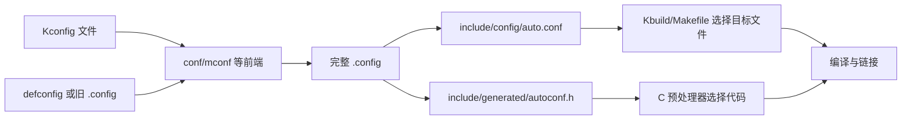

我最近需要自己裁剪并构建 U-Boot 和 Linux Kernel。两个项目都让我先选一个 `defconfig`，再面对 `menuconfig` 里几千个选项，最后得到一片 `CONFIG_FOO=y`。我会用这些命令，却不知道中间发生了什么。于是我取出 Linux 6.18 的 Kconfig 实现，写了一棵只有 7 个符号的配置树，并一路追到 Makefile 和 C 预处理器。30 行 Kconfig 之后，这套系统终于不再像一个蓝色背景的许愿池。

本文以 **Linux 6.18** 和 **U-Boot v2026.07** 为准。Linux 6.18 是 2025 年 11 月 30 日发布的 longterm 内核，预计维护到 2028 年 12 月；U-Boot v2026.07 则是写作时适合新项目参考的稳定版本。Kconfig 的核心模型很稳定，但具体符号、默认值和 U-Boot 的兼容生成步骤会随版本变化，所以我会把机制和某个板子的配置内容分开。

## 先纠正一个名字

Kconfig 不是完整的构建系统。

我更愿意把整个过程分成 3 层：

1. **Kconfig** 描述有哪些配置符号、它们的类型、默认值和约束，并求出一份合法配置。
2. **Kbuild/Makefile** 读取配置，决定哪些目录和 `.o` 文件参加编译，以及传递哪些编译选项。
3. **编译器和链接器** 根据宏继续裁剪 C 代码，最后生成内核或 U-Boot 镜像。

Kconfig 像配电柜：它决定哪些回路通电，但并不亲自制造电器。`make menuconfig` 只是配电柜的一块操作面板，不是配电柜本身，更不是发电厂。



这张图是本文最重要的地图。后面的每个文件都只是在这条数据流上承担一个角色。

## 我先造一个口袋大小的配置系统

我使用 Linux 6.18 自带的 `scripts/kconfig/`，因为 U-Boot 的 Kconfig 语言源自 Linux，而 Linux 版本还保留了 `m` 这个最容易暴露三值逻辑的状态。先取得源码：

```bash
git clone --depth 1 --branch v6.18 \
  https://github.com/torvalds/linux.git linux-6.18
cd linux-6.18
mkdir -p lab/drivers
```

Kconfig 前端需要主机上的 C 编译器、GNU Make、Flex 和 Bison。`menuconfig` 还需要 ncurses 开发文件。这里只运行非交互的 `alldefconfig`，所以先不碰 ncurses。

根配置 `lab/Kconfig` 如下：

```text
mainmenu "Pocket Board Configuration"

config MODULES
	bool "Enable loadable modules"
	modules
	default y

menu "Board"

config SOC_ALPHA
	bool "Alpha SoC"
	default y

config HAS_I2C
	bool
	default y if SOC_ALPHA

config LOG_LEVEL
	int "Log level"
	range 0 4
	default 2

endmenu

source "lab/drivers/Kconfig"
```

驱动配置放在 `lab/drivers/Kconfig`：

```text
menu "Drivers"

config SENSOR
	tristate "Temperature sensor"
	depends on HAS_I2C
	default m

config SENSOR_DEBUG
	bool "Verbose sensor debugging"
	depends on SENSOR

config APP
	bool "Sensor application"
	select SENSOR_CORE

config SENSOR_CORE
	bool
	depends on HAS_I2C

endmenu
```

现在让 Linux 的构建入口编译 Kconfig 前端，并用所有符号的默认值求解一次：

```bash
make O="$PWD/out" KBUILD_KCONFIG=lab/Kconfig alldefconfig
```

`O=` 把生成物放进 `out/`，`KBUILD_KCONFIG` 把入口从内核根目录的 `Kconfig` 换成我的实验文件。第一次运行还会把 `conf.c`、解析器和词法分析器编译成主机程序 `out/scripts/kconfig/conf`。换句话说，配置 Linux 之前，Linux 先在我的电脑上编译了一个小型配置求解器（构建系统也要先构建自己，乌龟下面还是乌龟）。

我得到的 `out/.config` 核心部分是：

```text
CONFIG_MODULES=y
CONFIG_SOC_ALPHA=y
CONFIG_HAS_I2C=y
CONFIG_LOG_LEVEL=2
CONFIG_SENSOR=m
# CONFIG_SENSOR_DEBUG is not set
# CONFIG_APP is not set
```

这里已经发生了几件值得追踪的事：

- 我没有直接设置 `HAS_I2C`，它从 `SOC_ALPHA=y` 的条件默认值得到 `y`。
- `SENSOR` 的上限允许到 `y`，默认值把它设成 `m`。
- `SENSOR_DEBUG` 没有显式 `default`，所以默认为 `n`。
- `APP` 同样默认为 `n`，因此它还没有触发 `select`。

Kconfig 文件不是按顺序执行的 Shell 脚本。解析器先收集符号与关系，再计算值、可见性和取值上下限。把它当成一个受约束的配置数据库，比把它当成一串赋值语句准确得多。

## 一个 `config` 到底定义了什么？

最常见的条目是：

```text
config SENSOR
	tristate "Temperature sensor"
	depends on HAS_I2C
	default m
	help
	  Build support for the temperature sensor.
```

`SENSOR` 是符号名。写入配置文件时，前端通常给它加上 `CONFIG_` 前缀，于是得到 `CONFIG_SENSOR`。Kconfig 源码中的依赖表达式仍然写 `SENSOR`，不要写 `CONFIG_SENSOR`。

一个符号常见的属性包括：

| 属性 | 回答的问题 |
| --- | --- |
| `bool` / `tristate` / `string` / `int` / `hex` | 值属于什么类型？ |
| `prompt` 或类型后的字符串 | 用户能否在界面中看到并修改它？ |
| `default` | 用户没有给值时，从哪里开始？ |
| `depends on` | 这个符号允许取到多大的值？ |
| `select` | 当前符号启用时，强制抬高哪个符号的下限？ |
| `imply` | 当前符号启用时，弱建议哪个符号？ |
| `range` | 整数或十六进制值允许在哪个区间？ |
| `help` | 用户在配置界面请求帮助时看到什么？ |

类型后的提示文字其实是 `prompt` 的简写：

```text
bool "Alpha SoC"
```

等价于：

```text
bool
prompt "Alpha SoC"
```

这解释了一个常见现象：**符号存在，不代表它会出现在 `menuconfig`。** `HAS_I2C` 和 `SENSOR_CORE` 没有 prompt，它们是内部符号。用户不能直接操作它们，只能让 `default`、`select` 等关系计算出值。编辑 `.config` 强塞一个值也不会把内部符号变成公开开关；下一次解析时，Kconfig 仍按它的定义处理。

`menu`、`comment` 和 `mainmenu` 主要组织界面。`source` 把另一份 Kconfig 文件读入同一棵配置树。它们不会因为排版漂亮就自动让任何 `.c` 文件参加编译。

## `n`、`m`、`y` 不是 3 个字符串

Linux 的 `tristate` 使用三值逻辑：

| 文本 | 数值 | 含义 |
| --- | ---: | --- |
| `n` | 0 | 不构建 |
| `m` | 1 | 构建为可加载模块 |
| `y` | 2 | 内建 |

表达式中的 `&&` 取较小值，`||` 取较大值，`!` 则做 $2-x$：

```text
m && y = m
m || n = m
!m = m
```

这不是普通布尔代数中随手多塞了一个字母。它让依赖能够表达一个关键约束：内建代码不能依赖只在运行时才加载的模块。例如 `FOO=y` 且 `BAR=m` 时，`FOO depends on BAR` 会把 `FOO` 的上限压到 `m`，因此 `FOO` 不能保持 `y`。

`modules` 属性指定哪一个符号负责开启模块状态。Linux 使用它让大量 `tristate` 真正拥有 `m`。U-Boot v2026.07 没有 Linux 那样的可加载内核模块体系，也没有定义全局 `MODULES` 符号。它的树中仍能看到一些 `tristate` 声明，但日常板级裁剪应把 U-Boot 配置理解为主要在 `n/y` 之间选择，不要看到 `tristate` 就期待生成 `.ko`。

## `depends on` 是上限，不是自动开关

假设：

```text
config SENSOR
	tristate "Temperature sensor"
	depends on HAS_I2C
```

当 `HAS_I2C=n` 时，`SENSOR` 的最大值是 `n`，界面也会把它隐藏或禁用。当 `HAS_I2C=y` 时，Kconfig 只是允许 `SENSOR` 取 `n`、`m` 或 `y`，并不会替用户启用它。

所以 `depends on` 的读法不是：

> 选择 SENSOR 时，顺便打开 HAS_I2C。

而是：

> 只有 HAS_I2C 足够可用时，SENSOR 才允许达到相应状态。

菜单也会传递依赖：

```text
menu "I2C drivers"
	depends on HAS_I2C

config SENSOR_A
	tristate "Sensor A"

config SENSOR_B
	tristate "Sensor B"

endmenu
```

这里 `SENSOR_A` 和 `SENSOR_B` 都继承 `HAS_I2C` 依赖。`if ... endif` 也会把表达式附加到内部条目。它们不只是界面折叠工具。

## `default` 只在用户没有决定时说话

Kconfig 允许一个符号出现多个 `default`：

```text
config BUFFER_SIZE
	int "Buffer size"
	default 4096 if ARCH_64BIT
	default 1024
```

如果多个默认值的条件都成立，**源码中第一个可见的默认值生效**。但默认值只在用户没有提供值时使用。用户已经通过配置界面或已有 `.config` 选过 `2048`，`default 4096` 不会每次构建都把它夺回来。

这也解释了为什么新增配置通常保持 `default n`。旧配置升级到新源码时，`make olddefconfig` 会替新符号采用默认值；如果每个新驱动都 `default y`，一次版本升级就会把内核悄悄养胖。Linux 文档只为保留旧行为、纯粹打开下级菜单的 gatekeeper，以及少数用户普遍预期的基础设施等情况建议 `default y`。

## `select` 很方便，也很锋利

实验中的 `APP` 写成：

```text
config APP
	bool "Sensor application"
	select SENSOR_CORE

config SENSOR_CORE
	bool
	depends on HAS_I2C
```

我又准备了一份故意不合法的输入：

```text
# CONFIG_SOC_ALPHA is not set
CONFIG_APP=y
```

此时 `HAS_I2C=n`。我把它交给同一个 Linux 6.18 `conf`，得到：

```console
WARNING: unmet direct dependencies detected for SENSOR_CORE
  Depends on [n]: HAS_I2C [=n]
  Selected by [y]:
  - APP [=y]
```

`select` 强制抬高目标符号的值，**不会沿着目标符号的 `depends on` 继续解决依赖**。于是 `APP` 可以把 `SENSOR_CORE` 推到 `y`，同时留下 `HAS_I2C=n` 这个自相矛盾的组合。

这不是求解器忘了帮忙，而是 `select` 的定义。Linux 文档明确建议谨慎使用它，最好只选择没有 prompt、也没有依赖的内部符号。若用户应该理解并控制前置条件，使用 `depends on`；若只是希望另一个功能通常随当前功能开启，但仍允许用户关闭，考虑 `imply`。

一个无聊但安全的重构通常是把能力和实现拆开：

```text
config HAVE_SENSOR_CORE
	bool

config SENSOR_CORE
	bool "Sensor core"
	depends on HAVE_SENSOR_CORE && HAS_I2C
```

平台可以 `select HAVE_SENSOR_CORE`，却不绕过 `SENSOR_CORE` 自己的运行条件。多写一个内部符号，比得到一份能通过配置但不能链接的组合便宜得多。

## `defconfig`、`.config` 到底谁是谁？

这是我以前最容易混淆的部分。

### `Kconfig` 是规则库

散布在源码树中的 `Kconfig` 文件定义全部符号和关系。Linux 6.18 的 Git 索引中有 1881 个文件名包含 `Kconfig`，U-Boot v2026.07 中有 1098 个。单靠一个平铺的配置文件维护这种规模，大概会迅速演化成考古学。

### `defconfig` 是最小起点

Linux 的架构默认配置通常位于：

```text
arch/<arch>/configs/<name>_defconfig
```

U-Boot 的板级默认配置位于：

```text
configs/<board>_defconfig
```

它们通常只保存偏离 Kconfig 默认值的决定，不是完整快照。我实际运行：

```bash
make O=/tmp/uboot-out sandbox_defconfig
```

U-Boot v2026.07 的 `configs/sandbox_defconfig` 中有 392 行已启用的 `CONFIG_` 赋值，展开后的 `/tmp/uboot-out/.config` 有 1125 行已启用赋值，约为 **2.87 倍**。剩余值来自默认值、架构选择、依赖和反向依赖。

> [!IMPORTANT]
> 不要把 `defconfig` 直接复制成 `.config` 后立刻编译，也不要假设它已经列出每个关闭项。应该通过 `make <board>_defconfig` 或对应配置目标，让当前源码树重新求解完整配置。

### `.config` 是当前构建的完整用户配置

`.config` 是某个源码版本、架构和用户选择组合后的工作状态。它比 `defconfig` 完整，也更容易在版本升级后变旧。

常见的关闭项写作：

```text
# CONFIG_SENSOR_DEBUG is not set
```

这不是普通注释，而是 Kconfig 保存 `n` 的标准形式。对于 Makefile 消费的 `auto.conf` 和 C 代码消费的 `autoconf.h`，关闭符号通常直接缺席。

### `savedefconfig` 做反向压缩

完成配置后：

```bash
make savedefconfig
```

Kconfig 会在源码树或输出树中生成名为 `defconfig` 的最小配置，只保留相对当前默认规则有必要记录的选择。U-Boot 新板级配置的常见工作流是：

```bash
make my_board_defconfig
make menuconfig
make savedefconfig
cp defconfig configs/my_board_defconfig
```

提交前应重新从保存的 defconfig 展开一次，确认它确实复现预期配置。默认值会变化，所以 `savedefconfig` 是相对于**当前 Kconfig 规则**做的压缩，不是跨所有未来版本的数学最小集。

## 一次配置命令实际经过什么？

以 U-Boot 为例：

```bash
make O=build my_board_defconfig
```

可以拆成下面几步：

1. 顶层 Makefile 识别 `<board>_defconfig` 配置目标。
2. 构建主机程序 `scripts/kconfig/conf`。这里用的是主机编译器 `HOSTCC`，不是给目标板生成代码的交叉编译器。
3. `conf` 从根 `Kconfig` 开始，递归解析 `source` 引入的文件，建立符号、菜单和依赖图。
4. `conf` 读取 `configs/my_board_defconfig` 作为输入，补齐默认值并施加约束。
5. 完整结果写入 `build/.config`。
6. 后续同步生成 Makefile 和 C 代码需要的配置文件。

`menuconfig`、`nconfig`、`xconfig` 和 `gconfig` 共享同一套解析与求值核心，只是前端不同：

| 目标 | 交互方式 |
| --- | --- |
| `config` | 逐行询问 |
| `menuconfig` | ncurses 菜单 |
| `nconfig` | 另一套 ncurses 界面 |
| `xconfig` | Qt 图形界面 |
| `oldconfig` | 读取旧配置，并逐个询问新符号 |
| `olddefconfig` | 读取旧配置，新符号直接采用默认值 |
| `alldefconfig` | 从所有默认值生成新配置 |
| `allnoconfig` | 尽量全部设为 `n`，仍受强制关系约束 |
| `savedefconfig` | 把当前配置压缩成最小 defconfig |
| `listnewconfig` | 列出旧配置中没有的新符号 |

`menuconfig` 并不拥有特殊的求值能力。它只是让人类更容易编辑同一张配置图。自动化构建通常更偏爱 `olddefconfig`，因为 CI 不太擅长在蓝色菜单里按空格键（至少目前如此）。

## 配置怎样进入 Makefile？

同步配置后，Linux 和 U-Boot 都会生成：

```text
include/config/auto.conf
```

内容类似：

```makefile
CONFIG_HAS_I2C=y
CONFIG_LOG_LEVEL=3
CONFIG_SENSOR=y
```

顶层构建系统把它当作 Makefile 片段包含进来。子目录 Makefile 就可以写：

```makefile
obj-$(CONFIG_SENSOR) += sensor.o
```

展开过程非常直接：

- `CONFIG_SENSOR=y` 得到 `obj-y += sensor.o`，对象内建。
- `CONFIG_SENSOR=m` 得到 `obj-m += sensor.o`，Linux 把对象送入模块构建路径。
- `CONFIG_SENSOR` 未定义时得到 `obj- += sensor.o`，正常的 `obj-y` / `obj-m` 收集逻辑不会选择它。

目录也能用同样方式裁剪：

```makefile
obj-$(CONFIG_HAS_I2C) += i2c/
```

所以关闭一个驱动最彻底的效果不是给整份 C 文件套上 `#if 0`，而是让它根本不进入编译输入。编译器少工作，链接器也不必期待稍后用 section garbage collection 擦屁股。

U-Boot 还要处理 SPL、TPL、VPL 等不同阶段，因此源码中常见：

```makefile
obj-$(CONFIG_$(PHASE_)ADC) += adc-uclass.o
```

`PHASE_` 会让构建阶段选择 `CONFIG_ADC`、`CONFIG_SPL_ADC`、`CONFIG_TPL_ADC` 等对应符号。裁剪 U-Boot 时必须问清楚一个功能属于完整 U-Boot 还是早期阶段；只关 `CONFIG_FOO`，不代表 `CONFIG_SPL_FOO` 自动消失。

### Linux 中谁消费 `obj-y` 和 `obj-m`？

上面的表达式还留下了一个问题：谁读取这些变量并把它们变成编译动作？在 Linux 6.18 中，关键入口叫 `scripts/Makefile.build`。`scripts/Kbuild.include` 先定义一段缩写：

```makefile
build := -f $(srctree)/scripts/Makefile.build obj
```

因此顶层 Makefile 中的：

```makefile
$(Q)$(MAKE) $(build)=drivers/i2c
```

大致等价于再次调用 Make，并指定当前处理的目录：

```bash
make -f scripts/Makefile.build obj=drivers/i2c
```

`scripts/Makefile.build` 是逐目录工作的通用引擎。它先清空 `obj-y`、`obj-m`、`lib-y`、编译 flags 等变量，避免环境中的同名变量混进来；然后读取 `include/config/auto.conf`、公共 Kbuild 规则、编译器规则、当前目录的 `Kbuild` 或 `Makefile`，最后再读取 `scripts/Makefile.lib`。如果同一目录同时存在 `Kbuild` 和 `Makefile`，Kbuild 基础设施优先使用 `Kbuild`。


读取当前目录规则后，`scripts/Makefile.build` 会展开复合对象，找出要递归进入的子目录，并把 `obj-y` 中的子目录映射为对应的 `built-in.a`。启用模块构建时，它也会沿 `obj-m` 收集模块目标并生成 `modules.order`。例如 `drivers/i2c/` 不是由顶层 Makefile 硬编码每一个源文件，而是同一套引擎带着不同的 `obj` 参数逐层下钻。

这就是本文需要抵达的 Kbuild 边界：Kconfig 求出 `CONFIG_FOO`，`auto.conf` 把值交给 Make，目录中的 Kbuild 文件把它展开成 `obj-y` 或 `obj-m`，`scripts/Makefile.build` 再把列表变成当前目录的编译和归档目标。至于 `.c` 如何变成 `.o`、多文件模块如何合并、`modpost` 怎样生成模块元数据，以及 `built-in.a` 最后如何进入 `vmlinux`，那已经是另一条足够写满一篇文章的数据流。

U-Boot 也继承了 Kbuild 风格，并维护自己的 `scripts/Makefile.build`，但它的镜像阶段、SPL/TPL/VPL 和兼容配置让后续链接路径与 Linux 不完全相同。这里借 Linux 6.18 看清通用接口，不把两套最终链接过程强行说成一回事。

## 配置怎样进入 C 代码？

另一份关键生成物是：

```text
include/generated/autoconf.h
```

我的实验配置生成了：

```c
#define CONFIG_LOG_LEVEL 3
#define CONFIG_HAS_I2C 1
#define CONFIG_APP 1
#define CONFIG_MODULES 1
#define CONFIG_SOC_ALPHA 1
#define CONFIG_SENSOR_CORE 1
#define CONFIG_SENSOR 1
```

C 代码因此可以做更细粒度的选择：

```c
#if IS_ENABLED(CONFIG_SENSOR)
register_sensor();
#endif
```

Linux 中优先使用项目提供的 `IS_ENABLED()`、`IS_BUILTIN()`、`IS_MODULE()` 等宏，而不是把所有判断都写成裸 `#ifdef`。原因之一是模块状态：`CONFIG_SENSOR=m` 通常表现为 `CONFIG_SENSOR_MODULE=1`，并不等同于 `#define CONFIG_SENSOR 1`。`IS_ENABLED(CONFIG_SENSOR)` 能同时覆盖内建和模块两种启用状态。

对于数值和字符串，生成结果保留相应值：

```c
#define CONFIG_LOG_LEVEL 3
#define CONFIG_LOCALVERSION "-lab"
```

> [!WARNING]
> 不要手改 `include/config/auto.conf` 或 `include/generated/autoconf.h`。它们是派生文件，下一次同步就会重写。要改变配置，修改 Kconfig、defconfig 或通过受支持的配置前端修改 `.config`。

Linux 6.18 已把 `syncconfig` 标为内部实现细节。正常用户运行 `make` 或配置目标即可，顶层 Makefile 会在 `.config` 或 Kconfig 输入变化时更新这些生成物。手工调用 `make syncconfig` 通常是在绕过正确入口。

## U-Boot 为什么看起来还多一层？

U-Boot 从 v2014.10-rc1 开始用 Kconfig 替代旧的板级配置体系，但 v2026.07 仍保留一些兼容生成步骤。除了与 Linux 相同的 `.config`、`include/config/auto.conf` 和 `include/generated/autoconf.h`，它还可能生成或使用：

```text
include/config.h
include/autoconf.mk
spl/include/autoconf.mk
tpl/include/autoconf.mk
```

板级代码中也仍能看到 `include/configs/<board>.h`。因此在 U-Boot 中遇到一个 `CONFIG_` 或 `CFG_` 宏时，不能只在 Kconfig 文件里搜索一次就宣布它不存在。要区分：

- Kconfig 管理并生成的 `CONFIG_*`。
- 旧板级头文件或其他构建步骤提供的兼容配置。
- `CFG_*` 这类不一定由 Kconfig 管理的编译期常量。
- Device Tree 描述的硬件实例与运行时数据。

新配置应优先进入 Kconfig，而不是继续往板级头文件塞宏。旧路径存在是迁移历史，不是新代码需要复制的设计模式。

## 裁剪一个真实功能时，我现在怎么做？

假设我要在 U-Boot 中去掉某个以太网驱动，或者在 Linux 中加入某个 I2C 控制器。我会沿着同一条链倒着走。

### 1. 从符号定义开始

在 `menuconfig` 中按 `/` 搜索符号名，查看：

- 定义位置。
- 类型和 prompt。
- `depends on`。
- 被哪些符号 `select`。
- 当前值为何被限制。

如果界面显示：

```text
Symbol: FOO [=n]
Depends on: BAR [=n] && ARCH_BAZ [=y]
```

真正阻止 `FOO` 的是 `BAR=n`。反复按空格不会改变这个上限。

### 2. 查 Kbuild/Makefile 消费点

寻找类似：

```makefile
obj-$(CONFIG_FOO) += foo.o
```

确认符号控制的是单个对象、整个目录，还是一组公共代码。有时 UI 中一个开关只控制上层框架，具体驱动还有第二个符号。

### 3. 查 C 代码中的条件

查看 `IS_ENABLED(CONFIG_FOO)`、`#ifdef CONFIG_FOO` 和该符号影响的数据结构。一个符号可能既控制对象是否编译，也控制已编译文件中的某段代码。

### 4. 检查阶段和架构变体

U-Boot 要额外查看 `CONFIG_SPL_FOO`、`CONFIG_TPL_FOO` 和 `CONFIG_VPL_FOO`。Linux 则要留意 `FOO=y` 与 `FOO=m` 的差别，以及目标架构的 Kconfig 是否为它追加了依赖或默认值。

### 5. 从干净默认配置重放

U-Boot：

```bash
make O=build my_board_defconfig
make O=build menuconfig
make O=build savedefconfig
```

Linux：

```bash
make O=build ARCH=arm64 my_defconfig
make O=build ARCH=arm64 menuconfig
make O=build ARCH=arm64 savedefconfig
```

交叉编译时再为实际构建设置正确的 `CROSS_COMPILE`。`O=`、`ARCH` 和 `CROSS_COMPILE` 应在同一输出目录的配置与构建过程中保持一致，避免拿一份架构 A 的 `.config` 去喂架构 B。

### 6. 比较语义差异，不比较整份噪声

Linux 提供：

```bash
scripts/diffconfig old.config new.config
```

它比直接 `diff` 两份完整 `.config` 更适合查看符号变化。配置升级时还可以使用：

```bash
make listnewconfig
make olddefconfig
```

前者告诉我出现了哪些新问题，后者按默认值回答它们。需要审查安全、启动或尺寸影响时，我会先看 `listnewconfig`，而不是让新符号在日志里无声飘过。

## 几个容易制造幽灵问题的操作

### 直接编辑 `.config` 后不重新求解

手改 `.config` 可以用于快速实验，但输入仍受依赖约束。应随后运行 `olddefconfig` 或受支持的配置目标。否则文件里写着 `y`，求值结果、生成头和实际构建可能并不支持这个愿望。

### 把 `select` 当作递归安装依赖

它不会递归满足目标的依赖。警告已经很直白，修 Kconfig 关系，不要忽视警告。

### 在 defconfig 中记录所有默认值

这样得到的是一份巨大快照。默认值改变时，它会把旧决定钉死，也让代码审查看不出板级真正选择了什么。让 `savedefconfig` 做压缩。

### 只看 `menuconfig` 中是否可见

无 prompt 的内部符号不会出现；依赖为 `n` 的条目也可能隐藏。搜索符号并查看定义，比滚动菜单可靠。

### 认为 Kconfig 会自动裁剪任何东西

如果新增了：

```text
config FOO
	bool "Foo support"
```

却没有在 Makefile 或 C 代码中消费 `CONFIG_FOO`，切换它不会改变二进制的一个 bit。Kconfig 只产生决定，构建规则和源码必须执行决定。

## 我最终保留的心智模型

我现在把 Kconfig 看成一个有 4 类边的符号图：

- `depends on` 压低取值上限。
- `select` 强制抬高取值下限，但不替目标检查依赖。
- `imply` 提供可被用户拒绝的弱下限。
- `default` 只在用户没有作出决定时给出起点。

`defconfig` 是送进图中的稀疏输入，`.config` 是当前版本求解后的工作状态，`auto.conf` 和 `autoconf.h` 是分别交给 Make 与 C 的机器接口。随后 `obj-$(CONFIG_FOO)` 决定文件是否进场，`IS_ENABLED(CONFIG_FOO)` 决定文件内部哪段代码存活。

这套设计从 1881 份 Linux Kconfig 文件扩展到 U-Boot 的 1098 份，靠的不是某个神奇菜单，而是把配置声明、求值、构建选择和源码条件分开。未来我怀疑更多固件会把硬件描述继续推向 Device Tree，把编译期能力留给 Kconfig；但只要我们仍要为固定板卡在镜像尺寸、启动链和驱动集合之间做取舍，这张符号图就不会消失。

接下来最好的练习不是继续读语法表。选自己板子的一个驱动，从它的 `config FOO` 追到 `obj-$(CONFIG_FOO)`，再追到 `autoconf.h` 和最终镜像。追完一个真实符号，蓝色菜单就只是 UI 了。很好，我终于可以回去裁内核，而不是在 `menuconfig` 里用空格键进行嵌入式占卜。

## 参考资料

- [Linux 6.18 Kconfig Language](https://github.com/torvalds/linux/blob/v6.18/Documentation/kbuild/kconfig-language.rst)
- [Linux 6.18 Configuration targets and editors](https://github.com/torvalds/linux/blob/v6.18/Documentation/kbuild/kconfig.rst)
- [Linux 6.18 scripts/kconfig/Makefile](https://github.com/torvalds/linux/blob/v6.18/scripts/kconfig/Makefile)
- [Linux 6.18 scripts/Makefile.build](https://github.com/torvalds/linux/blob/v6.18/scripts/Makefile.build)
- [Linux 6.18 Linux Kernel Makefiles](https://github.com/torvalds/linux/blob/v6.18/Documentation/kbuild/makefiles.rst)
- [Linux Kernel active releases](https://www.kernel.org/releases.html)
- [U-Boot v2026.07: Kconfig in U-Boot](https://docs.u-boot.org/en/v2026.07/develop/kconfig.html)
- [U-Boot v2026.07: Building with GCC](https://docs.u-boot.org/en/v2026.07/build/gcc.html)
