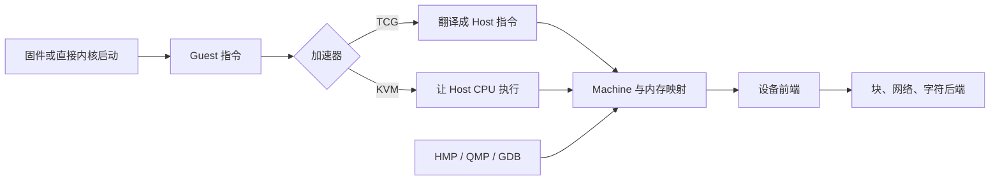
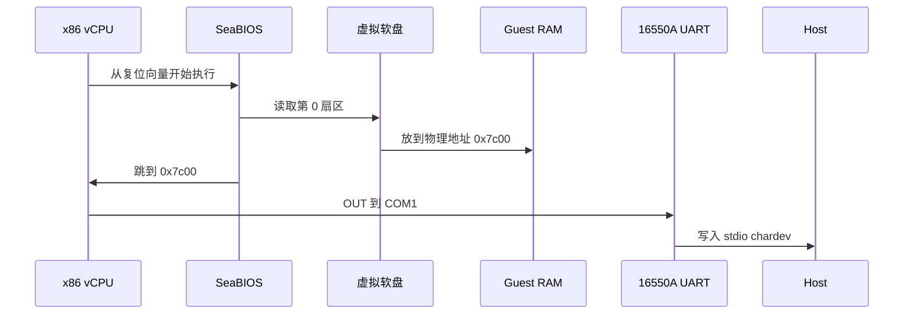
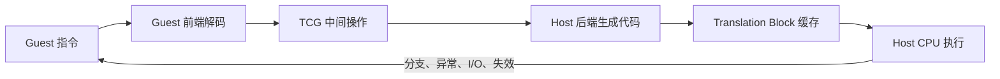
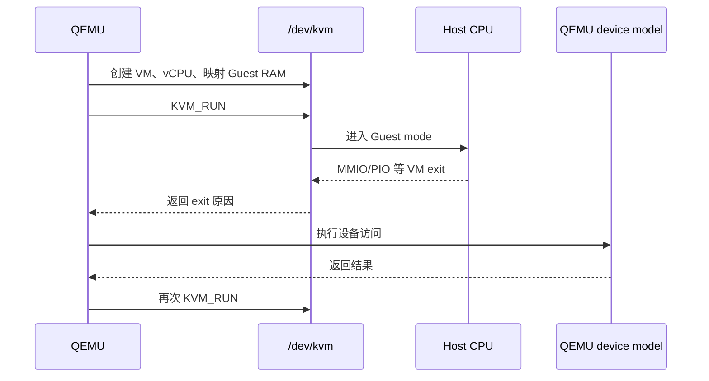
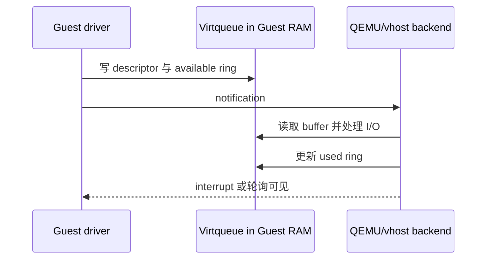

写完 [Kconfig](/posts/understanding-kconfig/) 和 [Kbuild](/posts/understanding-kbuild/) 之后，我已经能配置、编译并加载一个 Linux 内核模块，却发现实验台中央还摆着一块巨大的黑盒：我会复制一行 `qemu-system-x86_64` 命令，但不知道它究竟造了哪台机器、CPU 在哪里执行、磁盘为何既是文件又是设备，也不知道按下 `Ctrl+A X` 时到底在和谁说话。于是我写了一个 512 字节启动扇区，把它放进 QEMU 10.2.4，又从 QMP、Device Tree 和一份 992 字节的 AArch64 ELF 反向拆开这台并不存在的计算机。



这张图是本文的地图。QEMU 不是单纯的"虚拟 CPU"，也不是一个好看的虚拟机窗口。它把指令执行、整机拓扑、设备模型、宿主机后端和控制接口拼成一个进程。命令行之所以长，只是因为我们在一行文本里描述了一台计算机。

## 先把名字拆开

QEMU 最常见的 3 组程序做的是不同事情：

| 程序 | 输入 | 模拟范围 | 典型用途 |
| --- | --- | --- | --- |
| `qemu-system-x86_64`、`qemu-system-aarch64` | 固件、内核、磁盘和设备参数 | CPU、内存、总线、中断控制器、设备等整机 | 启动操作系统、固件和裸机程序 |
| `qemu-aarch64`、`qemu-riscv64` | 某个目标架构的用户态 ELF | 指令集、系统调用、信号和线程接口 | 在 x86_64 Linux 上运行或测试异构 Linux 程序 |
| `qemu-img` | 磁盘镜像 | 不运行 Guest | 创建、检查、转换、比较镜像 |

另外 3 个名字经常与它混在一起：

- **KVM** 是 Linux 内核里的虚拟化接口。它让兼容架构的 Guest 指令直接在硬件虚拟化模式中执行，但不负责给我造 UART、网卡和磁盘。
- **QEMU** 可以只用 TCG 完成跨架构模拟，也可以调用 KVM 执行 vCPU，同时继续提供设备模型和进程生命周期。
- **libvirt** 是更高一层的管理 API。它探测能力、生成 QEMU 参数并管理网络、存储和生命周期；`virsh` 和 virt-manager 通常站在这一层。

所以"QEMU 还是 KVM"不是一个很好的二选一。常见的 Linux 虚拟机恰好是 **QEMU + KVM**：KVM 跑 CPU，QEMU 造其余机器。只写 `qemu-system-x86_64` 而不指定加速器时，QEMU 默认使用 TCG；安装了 KVM 并不等于这条命令自动用上它。

本文固定在以下实验环境：

| 项目 | 实验值 |
| --- | --- |
| Host | x86_64 Linux |
| QEMU | `10.2.4` |
| GNU Binutils | `2.46` |
| Guest 实验 1 | 16-bit x86 裸机启动扇区 |
| Guest 实验 2 | AArch64 Linux 用户态静态 ELF |
| 加速器 | TCG 与 KVM 均实际启动 |

先问正在使用的二进制，而不是问搜索引擎记得哪个版本：

```bash
qemu-system-x86_64 --version
qemu-system-x86_64 -accel help
qemu-system-x86_64 -machine help
qemu-system-x86_64 -cpu help
qemu-system-x86_64 -device help
qemu-system-x86_64 -nic help
qemu-system-x86_64 -display help
```

在我的 QEMU 10.2.4 构建中，x86_64 的 `-machine help` 打印 43 行 machine 类型，`-device help` 列出 455 个设备模型；AArch64 的 machine 列表则有 113 行。这里包含版本化 machine 和别名，不能直接当成 113 块不同开发板，但它已经很好地解释了为什么背命令行是个坏主意。QEMU 自己就是可查询的硬件目录。

## 一条命令其实在描述什么？

我会把 system emulator 的参数按 7 层阅读：

```text
qemu-system-$ARCH \
  [machine] [cpu] [accelerator] \
  [devices] [backends] [interfaces] [boot]
```

| 层 | 回答的问题 | 常见参数 |
| --- | --- | --- |
| Machine | 这是什么板子，地址图和默认设备是什么？ | `-machine`、`-m`、`-smp` |
| CPU | Guest 看见哪种 CPU 和哪些 feature？ | `-cpu` |
| Accelerator | 指令由 TCG 翻译还是交给 Hypervisor？ | `-accel` |
| Device | Guest 驱动看见什么硬件？ | `-device` |
| Backend | 设备的数据通向 Host 哪里？ | `-blockdev`、`-netdev`、`-chardev` |
| Interface | 人和管理程序怎样观察、控制和调试？ | `-display`、`-serial`、`-qmp`、`-gdb` |
| Boot | 第一条 Guest 代码来自哪里？ | `-bios`、`-kernel`、`-initrd`、`-append`、`-drive` |

这里最有用的分界是 **device 与 backend**。`virtio-net-pci` 是 Guest 能枚举并由驱动绑定的 PCI 设备；`user`、`tap` 或 `passt` 是 Host 侧真正收发包的后端。`virtio-blk-pci` 是 Guest 磁盘控制器；raw 文件、qcow2 文件或 Host 块设备是后端。前者像插座，后者像插座后面的电线，只是这个比喻用一次就够了。

## 我先启动 512 字节，而不是一个发行版

如果一上来就启动 Debian，屏幕上会同时出现固件、引导器、内核、initramfs、systemd 和虚拟硬件。每一层都可能成功地遮住上一层。为了只观察 QEMU，我写了一个 BIOS 启动扇区：初始化 COM1，输出一行字，然后向测试退出设备写一个值。

```asm
.code16
.global _start

_start:
	cli
	xorw %ax, %ax
	movw %ax, %ds
	movw %ax, %ss
	movw $0x7c00, %sp

	# COM1: 115200 baud, 8N1, FIFO on.
	movw $0x3f9, %dx
	xorb %al, %al
	outb %al, %dx
	movw $0x3fb, %dx
	movb $0x80, %al
	outb %al, %dx
	movw $0x3f8, %dx
	movb $0x01, %al
	outb %al, %dx
	movw $0x3f9, %dx
	xorb %al, %al
	outb %al, %dx
	movw $0x3fb, %dx
	movb $0x03, %al
	outb %al, %dx
	movw $0x3fa, %dx
	movb $0xc7, %al
	outb %al, %dx
	movw $0x3fc, %dx
	movb $0x0b, %al
	outb %al, %dx

	movw $message, %si
print:
	lodsb
	testb %al, %al
	jz done
	movb %al, %ah
wait_tx:
	movw $0x3fd, %dx
	inb %dx, %al
	testb $0x20, %al
	jz wait_tx
	movb %ah, %al
	movw $0x3f8, %dx
	outb %al, %dx
	jmp print

done:
	movw $0xf4, %dx
	movb $0x10, %al
	outb %al, %dx
	hlt

message:
	.asciz "hello from sector 0\r\n"

.org 510
.word 0xaa55
```

构建时我先链接 ELF，让 `message` 得到以 `0x7c00` 为基准的正确地址，再只抽取 `.text`：

```bash
as --32 -o boot.o boot.S
ld -m elf_i386 -Ttext 0x7c00 -o boot.elf boot.o
objcopy -O binary --only-section=.text boot.elf boot.bin
stat --format='%n %s bytes' boot.bin
```

输出刚好是：

```text
boot.bin 512 bytes
```

最后 16 字节为：

```text
00 00 00 00 00 00 00 00 00 00 00 00 00 00 55 aa
```

`0x55 0xaa` 位于偏移 510，BIOS 才把它当成可启动扇区。现在启动：

```bash
qemu-system-x86_64 \
  -machine pc,accel=tcg \
  -drive file=boot.bin,format=raw,if=floppy \
  -display none \
  -serial stdio \
  -monitor none \
  -no-reboot \
  -device isa-debug-exit,iobase=0xf4,iosize=0x04
```

实际输出只有一行：

```text
hello from sector 0
```

进程退出码为 `33`。这不是随机事故。`isa-debug-exit` 收到 `0x10` 后按 `(value << 1) | 1` 生成退出码，所以得到 $0x10 \times 2 + 1 = 33$。这个设备不是现实 PC 上的标准零件，而是我明确加进实验机的测试出口。Guest 写一个 I/O port，QEMU 的设备回调收到访问并结束 Host 进程。512 字节代码已经跨过了 CPU、I/O 地址空间、UART、字符后端和进程生命周期 5 层。

### 从复位向量到 `0x7c00`

这条路径仍有固件参与：



`boot.bin` 不是 Host 进程可直接执行的 ELF。SeaBIOS 经虚拟软盘控制器读它，检查签名并复制到 Guest RAM。我的 `outb` 也没有直接碰 Host 的物理串口；QEMU 捕获 Guest I/O 指令，把访问路由到 16550A 设备模型，再由 `-serial stdio` 连接终端。

我把 `-accel tcg` 换成 `-accel kvm` 后，同一个扇区也输出同一行并以 33 退出。可观察的 machine contract 没变，变化的是 vCPU 执行引擎。这正是加速器应该有的边界。

## TCG 到底模拟了什么？

TCG 是 Tiny Code Generator。粗略但有用的数据流是：



QEMU 通常以 translation block 为单位翻译一段 Guest 指令，而不是每执行一条就启动一次解释器。已经生成的 Host 代码可以缓存和复用；控制流、异常、自修改代码、MMIO 等事件再让执行返回 QEMU。具体边界是实现细节，不能把 TB 简化成 C 语言 basic block 的永久一一映射。

TCG 的价值不是"比硬件快"，而是 **Host 与 Guest 架构可以不同**。x86_64 Host 能运行 AArch64、RISC-V、MIPS 等 Guest，也能提供较强的可观察性、确定性相关选项和软件断点能力。代价是翻译、状态同步和设备模拟都有成本。

常用写法：

```bash
qemu-system-aarch64 \
  -machine virt,accel=tcg \
  -cpu max \
  -smp 4
```

`-cpu max` 表示 TCG 能提供的丰富功能集合，不代表某颗真实 SoC。若目标是复现 Cortex-A57 的行为，就应选 `-cpu cortex-a57`，并接受这个模型实现了什么、不实现什么。

`-accel tcg,thread=multi` 允许支持的目标为多个 vCPU 使用多个 TCG 线程。它不保证 4 个 Guest vCPU 就得到 4 倍性能；锁竞争、设备路径和 Guest 工作负载都在场。`one-insn-per-tb=on` 则故意把每个 TB 缩到一条指令，适合分析日志，不适合假装性能还正常（这次真的不能两全）。

## KVM 为什么快，又为什么仍然需要 QEMU？

当 Host 与 Guest 架构兼容、CPU 支持硬件虚拟化且 `/dev/kvm` 可用时，可以写：

```bash
qemu-system-x86_64 \
  -machine q35 \
  -accel kvm \
  -cpu host \
  -m 2G \
  -smp 4
```

QEMU 通过 KVM API 创建 VM 和 vCPU，把 Guest RAM 注册给内核，然后让 vCPU 进入硬件虚拟化执行。普通 Guest 指令不必先翻译成 Host 指令；遇到需要 Host 处理的事件，例如某些 I/O、MMIO 或停机状态，KVM 退出到 QEMU，QEMU 再运行对应设备逻辑。



`-cpu host` 暴露 Host CPU 的大量特性，通常适合单机开发和性能实验，却会把 VM 绑得更紧。需要跨不同 Host live migration 时，应选择双方共同支持的命名 CPU model 和 feature 集，而不是默认假设另一台机器也长着同一颗 CPU。

我不会用 512 字节启动扇区比较 TCG 与 KVM 性能。这个 workload 的 Guest 只输出 21 个字符，QEMU 进程启动和固件执行占据了绝大多数时间；测出来的主要是噪声，不是 CPU 加速比。要比较加速器，至少应固定 machine、CPU feature、vCPU 数、Guest 镜像和 workload，再分别测 Guest 内部 CPU 时间、I/O 吞吐与 Host 消耗。

也不要把 KVM 当成安全魔法。QEMU 的设备模型仍然处理 Guest 提交的数据，QEMU 官方文档明确指出 TCG 不是安全边界；测试不可信镜像时仍应使用非特权账户、最小设备集合、受控网络和宿主机沙箱策略。

## Machine 不是一个无关紧要的名字

Machine type 决定主板级拓扑：地址空间、总线、芯片组、中断控制器、固件接口和一组默认设备。CPU 只是板子上的一个节点。

x86_64 常见两族是：

- `pc-i440fx-*`：较老的 i440FX + PIIX PC 平台，兼容面广。
- `pc-q35-*`：较现代的 Q35 + ICH9 平台，原生 PCIe 拓扑更符合新设备。

我的 QEMU 10.2.4 默认项是 `pc-i440fx-10.2`，而 `pc` 是指向当前默认版本的别名。用于一次性内核实验时，别名很方便；用于长期保存或迁移的 VM 时，应记录版本化 machine，例如 `pc-q35-10.2`。升级 QEMU 后，`q35` 别名可能指向新兼容级别，而版本化名字存在的目的正是固定 Guest 可见的硬件 contract。

ARM 更能暴露这个事实。x86 PC 长期有相对统一的启动和硬件传统；ARM 镜像往往绑定到具体 SoC、UART 地址、中断控制器和 Device Tree。`qemu-system-aarch64` 因此没有默认 machine，必须写：

```bash
qemu-system-aarch64 -machine virt
```

`virt` 不是某块真实开发板。它是专门为虚拟化设计的通用平台，提供可配置 CPU、RAM、PL011、GIC、PCI/PCIe、VirtIO 和生成的 Device Tree。若目的是学习 Linux、U-Boot 和驱动框架，它通常比假装某块量产板更干净；若目的是复现真实板卡寄存器和启动 ROM，就必须检查 `-machine help` 是否真的包含那块板。没有 machine model 时，一份真实固件不会因为加上 `-dtb board.dtb` 就突然能运行。DTB 描述硬件，不负责实现硬件。

## 我让 QEMU 自己交出 ARM 硬件图

QEMU 可以把 `virt` machine 生成的 DTB 写出来：

```bash
qemu-system-aarch64 \
  -machine virt,dumpdtb=virt.dtb \
  -cpu cortex-a57 \
  -m 256M \
  -display none

dtc -I dtb -O dts -o virt.dts virt.dtb
```

QEMU 写出的 `virt.dtb` 是一个预留到 `1,048,576` 字节的 blob。反编译后，关键节点包括：

```text
memory@40000000 {
	reg = <0x00 0x40000000 0x00 0x10000000>;
	device_type = "memory";
};

pl011@9000000 {
	interrupts = <0x00 0x01 0x04>;
	reg = <0x00 0x9000000 0x00 0x1000>;
	compatible = "arm,pl011", "arm,primecell";
};

virtio_mmio@a000000 {
	interrupts = <0x00 0x10 0x01>;
	reg = <0x00 0xa000000 0x00 0x200>;
	compatible = "virtio,mmio";
};
```

实验中的 `-m 256M` 变成从 `0x40000000` 开始、长度 `0x10000000` 的 RAM。串口是 `0x09000000` 的 PL011，`chosen.stdout-path` 也指向它。DTB 还预留了从 `0x0a000000` 到 `0x0a003e00` 的 32 个 VirtIO MMIO slot，每个间隔 `0x200`。命令行不再是一串咒语，它已经变成内核实际消费的硬件描述。

因此 ARM64 串口启动参数通常是：

```text
console=ttyAMA0
```

而上一篇 x86_64 实验使用的是：

```text
console=ttyS0
```

这不是 Linux 随机换了名字。两个 machine 分别提供 PL011 和 16550A 风格 UART，对应不同驱动与设备节点。

## 固件启动、磁盘启动和直接内核启动

QEMU 可以从不同层进入 Guest。它们不是同一条路径的不同拼写。

### 1. 固件加磁盘

典型 PC VM：

```bash
qemu-system-x86_64 \
  -machine q35,accel=kvm \
  -m 2G \
  -drive file=system.qcow2,format=qcow2
```

QEMU 启动 BIOS 或 UEFI 固件，固件枚举设备并选择启动项，随后进入磁盘里的引导器，再由引导器加载内核。适合安装和运行完整发行版，也最接近通用机器的启动链。

UEFI 的代码镜像通常只读，变量存储则需要单独的可写副本。不要让多个 VM 直接共享同一个可写变量镜像；Secure Boot key、BootOrder 和固件设置都在里面。

### 2. `-bios` 启动固件或裸机镜像

对 ARM `virt` 上的 U-Boot v2026.07，官方文档给出的非安全启动是：

```bash
make qemu_arm64_defconfig
make

qemu-system-aarch64 \
  -machine virt \
  -cpu cortex-a57 \
  -nographic \
  -bios u-boot.bin
```

这里 QEMU 把 U-Boot 放进模拟 flash，从地址 `0x0` 执行，并把生成的 DTB 放在 RAM 开头。若要复现 EL3、TF-A 与 OP-TEE，则启动链和镜像组合会继续增加；不能拿一个非安全 `u-boot.bin` 命令假装已经验证 secure world。

### 3. `-kernel` 直接内核启动

上一篇文章中，我用下面的命令启动自己构建的 Linux 6.18：

```bash
qemu-system-x86_64 \
  -machine accel=tcg \
  -cpu max \
  -m 256M \
  -smp 1 \
  -nographic \
  -no-reboot \
  -kernel arch/x86/boot/bzImage \
  -initrd initramfs.cpio \
  -append "console=ttyS0 rdinit=/init panic=-1"
```

它绕过 Guest 磁盘上的 GRUB 和 root filesystem 查找，直接把 kernel、initramfs 和 command line 交给 QEMU 的直接 Linux boot 路径。它很适合内核迭代：不必每次把 `bzImage` 复制进磁盘分区，也不必调试一个与当前问题无关的 bootloader。

ARM64 对应的实验骨架是：

```bash
qemu-system-aarch64 \
  -machine virt,accel=tcg \
  -cpu cortex-a57 \
  -m 512M \
  -smp 2 \
  -nographic \
  -no-reboot \
  -kernel arch/arm64/boot/Image \
  -initrd initramfs.cpio \
  -append "console=ttyAMA0 rdinit=/init panic=-1"
```

内核必须真的包含 `virt` 所需的 CPU、GIC、PL011、timer、PCI 或 VirtIO 支持。QEMU 能造出设备，不会替 Linux 打开 Kconfig。于是前两篇文章与这一篇形成了闭环：Kconfig 允许驱动存在，Kbuild 把驱动放进镜像，QEMU machine 决定启动后是否真有匹配的硬件。

## `-nographic` 不等于 `-display none`

这两个选项看起来接近，行为并不相同：

| 选项 | 图形窗口 | 串口 | Monitor |
| --- | --- | --- | --- |
| `-display none` | 不创建显示输出 | 不自动重定向 | 不自动重定向 |
| `-nographic` | 禁用图形输出 | 通常把串口接到 stdio | 将 Monitor 与串口复用到 stdio |
| `-serial stdio -monitor none -display none` | 无 | 只把串口接到 stdio | 禁用 HMP |

我在自动实验中偏爱第三种显式写法，因为日志里只有 Guest 串口，不会意外把 `(qemu)` Monitor prompt 混进去。交互调试时 `-nographic` 很方便：

- `Ctrl+A H` 查看快捷键。
- `Ctrl+A C` 在串口与 HMP Monitor 之间切换。
- `Ctrl+A X` 退出 QEMU。

这些是 QEMU chardev multiplexer 的转义，不是 Guest 收到的 `Ctrl+A`。要把真的 `Ctrl+A` 送给 Guest，需要按两次 `Ctrl+A`。

`console=ttyS0` 或 `console=ttyAMA0` 同样不可省略。QEMU 把虚拟串口接到终端，只解决 Host 端；Linux command line 还要告诉内核把 console 写到哪个 Guest 设备。两边必须在同一根虚拟电线上见面。

## 设备前端与后端必须成对阅读

考虑网络：

```bash
-netdev user,id=net0,hostfwd=tcp:127.0.0.1:2222-:22 \
-device virtio-net-pci,netdev=net0,mac=52:54:00:12:34:56
```

- `virtio-net-pci` 是 Guest 枚举到的网卡。
- `netdev=net0` 把它连到 ID 为 `net0` 的 Host backend。
- `user` 选择无特权用户态网络栈。
- `hostfwd` 把 Host `127.0.0.1:2222` 转到 Guest TCP 22。

只写 `-netdev` 没有 Guest 网卡，Guest 无从发送；只写带 `netdev=net0` 的 `-device` 而没有同名 backend，QEMU 会在启动时拒绝这个悬空引用。ID 是这张图里的接线标签。

存储也一样。下面的显式 block graph 经 QEMU 10.2.4 启动验证：

```bash
qemu-system-x86_64 \
  -machine q35,accel=tcg \
  -nodefaults \
  -display none \
  -S \
  -blockdev driver=file,node-name=file0,filename=disk.qcow2 \
  -blockdev driver=qcow2,node-name=disk0,file=file0 \
  -device virtio-blk-pci,drive=disk0
```

数据路径为：


`-drive file=...,format=qcow2,if=virtio` 是方便的组合式旧入口；`-blockdev` 加 `-device` 更啰嗦，却把格式层、文件层和 Guest 设备层分开。要做 overlay、镜像过滤、throttle 或 live block operation 时，显式图更容易审查。

`-nodefaults` 会移除 machine 的常见默认设备。它适合可重复实验，但不是"删掉全部硬件"；machine 本身不可缺少的控制器和平台对象仍然存在。搭一台最小 VM 时，我会加它，然后只添加实验需要的串口、磁盘和网卡。

## raw 与 qcow2 不是"大文件与小文件"

我创建了两个虚拟容量均为 1 GiB 的空镜像：

```bash
qemu-img create -f raw disk.raw 1G
qemu-img create -f qcow2 disk.qcow2 1G
qemu-img info --output=json disk.qcow2
```

在支持 sparse file 的 Host filesystem 上，结果是：

| 镜像 | Guest 虚拟容量 | Host 文件逻辑长度 | 实际分配空间 |
| --- | ---: | ---: | ---: |
| raw | `1,073,741,824` B | `1,073,741,824` B | `4,096` B |
| qcow2 | `1,073,741,824` B | `196,624` B | `200,704` B |

空 raw 在这里反而只分配 4 KiB，因为它是 sparse file；qcow2 需要约 196 KiB 元数据。于是"qcow2 一定更省空间"在第 0 秒就是错的。两者真正的差别是格式与能力：

| 维度 | raw | qcow2 |
| --- | --- | --- |
| 布局 | 扇区偏移接近直接映射 | L1/L2 table、cluster、refcount 等元数据 |
| 稀疏 | 依赖 Host filesystem | 格式原生按 cluster 分配 |
| backing file | 无 | 有 |
| internal snapshot | 无 | 有 |
| 压缩/加密能力 | 格式本身无 | 支持特定模式 |
| 可移植和恢复 | 简单 | 需要理解 qcow2 元数据 |

我又创建了 overlay：

```bash
qemu-img create \
  -f qcow2 \
  -F qcow2 \
  -b "$PWD/disk.qcow2" \
  overlay.qcow2
```

它的虚拟容量仍是 1 GiB，初始实际分配 `200,704` 字节。读取未覆盖 cluster 时沿 backing chain 去 base，写入则进入 overlay。这个机制非常适合"一份只读基础镜像 + 多个实验分支"。

> [!WARNING] Backing chain 是数据结构，不是文件命名约定
> 移动、修改或删除 base 可能让 overlay 读到错误数据或直接打不开。创建时显式写 `-F`，用 `qemu-img info --backing-chain` 检查链，并在分发前用 `qemu-img convert` 或 `rebase` 按计划扁平化。不要在不理解 `rebase -u` 的情况下用它改元数据指针。

QEMU 里至少有 3 种容易都被叫作"快照"的东西：

1. `-snapshot`：写入临时 overlay，QEMU 退出后通常丢弃。本质上是一次性运行模式。
2. qcow2 internal snapshot：用 `savevm`、`loadvm`、`delvm` 保存磁盘与 VM state，受设备支持限制。
3. external snapshot/overlay：新 qcow2 文件以旧镜像为 backing file，链条显式存在，常用于管理系统。

快照不是备份。Guest filesystem 正在写入时抓到的镜像可能只是 crash-consistent；数据库一致性还需要 Guest 协作、freeze 或应用层 protocol。

## VirtIO 为什么不是"模拟一块更快的真网卡"？

QEMU 可以模拟 e1000、AHCI、NVMe 等现实设备，Guest 使用现实硬件驱动。这对兼容性和固件测试很重要，但每次寄存器访问与硬件语义都要模拟。

VirtIO 选择另一条路：它定义一种专为虚拟环境设计的标准设备 contract。Guest 驱动与 device 通过 virtqueue 交换 descriptor，批量描述 buffer，再用 notification 告知对方。它不需要假装自己是某块 20 年前的网卡。



这里还要区分 **设备类型** 与 **transport**：

- `virtio-blk`、`virtio-net`、`virtio-rng` 描述设备功能。
- `virtio-*-pci` 经 PCI capability 暴露。
- `virtio-*-device` 在某些 machine 上经 VirtIO MMIO 或其他 bus 暴露。
- split virtqueue 与 packed virtqueue 描述 ring layout，不是两种磁盘格式。

使用 VirtIO 的前提是 Guest 有对应驱动。initramfs 想从 `/dev/vda` 挂载 root 时，`CONFIG_VIRTIO_BLK`、transport 和必要的 PCI 支持必须内建，不能全做成等 root filesystem 挂载后才加载的模块。这又回到了 Kconfig，只是现在我们终于知道那个选项在为哪块虚拟硬件服务。

`vhost` 还能把部分 VirtIO 数据面移出 QEMU 主循环，例如 `vhost-net` 借助内核处理网络数据，`vhost-user` 则通过 Unix socket 连接独立 userspace backend。控制面、feature negotiation、内存共享和安全边界会变复杂，不能只因为名字里有 `vhost` 就默认打开。

## 网络：先用 user，理解后再上 TAP

最省事的无特权配置是：

```bash
-netdev user,id=net0,hostfwd=tcp:127.0.0.1:2222-:22 \
-device virtio-net-pci,netdev=net0
```

QEMU user-mode network 的默认拓扑通常是：

```text
Guest 10.0.2.15
  -> gateway 10.0.2.2
  -> DNS 10.0.2.3
  -> Host/Internet
```

Guest 位于 NAT 后面，Host 或局域网不能凭空主动连接它，所以 SSH 需要 `hostfwd`。绑定 `127.0.0.1` 比省略地址更保守，避免意外把实验 SSH 暴露到所有 Host 接口。

ICMP 是一个常见误判点。user backend 对外部 `ping` 的支持受 Host 与配置限制，`ping` 失败不能单独证明 TCP/DNS 坏了。先在 Guest 检查地址、route、DNS，再用实际要验证的 TCP/UDP 流量测试。

TAP 则在 Host 创建二层接口：

```bash
-netdev tap,id=net0,ifname=tap0,script=no,downscript=no \
-device virtio-net-pci,netdev=net0
```

它适合桥接到 Host bridge、构建多 VM 二层网络或做抓包实验，但创建和配置 TAP/bridge 通常需要额外权限。网络连不通时应分别检查：

1. Guest NIC 驱动是否绑定。
2. Guest link、地址和 route 是否正确。
3. QEMU device 是否连到正确 `netdev` ID。
4. TAP 是否 UP 并加入预期 bridge。
5. Host forwarding、防火墙和 NAT 是否允许流量。

`passt` 是另一种无特权 backend。它作为独立 daemon 工作，通常比内置 user-mode stack 提供更完整的 IPv6、性能和隔离特性。选择 backend 是网络拓扑与安全决策，不是 VirtIO 驱动决策。

## QEMU user mode：只模拟一个进程

为了确认 `qemu-aarch64` 和 system emulator 的边界，我写了一个不用 libc 的 AArch64 程序：

```asm
.global _start
.text
_start:
	mov x0, #1
	adr x1, message
	mov x2, #message_end - message
	mov x8, #64
	svc #0

	mov x0, #7
	mov x8, #93
	svc #0

message:
	.ascii "hello from AArch64 user mode\n"
message_end:
```

交叉链接出一个 `992` 字节静态 ELF：

```bash
aarch64-linux-gnu-gcc \
  -nostdlib \
  -static \
  -Wl,--build-id=none \
  -o hello-aarch64 hello-aarch64.S

file hello-aarch64
```

`file` 确认它是：

```text
ELF 64-bit LSB executable, ARM aarch64, statically linked
```

x86_64 Host 不能原生执行这份指令，但 user emulator 可以：

```bash
qemu-aarch64 -strace ./hello-aarch64
```

我实际看到：

```text
write(1,0x400098,29)hello from AArch64 user mode
 = 29
exit(7)
```

进程退出码正是 7。这里没有 AArch64 BIOS、GIC、PL011、磁盘或第二个 Linux kernel。QEMU 翻译 AArch64 用户指令，拦截 `svc`，把 Guest ABI 的 `write` 和 `exit` 参数转换后交给 Host Linux kernel。

动态链接程序还需要目标架构的 loader 与 shared libraries：

```bash
qemu-aarch64 -L /path/to/aarch64-sysroot ./app
```

`-L` 指向 Guest ABI sysroot，不是随便一个包含 `.so` 的目录。混用错误架构、错误 dynamic linker 路径或不兼容 glibc 时，问题发生在 ABI 与文件系统视图，不在虚拟网卡，因为这里根本没有网卡。

user mode 适合交叉编译后的命令行程序测试、CI 和编译器工作；涉及 kernel driver、boot flow、真实 MMIO 或完整网络 namespace 语义时，应回到 system emulation。

## HMP、QMP 和 Guest Agent 是 3 个平面

### HMP：给人使用的 Monitor

HMP 是 `(qemu)` prompt 后面的交互命令：

```text
(qemu) info status
(qemu) info registers
(qemu) info pci
(qemu) info block
(qemu) stop
(qemu) cont
(qemu) quit
```

它适合临时观察。输出面向人，会随版本调整，不应让生产脚本靠正则解析。

### QMP：给程序使用的控制 API

QMP 使用以 CRLF 分隔的 JSON object。连接建立后，server 先发送 greeting；client 必须完成 `qmp_capabilities` negotiation，随后才能发普通命令。下面是我实际运行的最小 Unix socket client 的核心：

```python
import json
import socket

sock = socket.socket(socket.AF_UNIX, socket.SOCK_STREAM)
sock.connect("/tmp/qmp.sock")
stream = sock.makefile("rwb", buffering=0)

print(json.loads(stream.readline()))  # greeting

for request in [
    {"execute": "qmp_capabilities", "id": 1},
    {"execute": "query-status", "id": 2},
    {"execute": "query-kvm", "id": 3},
    {"execute": "query-cpus-fast", "id": 4},
    {"execute": "quit", "id": 5},
]:
    stream.write((json.dumps(request) + "\r\n").encode())
    while True:
        response = json.loads(stream.readline())
        if response.get("id") == request["id"]:
            print(response)
            break
```

QEMU 由以下参数启动并停在第一条 Guest 指令之前：

```bash
qemu-system-x86_64 \
  -machine pc,accel=tcg \
  -m 64M \
  -S \
  -display none \
  -serial none \
  -monitor none \
  -qmp unix:/tmp/qmp.sock,server=on,wait=off
```

关键响应是：

```json
{"return":{"status":"prelaunch","running":false},"id":2}
{"return":{"enabled":false,"present":true},"id":3}
```

`present=true` 表示该 QEMU binary 与环境存在 KVM 能力，`enabled=false` 则准确反映这台 VM 明确选择了 TCG。`-S` 让状态停在 `prelaunch`。我喜欢这种接口：没有从彩色日志猜心情，只有结构化状态。

QMP response 的 `id` 对应 request；event 则可能异步到来。客户端不能假设读到的下一行一定是刚才命令的 response，必须按 `id` 配对，并单独处理 `event`。生产代码还要处理 partial read、断连、schema/version 差异和 error object。

### Guest Agent：进入 Guest OS 的通道

QEMU Guest Agent 是 Guest 内运行的进程，常通过 virtio-serial 与 Host 管理层通信。它能报告 Guest IP、freeze filesystem、关机或执行受支持操作。QMP 能问 QEMU "vCPU 是否暂停"，却不能凭空知道 Guest 里的 ext4 是否 freeze；QGA 正是跨过这条边界。

不要把 QMP 或 GDB socket 暴露到不可信网络。它们通常没有应用层认证；能控制 VM 或调试 Guest 的接口本质上就是高权限接口。Unix socket 加严格文件权限是本地实验的稳妥默认值。

## 用 GDB 在第一条指令前拦住机器

QEMU 内置 gdbstub。最短入口是：

```bash
qemu-system-x86_64 \
  -S \
  -s \
  -kernel arch/x86/boot/bzImage \
  -append "console=ttyS0"
```

- `-S`：创建 machine，但不启动 vCPU。
- `-s`：等价于 `-gdb tcp::1234`。

另一个终端连接：

```bash
gdb vmlinux
(gdb) target remote :1234
(gdb) hbreak start_kernel
(gdb) continue
```

调内核时应给 GDB `vmlinux`，不是压缩后的 `bzImage`。`vmlinux` 保留 ELF section 与 symbol；QEMU 启动的是可引导压缩镜像，两者承担不同角色。若 KASLR 让 runtime address 与 symbol address 不一致，可以在实验 command line 加 `nokaslr`，或者正确处理 relocation，而不是把断点下在希望它出现的地址。

调 16-bit 启动扇区时，连接后可用：

```text
set architecture i8086
x/10i $cs*16+$eip
info registers
```

TCG 下 QEMU 可提供大量 hardware breakpoint/watchpoint；KVM 的能力取决于 accelerator 实现与硬件。user-mode TCG 还不支持 watchpoint。调试 multicore machine 时，每个 vCPU 会作为 GDB thread 暴露，多 cluster machine 还可能需要 `target extended-remote` 与多个 inferior。

为避免固定 TCP port 和误暴露，我更喜欢 Unix socket：

```bash
-chardev socket,path=/tmp/gdb.sock,server=on,wait=off,id=gdb0 \
-gdb chardev:gdb0 \
-S
```

GDB 9.0 及以上可以：

```text
target remote /tmp/gdb.sock
```

## 日志、trace 和可重复执行

串口日志、QEMU debug log 与 trace event 是 3 类不同证据：

- `-serial file:guest.log` 记录 Guest 经 UART 输出的内容。
- `-d ... -D qemu.log` 记录 QEMU 的执行或设备 debug 信息。
- `-trace ...` 订阅代码中定义的 trace event。

先查询支持项：

```bash
qemu-system-x86_64 -d help
qemu-system-x86_64 -trace help
```

调早期启动常见写法：

```bash
-d guest_errors,int -D qemu.log
```

`-d in_asm` 可以看到翻译的 Guest instruction block，但完整 Linux boot 会快速生成巨大日志。先缩小复现、使用 `-S` 和 breakpoint，或只在目标阶段打开日志。把几 GiB `in_asm` 当作理解系统的方法，很像为了找一根针而给整个草垛做逐原子 CT，技术上努力，方向上稍微有点可疑。

需要可重放的 TCG 实验时，QEMU 还有 instruction counting 与 record/replay 机制，但它们会约束设备、时钟和加速器。`-icount` 的虚拟时间不等于真实 wall-clock 性能；不要把确定性工具产生的时间数字拿去做 VM 性能榜。

更深入的动态分析可以使用 TCG plugin，按 instruction、basic block 或 memory access 订阅事件。plugin 能观察非常细的执行，却不应被理解成可以随意修改 Guest state 的通用 hook。先用 QMP、GDB 和现成 trace event，把 plugin 留给确实需要指令级统计的问题。

## 时钟、SMP 和"偶尔失败"

VM 里至少同时存在几种时间：Host wall clock、QEMU virtual clock、Guest wall clock、Guest monotonic clock，以及设备 timer。暂停 VM、Host 休眠、过载或迁移都会让它们以不同方式变化。

`-smp` 也不仅是一个数量：

```bash
-smp cpus=4,sockets=1,cores=2,threads=2
```

Guest 会看见拓扑，调度器与软件许可可能据此作决定。若只写 `-smp 4`，QEMU 会根据 machine 默认规则补齐 topology；需要可复现实验时应把真正相关的拓扑写全。

并发 bug 在 TCG 单线程、TCG 多线程和 KVM 下可能表现不同。TCG 没复现不等于真实硬件没有 bug，KVM 复现也不等于 QEMU 设备模型必然有错。先确定问题落在 Guest 软件、虚拟 CPU、设备 contract 还是 Host backend，再更换加速器做交叉验证。

## 一套可重复的内核实验命令

我现在不会从一条不断追加参数的历史命令开始，而是明确命名每一层：

```bash
qemu-system-x86_64 \
  -name pocket-kernel \
  -machine pc-q35-10.2,accel=tcg \
  -cpu max \
  -m 256M \
  -smp cpus=1,sockets=1,cores=1,threads=1 \
  -nodefaults \
  -no-reboot \
  -display none \
  -chardev stdio,id=serial0 \
  -device isa-serial,chardev=serial0 \
  -monitor none \
  -qmp unix:/tmp/pocket-kernel.qmp,server=on,wait=off \
  -chardev socket,path=/tmp/pocket-kernel.gdb,server=on,wait=off,id=gdb0 \
  -gdb chardev:gdb0 \
  -kernel arch/x86/boot/bzImage \
  -initrd initramfs.cpio \
  -append "console=ttyS0 rdinit=/init panic=-1 nokaslr"
```

`-nodefaults` 移除了常见默认外设，所以我显式创建 `isa-serial`，再通过 ID 为 `serial0` 的 chardev 接到 stdio。最小化的目标是让依赖可见，不是参加参数最短比赛。

用于网络和持久 rootfs 时再加：

```bash
-blockdev driver=file,node-name=root-file,filename=root.qcow2 \
-blockdev driver=qcow2,node-name=root,read-only=off,file=root-file \
-device virtio-blk-pci,drive=root \
-netdev user,id=net0,hostfwd=tcp:127.0.0.1:2222-:22 \
-device virtio-net-pci,netdev=net0
```

对应内核至少要检查：

```text
CONFIG_SERIAL_8250=y
CONFIG_SERIAL_8250_CONSOLE=y
CONFIG_VIRTIO=y
CONFIG_VIRTIO_PCI=y
CONFIG_VIRTIO_BLK=y
CONFIG_VIRTIO_NET=y
```

具体符号仍以目标 Linux 版本和 machine 为准。root 设备还要在 `-append` 中给出正确 `root=/dev/vda...`、filesystem driver 和等待策略。看到 `VFS: Unable to mount root fs` 时，我会先核对 4 件事：Guest 设备类型、transport driver、block/filesystem driver 是否内建、root path 是否与实际分区一致。

## 常见失败怎样沿层次定位？

### QEMU 启动前就报 property 或 bus 错误

这是 Host 侧 machine graph 没建起来。检查 `-device TYPE,help`、ID 拼写、bus 名、machine 是否提供该 bus，以及当前 QEMU build 是否包含设备。Guest kernel 尚未执行，不要先改 Kconfig。

### 屏幕全黑或终端没有日志

分别检查显示与 console：

1. `-display none` 是否把唯一图形输出关闭。
2. `-serial stdio` 或 `-nographic` 是否连接正确 UART。
3. kernel command line 是否使用 `ttyS0`、`ttyAMA0` 等正确设备。
4. UART driver 和 console support 是否内建。
5. 使用 `-S` 时是否忘了从 GDB 或 QMP `cont`。

### `No bootable device`

固件没有找到可启动介质。检查镜像内容、boot signature/EFI executable、`bootindex`、磁盘 interface 与 firmware 能否驱动它。一个包含 ext4 的文件不自动等于含有 bootloader 的 boot disk。

### 内核看不见磁盘或网卡

先用 QMP/HMP 确认 device 真的存在并连接 backend，再看 Guest `dmesg`、PCI/Device Tree 枚举和驱动配置。VirtIO PCI 与 VirtIO MMIO 需要不同 transport；设备存在但没有 driver 与设备根本没创建，会得到相似的"看不见"，修复层却完全不同。

### `Could not access KVM kernel module`

检查 `/dev/kvm`、Host CPU virtualization、内核模块、权限和容器 device passthrough。需要兼容 fallback 时可写：

```bash
-accel kvm:tcg
```

但性能实验不应静默 fallback。用 QMP `query-kvm` 记录 `enabled`，否则以为自己测了 KVM，实际跑了一夜 TCG，也算一种很昂贵的类型错误。

### SSH 端口转发连不上

检查 Host port 是否被占用、`hostfwd` 的绑定地址、Guest sshd 是否监听、Guest firewall 和地址配置。QEMU user networking 默认不接受任意外部入站，端口转发是明确开的洞。

### 镜像提示 format probing 警告

显式写 `format=raw` 或 `format=qcow2`。格式自动探测不仅让行为含糊，对 raw 镜像还可能因安全限制阻止对第 0 block 的写入。命令行里知道格式，就把它写出来。

## 安全边界不能靠"它只是虚拟机"

我会保留这些默认纪律：

- 用普通用户运行 QEMU，不给整个进程 root。
- 不可信 Guest 只配置需要的设备与 backend。
- QMP、HMP、GDB 和 migration socket 使用 Unix socket 或绑定 loopback，并限制权限。
- 不随意添加 Host 目录共享、USB passthrough、VFIO、`/dev/mem` 或可写物理块设备。
- user networking 的 `hostfwd` 显式绑定 `127.0.0.1`。
- 对 base image 只读，实验写入 overlay。
- semihosting 只给可信裸机代码使用，因为它可以绕过 Guest/Host 隔离访问 Host 资源。
- 记录 QEMU version、machine version、CPU model、firmware、镜像 hash 和完整参数。

VFIO passthrough 能减少设备模拟并接近原生性能，但它把 IOMMU group、DMA 隔离、reset semantics 和 Host driver ownership 带进系统。它不是"再加一个 `-device`"级别的学习步骤。我会先把纯模拟设备与 VirtIO 路径弄清，再碰 passthrough。

## 我最终保留的心智模型

现在我把 QEMU 看成 5 张互相连接的图：

1. **执行图**：Guest ISA 经 TCG 或 KVM 前进。
2. **machine 图**：CPU、RAM、bus、中断控制器和设备占据确定位置。
3. **I/O 图**：Guest device 经 block、network、character backend 连接 Host。
4. **启动图**：reset 后进入 firmware、bootloader 或 direct kernel boot。
5. **控制图**：人用 HMP，程序用 QMP，调试器用 gdbstub，Guest Agent 报告 OS 内部状态。

512 字节启动扇区只用了 1 个 vCPU、1 个 UART、1 个软盘和 1 个测试退出设备，却已经证明了这 5 张图如何接起来。随后 992 字节 AArch64 ELF 又拿掉整台 machine，只留下指令翻译与 syscall translation。最后，`virt` 的 1 MiB DTB 把 ARM machine 的 RAM、PL011、GIC、PCI 和 32 个 VirtIO MMIO slot 全部摊在文本里。QEMU 没有变简单，但黑盒变成了几张可以逐边检查的图。

接下来我最想做的是把上一篇 `pocket_sensor` 从一个靠 `insmod` 自说自话的模块，改成真正的 platform driver：在 ARM `virt` 上增加一个小型 MMIO 设备模型，让 QEMU 生成对应 Device Tree 节点，再观察 Linux 从 `compatible` 匹配到 `probe()`、中断与 `remove()`。到那一步，Kconfig、Kbuild、Device Tree、driver core 和 QEMU device model 会在同一条可执行链上相遇。

很好。我终于不再把 `-nographic` 当作启动虚拟机的咒语了。它只是把一根虚拟串口线接到了我的终端，剩下 455 个设备还在后面安静地等着制造新问题。

## 参考资料

- [QEMU 10.2.4: System Emulation Introduction](https://gitlab.com/qemu-project/qemu/-/blob/v10.2.4/docs/system/introduction.rst)
- [QEMU: System Invocation](https://www.qemu.org/docs/master/system/invocation.html)
- [QEMU: Disk Images](https://www.qemu.org/docs/master/system/images.html)
- [QEMU: Network Emulation](https://www.qemu.org/docs/master/system/devices/net.html)
- [QEMU: User Space Emulator](https://www.qemu.org/docs/master/user/main.html)
- [QEMU: GDB Usage](https://www.qemu.org/docs/master/system/gdb.html)
- [QEMU Machine Protocol Specification](https://www.qemu.org/docs/master/interop/qmp-spec.html)
- [QEMU Machine Protocol Reference](https://www.qemu.org/docs/master/interop/qemu-qmp-ref.html)
- [QEMU: Arm System Emulator](https://www.qemu.org/docs/master/system/target-arm.html)
- [QEMU 10.2.4: isa-debug-exit implementation](https://gitlab.com/qemu-project/qemu/-/blob/v10.2.4/hw/misc/debugexit.c)
- [OASIS VirtIO 1.3 Specification](https://docs.oasis-open.org/virtio/virtio/v1.3/virtio-v1.3.html)
- [U-Boot v2026.07: QEMU ARM](https://docs.u-boot.org/en/v2026.07/board/emulation/qemu-arm.html)
