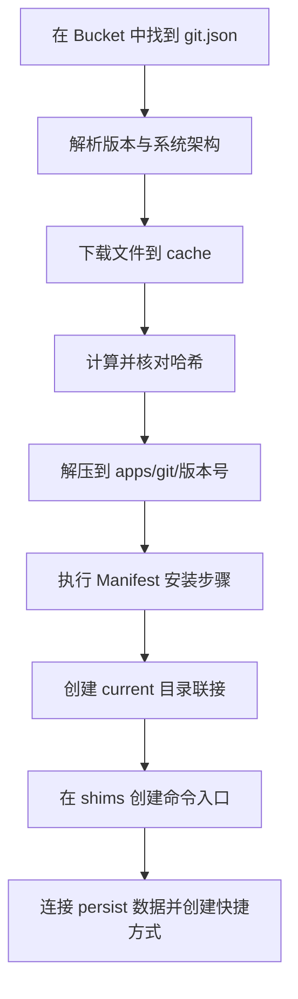

我第一次写 Scoop 时，只记下了安装、添加 Bucket、更新和清理这几件事。它能用，但更像一张贴在显示器边上的命令速查表。后来我真的给 Scoop 提交了两个软件包，才发现 Scoop 最有意思的地方并不是少点几次 "下一步"，而是它把一个 Windows 软件的安装过程压缩成了一份可以阅读、审查和自动更新的 JSON 文件。

这次我想把盖子掀开。我们先看 `scoop install` 到底做了什么，再把日常命令走一遍，最后从零写一个 Manifest，并用我提交的 [`mfgtools`](https://github.com/ScoopInstaller/Main/blob/master/bucket/mfgtools.json) 和 [`axolotl-launcher`](https://github.com/Calinou/scoop-games/blob/master/bucket/axolotl-launcher.json) 两个真实案例，看看一个软件怎样进入公共 Bucket。

> [!NOTE] 本文的边界
> Scoop 可以管理大量便携软件，也可以静默处理部分安装程序，但它并不能把所有 Windows 软件都变成绿色软件。Manifest 中如果调用了厂商安装器或自定义脚本，软件仍可能写注册表、安装服务或修改系统目录。先读 Manifest，再决定是否安装。

## Scoop 到底是什么

Scoop 的核心其实很朴素：一组 PowerShell 脚本、若干 Git 仓库，以及描述软件安装方式的 JSON Manifest。它不像传统安装器那样努力接管整个系统，而是尽量把文件、版本、入口和持久数据收拢到自己的目录中。

我更愿意把它想成一个小型仓库管理员：

- Bucket 是货架目录，告诉它有哪些软件。
- Manifest 是每件货物的装箱单，写明版本、下载地址、校验值和摆放方法。
- `apps` 保存按版本分开的程序文件。
- `shims` 提供稳定的命令入口。
- `persist` 保存更新时不能丢的数据。
- `cache` 保存已经下载的安装包。

默认的用户级目录大致如下：

```text
%USERPROFILE%\scoop\
├── apps\
│   └── git\
│       ├── 2.51.0.windows.1\
│       └── current -> 2.51.0.windows.1
├── buckets\
│   ├── main\
│   └── extras\
├── cache\
├── persist\
└── shims\
```

这里最关键的是 `版本目录 -> current -> shim` 这条链。

假设我执行：

```powershell
scoop install git
```

Scoop 会完成这样一条流水线：



这不是概念上的猜测。[Scoop 的安装实现](https://github.com/ScoopInstaller/Scoop/blob/master/lib/install.ps1)就是按这个顺序调用下载、解压、安装脚本、`link_current`、`create_shims`、快捷方式和持久化逻辑。

### `current` 为什么重要

每个版本各住一个目录，`current` 则是指向当前版本的目录联接。更新时，Scoop 可以先把新版本放进新目录，再把 `current` 改指过去。旧版本不会立刻消失，因此我们还能切换版本或在确认无误后清理它。

这有点像铁路道岔：程序版本是不同轨道，`current` 只负责把入口切到当前轨道。切换版本不需要搬动整列火车。

```powershell
# 查看一个软件当前实际目录
scoop prefix git

# 重新建立 current、Shim 和快捷方式
scoop reset git
```

### Shim 为什么不等于把所有目录塞进 PATH

传统做法常常给每个软件追加一条 `PATH`。安装 $N$ 个软件，环境变量里就可能多出 $N$ 个目录。Scoop 通常只需要把一个固定的 `shims` 目录加入 `PATH`，再由里面的入口转发到 `apps\<app>\current` 下的真实程序。

Manifest 中的 `bin` 决定创建哪些 Shim：

```json
"bin": "uuu.exe"
```

它也能给程序换一个更适合敲命令的别名：

```json
"bin": [
    [
        "Axolotl Launcher.exe",
        "axolotl-launcher"
    ]
]
```

所以升级后真实路径变了，命令名通常不变。`scoop which <command>` 可以沿着 Shim 找到它来自哪个软件：

```powershell
scoop which git
scoop which axolotl-launcher
```

### Persist 怎样让配置跨版本存活

如果配置文件跟程序一起留在版本目录，清理旧版本时配置也会被删掉。Manifest 的 `persist` 会把这些文件或目录转移到 `persist\<app>`，再用目录联接或硬链接接回程序目录。

```json
"persist": "data"
```

于是程序仍然以为自己在读 `apps\<app>\current\data`，实际数据却住在版本目录之外。普通卸载默认保留这些数据，彻底删除时才加 `--purge`：

```powershell
scoop uninstall <app>
scoop uninstall <app> --purge
```

### Bucket 为什么本质上是供应链边界

一个 Bucket 就是一个包含 JSON Manifest 的 Git 仓库。`scoop bucket add` 会把它克隆到本地，`scoop update` 再通过 Git 拉取变化。

这也意味着添加第三方 Bucket 不是一个纯粹的搜索操作，而是在增加新的软件供应源。Manifest 可以包含 `pre_install`、`installer` 和 `post_install` PowerShell 脚本。哈希能证明下载内容与 Manifest 期望的一致，却不能证明发布者或 Bucket 本身值得信任。密码学很认真，但它不会替我做价值判断，多少有点遗憾。

安装前我会看一眼 Manifest：

```powershell
scoop info extras/vscode
scoop cat extras/vscode
scoop home extras/vscode
```

如果同名软件存在于多个 Bucket，我会显式写成 `bucket/app`，而不是让搜索顺序替我决定：

```powershell
scoop install main/aria2
scoop install games/axolotl-launcher
```

## 安装 Scoop

[Scoop 当前要求 PowerShell 5.1 或更高版本](https://github.com/ScoopInstaller/Scoop/wiki/Quick-Start)。先检查版本：

```powershell
$PSVersionTable.PSVersion
```

普通用户安装不需要管理员 PowerShell：

```powershell
Set-ExecutionPolicy -ExecutionPolicy RemoteSigned -Scope CurrentUser
irm get.scoop.sh | iex
scoop help
```

`irm ... | iex` 很方便，也确实是在下载远程脚本后立即执行。介意这一点时，可以先保存并检查脚本：

```powershell
irm get.scoop.sh -OutFile install.ps1
Get-Content .\install.ps1
.\install.ps1
```

### 在安装前修改目录

默认用户目录是 `%USERPROFILE%\scoop`，全局目录是 `%ProgramData%\scoop`。如果我想把用户级软件放到 `D:\Scoop`，会在安装前设置 `SCOOP`：

```powershell
[Environment]::SetEnvironmentVariable("SCOOP", "D:\Scoop", "User")
$env:SCOOP = "D:\Scoop"
irm get.scoop.sh | iex
```

全局目录由 `SCOOP_GLOBAL` 控制。写入 Machine 级环境变量和安装全局软件都需要管理员权限：

```powershell
[Environment]::SetEnvironmentVariable("SCOOP_GLOBAL", "D:\ScoopGlobal", "Machine")
```

我会使用纯英文、无空格的短路径。这不是为了某种神秘仪式，而是为了避开历史安装脚本对空格、编码和引号处理不一致的问题。

### 已安装后的迁移

已经安装后再搬目录，比安装前指定路径更容易遗漏状态。基本步骤是：

1. 关闭正在运行的 Scoop 软件。
2. 把整个 Scoop 根目录移动到新位置。
3. 更新 `SCOOP` 和 `PATH` 中的 `shims` 路径。
4. 打开新终端，重建全部链接。

```powershell
scoop reset *
scoop checkup
```

## 我实际使用的命令行工作流

Scoop 的帮助风格更像 Git，而不是传统 PowerShell Cmdlet：

```powershell
scoop help
scoop help install
scoop help bucket
```

我把常用命令分成发现、安装、维护和迁移四组。记住工作流比背完整命令表更有用。

### 发现软件

```powershell
# 搜索名称和命令
scoop search ripgrep
scoop search rg

# 查看来源、版本、依赖等信息
scoop info main/ripgrep
scoop depends main/ripgrep

# 阅读安装清单和打开项目主页
scoop cat main/ripgrep
scoop home main/ripgrep
```

搜索不到时，先到 [Scoop Directory](https://scoop.sh/) 搜索社区 Bucket。仍然没有，再考虑自己写 Manifest，不要随手下载一个来历不明的 `setup.exe` 然后给它管理员权限。

### 安装、卸载与全局安装

```powershell
# 安装一个或多个软件
scoop install git aria2
scoop install extras/vscode

# 指定架构
scoop install main/7zip --arch 64bit

# 卸载，但保留 persist 数据
scoop uninstall vscode

# 连同 persist 数据彻底删除
scoop uninstall vscode --purge
```

只有确实需要所有用户共享时，我才使用全局安装：

```powershell
# 在管理员 PowerShell 中执行
scoop install git --global
scoop update git --global
scoop uninstall git --global
```

`--skip-hash-check` 会跳过完整性校验。除非我正在调试自己刚写的 Manifest，否则不会使用它，更不会把它当作下载失败的通用修复。

### 更新、锁定、回退与清理

```powershell
# 更新 Scoop 本体和本地 Bucket
scoop update

# 查看哪些软件可以更新
scoop status

# 更新一个软件或全部软件
scoop update git
scoop update *

# 暂停和恢复某个软件的更新
scoop hold git
scoop unhold git
```

如果 Manifest 带有 `autoupdate`，Scoop 还能根据当前清单生成指定旧版本的 Manifest：

```powershell
scoop install gh@2.7.0
```

这不是对任意软件、任意历史版本都有效。下载地址模式变过、旧文件被上游删除、旧哈希无法取得时，生成仍会失败。

版本切换或 Shim 冲突时使用 `reset`：

```powershell
scoop reset python
scoop reset python@3.12.10
```

确认新版本工作正常后再清理旧目录和下载缓存：

```powershell
scoop cleanup *
scoop cache show
scoop cache rm *
```

`cleanup` 删除旧的安装版本，`cache rm` 删除下载包，两者不是同一件事。磁盘空间凭空消失时，我通常两个地方都看。

### 导出和恢复环境

```powershell
scoop export > scoopfile.json
scoop import scoopfile.json
```

当前的 `export` 会记录应用和 Bucket，也可以按命令帮助提供的选项导出配置。我仍然会单独备份重要的 `persist` 数据，因为软件列表不是数据备份，正如购物清单不是冰箱。

### Aria2 要不要装

Scoop 检测到 Aria2 后会使用它进行多连接下载：

```powershell
scoop install aria2
```

我不再默认推荐把连接数一口气调到 `16`。单文件限速、代理、CDN 策略和网络质量不同，多连接不一定更快，反而可能触发限流。遇到异常时先关闭它做对照：

```powershell
scoop config aria2-enabled false
```

确认确实受益，再按自己的网络配置 `aria2-split` 和 `aria2-max-connection-per-server`。

## 推荐添加哪些 Bucket

Scoop 内置的 [Known Bucket 列表](https://github.com/ScoopInstaller/Scoop/blob/master/buckets.json) 当前包含 10 个名字。先查看，再按需添加：

```powershell
scoop bucket known
scoop bucket list
```

我通常从下面几个开始：

```powershell
scoop bucket add extras
scoop bucket add versions
scoop bucket add java
scoop bucket add nerd-fonts
scoop bucket add games
```

- [`main`](https://github.com/ScoopInstaller/Main)：默认启用，主要收录知名、稳定、非 GUI 的开发工具。
- [`extras`](https://github.com/ScoopInstaller/Extras)：浏览器、编辑器和桌面 GUI 软件最常用的来源。
- [`versions`](https://github.com/ScoopInstaller/Versions)：旧版、测试版和并行版本。只有确实需要多版本时再添加。
- [`java`](https://github.com/ScoopInstaller/Java)：不同厂商和版本的 JDK/JRE。
- [`nerd-fonts`](https://github.com/matthewjberger/scoop-nerd-fonts)：Nerd Fonts 字体，安装字体通常需要管理员权限。
- [`games`](https://github.com/Calinou/scoop-games)：开源或免费游戏、启动器和相关工具。

另外四个更偏场景化：

```powershell
scoop bucket add nirsoft
scoop bucket add sysinternals
scoop bucket add php
scoop bucket add nonportable
```

- `nirsoft` 和 `sysinternals`：对应两套 Windows 系统工具集合。
- `php`：需要切换多个 PHP 版本时有用。
- `nonportable`：收录必须运行传统安装器的软件。它天然更可能修改系统状态，我不会无脑添加。

第三方 Bucket 需要同时给名字和 Git 地址：

```powershell
scoop bucket add my-bucket https://github.com/<user>/my-bucket
scoop bucket rm my-bucket
```

Bucket 越多，搜索结果和信任面越大。我的策略很简单：需要哪个就加哪个，不把 `bucket known` 当成集邮册。

## 官方仓库没有软件时，先写一个 Manifest

Manifest 是 Scoop 的真正接口。[官方定义](https://github.com/ScoopInstaller/Scoop/wiki/App-Manifests)很直接：它是一份描述如何安装程序的 JSON 文件。

最小可用清单通常只需要版本、下载地址、哈希和命令入口，再补齐公共 Bucket 要求的描述、主页与许可证：

```json
{
    "version": "1.0.0",
    "description": "A small command-line tool that does one useful thing",
    "homepage": "https://github.com/example/tool",
    "license": "MIT",
    "architecture": {
        "64bit": {
            "url": "https://github.com/example/tool/releases/download/v1.0.0/tool-windows-x64.zip",
            "hash": "<sha256>"
        }
    },
    "bin": "tool.exe"
}
```

保存为 `tool.json` 后，可以直接安装本地文件：

```powershell
scoop install .\tool.json
scoop which tool
scoop uninstall tool
```

也可以让 Scoop 根据下载 URL 生成一个骨架，再手工补齐：

```powershell
scoop create https://github.com/example/tool/releases/download/v1.0.0/tool-windows-x64.zip
```

### 先研究发布物，不要先写 JSON

我写 Manifest 前会回答这几个问题：

1. 上游有没有稳定、可预测、无需登录的直链？
2. 发布物是单个 EXE、ZIP、7z、MSI，还是必须运行的安装器？
3. 压缩包解开后，真正的程序在哪一层目录？
4. 软件把配置、存档和缓存写到哪里？哪些应该 `persist`？
5. 版本能否从 GitHub Releases、网页、JSON API 或文件名稳定提取？
6. 下个版本发布时，URL 能否只替换 `$version` 就得到？

这里最常见的错误是围着当前版本硬编码，最后得到一个只能安装一次的 JSON。好的 Manifest 描述的不是一个文件，而是一族版本。

### 哈希是安装契约的一部分

Scoop 默认使用 SHA256。PowerShell 可以直接计算：

```powershell
Invoke-WebRequest $url -OutFile .\download.zip
(Get-FileHash .\download.zip -Algorithm SHA256).Hash.ToLower()
```

SHA256 是 256 bit，通常写成 64 个十六进制字符。只要上游悄悄替换了同一 URL 下的文件，哈希检查就会失败。这既可能是供应链风险，也可能只是上游重新打包，但两种情况都值得停下来调查，而不是条件反射地跳过校验。

### 常用字段怎样协作

- `architecture`：分别描述 `64bit`、`32bit` 和 `arm64` 发布物。
- `url` / `hash`：下载地址与对应校验值，多个 URL 就要有同样数量的哈希。
- `extract_dir` / `extract_to`：控制从压缩包中取哪一层、放到哪里。
- `bin`：创建命令行 Shim，也可以定义别名和固定参数。
- `shortcuts`：创建开始菜单快捷方式，适合 GUI 软件。
- `persist`：把配置或用户数据移出版本目录。
- `depends`：必须安装的运行时依赖。
- `suggest`：可选增强，不强制安装。
- `pre_install` / `post_install`：安装前后的 PowerShell 逻辑，能不用就不用。
- `installer` / `uninstaller`：必须运行传统安装器时使用。
- `checkver`：找出上游最新版本。
- `autoupdate`：用最新版本号重建 URL 等字段。

公共 Bucket 偏爱简单、可预测、便携的安装。十几行自定义 PowerShell 也许能把任何东西按进 Scoop，但维护者还要在六个月后理解它。能用字段表达，就不要写脚本。

### 让软件自动跟随新版本

GitHub Releases 是最省事的一种情况：

```json
"checkver": {
    "github": "https://github.com/example/tool"
},
"autoupdate": {
    "architecture": {
        "64bit": {
            "url": "https://github.com/example/tool/releases/download/v$version/tool-$version-windows-x64.zip"
        }
    }
}
```

`checkver` 负责回答 "最新版本是什么"，`autoupdate` 负责回答 "知道版本号后，下载地址长什么样"。Scoop 的自动更新工具会替换版本、生成新 URL、下载新文件并计算哈希。

在 Bucket 仓库根目录可以这样检查：

```powershell
$checkver = "$(scoop prefix scoop)\bin\checkver.ps1"
& $checkver tool .\bucket
& $checkver tool .\bucket -Update
```

然后安装生成后的本地 Manifest，不能只看 JSON 长得顺眼：

```powershell
scoop install .\bucket\tool.json
scoop which tool
scoop uninstall tool
```

GUI 软件还要真的启动、创建配置、升级一次、卸载一次，再检查快捷方式和 `persist`。安装成功只证明安装流程没有立刻摔倒，标准不算太高。

## 案例一：我提交的 mfgtools

[`mfgtools.json`](https://github.com/ScoopInstaller/Main/blob/master/bucket/mfgtools.json) 是最干净的一类 CLI Manifest。NXP 的项目名叫 mfgtools，实际命令行程序叫 `uuu`。截至本文更新时，Manifest 安装 `1.5.243`：

```json
{
    "version": "1.5.243",
    "description": "Freescale/NXP I.MX Chip image deploy tools.",
    "homepage": "https://github.com/nxp-imx/mfgtools",
    "license": "BSD-3-Clause",
    "architecture": {
        "64bit": {
            "url": "https://github.com/nxp-imx/mfgtools/releases/download/uuu_1.5.243/uuu.exe",
            "hash": "f6b76a6246befabeadfebdc1cbfe58f35939596caf7b78717ceab599b0c85027"
        }
    },
    "bin": "uuu.exe",
    "checkver": {
        "github": "https://github.com/nxp-imx/mfgtools",
        "regex": "uuu_([\\d.]+)"
    },
    "autoupdate": {
        "architecture": {
            "64bit": {
                "url": "https://github.com/nxp-imx/mfgtools/releases/download/uuu_$version/uuu.exe"
            }
        }
    }
}
```

我在 [PR #7614](https://github.com/ScoopInstaller/Main/pull/7614) 提交了它。这个包的安装路径只有几个动作：下载 1 个 `uuu.exe`，验证 1 个 SHA256，创建 1 个 `uuu` Shim。没有压缩包，没有快捷方式，没有持久数据，也没有安装脚本。

稍微特殊的是上游 Tag 为 `uuu_1.5.243`，而 Scoop 版本只需要 `1.5.243`。因此 `checkver.regex` 从 Tag 中捕获数字部分，`autoupdate.url` 再把 `uuu_` 前缀拼回去。

这份清单后来已经由 GitHub Actions 从我提交的 `1.5.233` 自动更新到 `1.5.243`。从手工提交到机器人接管后续版本，这才是 `checkver + autoupdate` 真正完成闭环的地方。

它适合进入 `main`，因为它是非 GUI 开发工具、提供稳定版本直链，而且安装过程足够标准。[`main` 的收录标准](https://github.com/ScoopInstaller/Scoop/wiki/Criteria-for-including-apps-in-the-main-bucket)还会考虑知名度、稳定版、完整版本和维护复杂度。写好 Manifest 只是技术门槛，选对 Bucket 是产品门槛。

## 案例二：我提交的 axolotl-launcher

[`axolotl-launcher.json`](https://github.com/Calinou/scoop-games/blob/master/bucket/axolotl-launcher.json) 是另一端。它是 Minecraft Java Edition 的 GUI 启动器，所以我把它提交到 `games`，对应 [PR #1795](https://github.com/Calinou/scoop-games/pull/1795)。

下载部分并不复杂：

```json
"architecture": {
    "64bit": {
        "url": "https://github.com/Mystic-Stars/Axolotl/releases/download/v1.9.5/Axolotl_Launcher_1.9.5_x64_portable.zip",
        "hash": "f83b553a3b7857927e4a190ba7dd548ce33532b482a06d1fda8519901bed65fa"
    }
},
"extract_dir": "Axolotl"
```

但一个 GUI 软件还要处理入口、快捷方式、运行时建议和用户数据：

```json
"suggest": {
    "Microsoft Edge WebView2": "extras/webview2"
},
"bin": [
    [
        "Axolotl Launcher.exe",
        "axolotl-launcher"
    ]
],
"shortcuts": [
    [
        "Axolotl Launcher.exe",
        "Axolotl Launcher"
    ]
],
"persist": [
    [
        ".Axolotl",
        "red.ghs.axolotl"
    ]
]
```

这里同时产生 2 个用户入口：终端里的 `axolotl-launcher` 和开始菜单里的 `Axolotl Launcher`。WebView2 是可选依赖，所以用 `suggest`，不是强制所有用户再安装一份 `depends`。

真正麻烦的是旧数据迁移。Axolotl 原本把数据放在 `%APPDATA%\red.ghs.axolotl`，而 Scoop 需要把它纳入 `persist`。Manifest 的 `pre_install` 做了几件防守性工作：

1. 只有目标持久化目录不存在、旧数据存在时才迁移。
2. 如果 Axolotl 仍在运行，立即中止，避免复制变化中的数据。
3. 先复制到 `.migration` 暂存目录，成功后再移动到最终位置。
4. 失败时清理暂存目录并重新抛出错误。
5. 最后删除压缩包自带的空 `.Axolotl`，让 `persist` 接管这个位置。

这比 `mfgtools` 多得多，但复杂度来自一个真实约束：已经使用官方安装方式的用户不能因为改用 Scoop 就丢掉数据。这里不能用一句 `Copy-Item` 糊过去。数据迁移像心脏手术，"大部分复制成功" 不是一种可以接受的状态。

它同样使用 GitHub Releases 做 `checkver`，并用 `$version` 构造后续下载地址：

```json
"checkver": {
    "github": "https://github.com/Mystic-Stars/Axolotl"
},
"autoupdate": {
    "architecture": {
        "64bit": {
            "url": "https://github.com/Mystic-Stars/Axolotl/releases/download/v$version/Axolotl_Launcher_$version_x64_portable.zip"
        }
    }
}
```

两个案例放在一起，Scoop 的设计就很清楚了：简单软件保持极简，复杂软件只为真实状态增加逻辑。不是每个 Manifest 都需要 `pre_install`，正如不是每个纸箱都需要起重机。

## 把 Manifest 提交到公共 Bucket

根据 Scoop 当前的[贡献规范](https://github.com/ScoopInstaller/.github/blob/main/.github/CONTRIBUTING.md)，我会按下面的顺序提交。

### 1. 选对仓库并先提 Issue

先根据软件类型选择 `main`、`extras`、`games` 或其他专用 Bucket，搜索是否已有同名软件和相关 Issue。贡献规范要求新软件先创建 Issue，说明实现方式和加入理由，等待维护者确认后再写 PR。

`main` 的要求最严格。一个 GUI 软件即使 Manifest 完美，也不应该硬塞进 `main`。我的两个例子正好展示了这个分流：`mfgtools` 去 `main`，Axolotl Launcher 去 `games`。

### 2. Fork、建分支、添加 JSON

```powershell
git clone https://github.com/<your-name>/Main.git
Set-Location Main
git switch -c add-tool

# 把清单放进 bucket 目录
git add .\bucket\tool.json
git commit -m "tool: Add version 1.0.0"
git push -u origin add-tool
```

字段顺序也有约定，大致从元数据、依赖、架构和安装步骤，走到入口、持久化、版本检测与自动更新。直接参考 [BucketTemplate](https://github.com/ScoopInstaller/BucketTemplate/blob/master/bucket/app-name.json.template)，比发明自己的排列方式省下 review 往返。

公共 Bucket 还要求：

- 使用 4 个空格缩进。
- `license` 尽量使用有效的 SPDX Identifier。
- 优先提供便携配置和 `persist`。
- 纯 CLI 软件不创建 `shortcuts`。
- 不接受命令行参数的纯 GUI 软件通常不需要 `bin`。
- 数组只有一个元素时尽量改成字符串。
- 只有 32 bit 下载时可以省略 `architecture`，其他情况应明确架构。

### 3. 做一次完整生命周期测试

我至少会验证：

```powershell
# JSON 能否解析
Get-Content .\bucket\tool.json -Raw | ConvertFrom-Json | Out-Null

# 本地清单能否完成安装和运行
scoop install .\bucket\tool.json
scoop which tool
tool --version

# checkver 能否找到同一版本，autoupdate 能否生成清单
$checkver = "$(scoop prefix scoop)\bin\checkver.ps1"
& $checkver tool .\bucket
& $checkver tool .\bucket -Update

# 卸载后入口是否消失
scoop uninstall tool
Get-Command tool -ErrorAction SilentlyContinue
```

GUI 软件不能用 `--version` 就算了。我会实际启动它，检查快捷方式，写入一份配置，执行升级，再确认配置仍在。然后普通卸载一次、`--purge` 卸载一次，分别观察持久数据是否保留和删除。

### 4. 发 PR，让自动验证器工作

新 Manifest 的 PR 标题格式是：

```text
<app name>: Add version <version>
```

提交 PR 后，再评论：

```text
/verify
```

这会启动自动 Manifest verifier。CI 通过不代表 review 一定结束，维护者仍可能要求简化脚本、修正许可证、调整 Bucket、补充 `persist`，或证明 URL 足够稳定。我会把这些反馈理解成未来维护成本的预演，而不是 JSON 格式考试。

### 5. 合并之后，自动更新才刚开始值班

只要 `checkver` 和 `autoupdate` 正确，Bucket 的自动化就能发现上游新版本、替换 URL、重新计算哈希并提交更新。我的两个 Manifest 都已经进入这条流水线。

这也是我现在判断一个 Manifest 是否完成的标准：不是 "今天能装"，而是 "下个版本发布后，我大概率不用半夜爬起来改 3 个数字"。

## 继续往里走

Scoop 把 Windows 软件安装拆成了几个普通、透明的部件：Git 提供版本化的软件目录，JSON 描述安装契约，SHA256 检查下载内容，目录联接切换版本，Shim 稳定命令入口，`persist` 隔离用户数据。每一层都不神秘，组合起来却把大量一次性的鼠标操作变成了可审查、可复现的文本。

如果你准备写第一个 Manifest，我建议按这个顺序继续读：

- [Scoop App Manifests 字段参考](https://github.com/ScoopInstaller/Scoop/wiki/App-Manifests)
- [Creating an App Manifest](https://github.com/ScoopInstaller/Scoop/wiki/Creating-an-app-manifest)
- [App Manifest Autoupdate](https://github.com/ScoopInstaller/Scoop/wiki/App-Manifest-Autoupdate)
- [Persistent data](https://github.com/ScoopInstaller/Scoop/wiki/Persistent-data)
- [Scoop 贡献规范](https://github.com/ScoopInstaller/.github/blob/main/.github/CONTRIBUTING.md)
- [BucketTemplate](https://github.com/ScoopInstaller/BucketTemplate)

挑一个你真的在用、上游发布方式稳定、安装流程足够简单的软件开始。先让它在自己的电脑上可靠地安装、更新、卸载，再把那份 JSON 交给整个社区。最坏的情况，你更理解了一个软件如何在 Windows 上生活；最好的情况，下一位用户只需要输入 `scoop install`。这笔交易相当不错。
